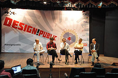
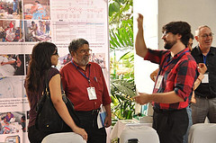
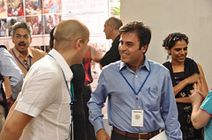

<figure aria-describedby="caption-attachment-439" class="wp-caption alignleft" id="attachment_439" style="width: 240px">

<figcaption class="wp-caption-text" id="caption-attachment-439">Panel discussing: The Challenge of Start Up Innovation</figcaption></figure>

On Oct 14, the [Center for Knowledge Societies (CKS)](http://cks.in/), an innovation consulting firm, hosted its second [Design Public](http://designpublic.in/blog/) conclave in Bangalore. The venue (National Gallery of Modern Art) couldn’t have been more picturesque, aesthetic and appropriate. It’s not often that one hears about design and public good in the same breath so I diligently pursued the event organizers and procured a press pass. I’m glad I did.

Considering that it’s almost two weeks since I attended the event, it didn’t make sense to write a liveblog-style post. Instead, what I’ve done is to organize the most interesting and original quotes I heard – during the 4 panel discussions and over lunchtime conversations – ala Twitter tweets sans the 140-characters limitation.

> There’s a difference between innovation happening in the West and East. The West innovates at the top of Maslow’s pyramid via well-to-do self-actualizers. In India, innovation happens at the bottom of pyramid – a local entrepreneur is compelled to innovate. In India, guys at the top have no hunger. – Harish Bijoor (HB Consults)
> 
> The fact that a lot more startups were born from HCL and Wipro than TCS and Infosys says a lot about the respective companies’ hiring philosophy and cultural ethos. – Mahesh Murthy (Pinstorm, Seedfund)
> 
> Working on satellite lasers for NASA was a lot simpler than fixing Bangalore’s urban challenges. – Ashwin Mahesh (Mapunity)
> 
> Too many people want to solve India-wide problems when they can’t solve the same problem in their home city/state. – Ashwin Mahesh (Mapunity)
> 
> The basic design of Pratham Books was to break down boundaries between government, NGO, markets, and volunteerism. – Rohini Nilekani (Arghyam, Pratham Books)
> 
> In government, understanding the process is more important than the idea itself. You need to mimic these processes to achieve your objective. – Ashwin Mahesh (Mapunity)
> 
> The general perception seems to be that government does not listen. My experience is that if you *try*, they WILL listen. It’s just that VERY FEW people even try. – Ashwin Mahesh (Mapunity)
> 
> <figure aria-describedby="caption-attachment-440" class="wp-caption alignright" id="attachment_440" style="width: 240px">

<figcaption class="wp-caption-text" id="caption-attachment-440">MP Ranjan (middle) &amp; Zachery Denfeld (right)</figcaption></figure>
> 
> Is there a 4th physical space for startups that has all the advantages of a garage, coffee shop, and a large corporation without any of their disadvantages? – Naresh Narasimhan (Venkataraman Associates)
> 
> Design is politics. – MP Ranjan (National Institute of Design / Design for India)
> 
> In an interesting experiment where American students had to devise a 21-day European travel itinerary and European students had to devise a corresponding American itinerary, both groups of students quickly learnt that design in the public space IS politics. – Eswaran Subrahmanian (C-STEP)
> 
> There is knowledge about failures around you. New designs must take that into account. – Eswaran Subrahmanian (C-STEP)
> 
> For the Food Security Bill, did anyone ask the poor how they want food security? As cash, food grains or subsidy? – Harsh Shrivastava (Planning Commission)
> 
> Nano is a great technical and financial design but poor social and public design. – MP Ranjan (National Institute of Design / Design for India)
> 
> Traffic simulations showing that time saved by dodging signals &amp; driving on pavements is NOT significant might start effecting a behavior change among motorists. – Eswaran Subrahmanian (C-STEP)

The most interesting person I met at the conclave was Zackery Denfeld. The two most interesting things he does in Bangalore?

- Cooking food for the Planetary Sculpture Supper Club at the [Center for Genomic Gastronomy](http://www.genomicgastronomy.com/about/) (go ahead, click that link – the center DOES exist!)
- Co-founder and conspirator (with Naresh Narasimhan) of Chaia Innovation Accelerator – a collaborative co-working space and startup accelerator that aims to create that ‘4th space’ Naresh alludes to above.

<figure aria-describedby="caption-attachment-441" class="wp-caption alignleft" id="attachment_441" style="width: 240px">

<figcaption class="wp-caption-text" id="caption-attachment-441">Aditya Dev Sood (left) and an attendee</figcaption></figure>

Aditya Dev Sood (CKS’s Founder &amp; CEO) wrote a good wrapup post – [In the Wake of Design Public Bangalore](http://designpublic.in/blog/in-the-wake-of-design-public-bangalore/). Among other things, he reminds Design Public’s stakeholders about the grand challenges in the following six areas:

- Rural Healthcare and Medical Technologies
- Technology-enabled Financial Inclusion
- User-friendly Public and Welfare Services
- Participatory Urban Governance
- Widespread Sewage and Sanitation
- Ecological Appliances and Community Solutions

Below are details of the four panel discussions I attended (it’s a pity I missed out on the Grand Challenge breakout sessions around online higher education, maternal and child healthcare, and sanitation/toilets):

*Innovation and the Indian Corporation*

Panelists: Arun Pande (TCS Labs), Krishnan Narayanan (Infosys Labs), Mahesh Murthy (Pinstorm, Seedfund), Harish Bijoor (HB Consults); Moderated by Samar Halankar (Hindustan Times)

*Is Innovation in the public and social sectors possible?*

Panelists: Rohini Nilekani (Arghyam, Pratham Books), Ashwin Mahesh (Mapunity), Harsh Shrivastava (Planning Commission), Sneha Raman (CKS); Moderated by Sunil Abraham (CKS)

*The Challenge of Start Up Innovation*

Panelists: Naresh Narasimhan, Aditya Mishra (Headstart Foundation), Zachary Denfeld (Pacific Northwest College of Art), Aditya Sood (CKS); Moderated by Amit Garg (MXV Consulting)

*The Theory and Practice of Innovation*

Panelists: Reto Wettach (Interaction Design Studios-Berlin), Eswaran Subrahmanian (C-STEP), MP Ranjan (Design for India); Moderated by Aditya Sood (CKS)

As I browsed through the [news coverage of Design Public](http://designpublic.in/blog/news-coverage-of-design-public-bangalore/), noticed two sloppy examples of journalism – the [Ibnlive](http://ibnlive.in.com/news/connecting-innovation-and-design/193778-60-119.html) and [Express Buzz](http://expressbuzz.com/cities/bangalore/Connecting-innovation-and-design/324009.html) articles confidently list Ramesh Ramanathan (of Janaagraha) and Shiv Vishwanathan as two of the speakers. They were ‘scheduled’ speakers for sure but they never attended the event.