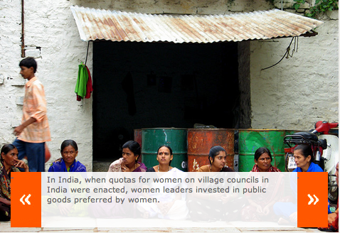
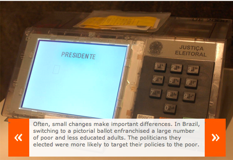

In the diverse melting pot that is the great Indian democracy, we all know the strong role ethnicity plays in deciding elections. In their book [Poor Economics](http://pooreconomics.com/), Abhijit Banerjee and Esther Duflo write about yet another RCT (Randomized Control Trial) they devised to determine whether it’s possible to change the voter’s natural mindset — to vote on ‘development issues’ instead on ‘ethnicity lines’.

> There’s a long tradition of scholars who think that voting in developing countries will end up being dominated by ethnicity. Their view is that ethnic loyalties are the basis of traditional societies and are bound to dominate political attitudes until the society modernizes. Yet the evidence suggests that ethnic voting is not as entrenched as is often believed. In one experiment in Uttar Pradesh during the 2007 state elections, Abhijit, Donald Green, Jennifer Green, and Rohini Pande worked with an NGO that ran a nonpartisan campaign (using street plays and puppet shows) around a simple slogin, “Don’t vote on caste, vote on development issues,” in randomly selected villages. This simple message reduced the probability that voters would choose a candidate from their own caste from 25 percent to 18 percent.
> 
> Why do some people vote based on caste but readily change their minds when an NGO asks them to rethink? One answer is that, often, voters actually know very little about what they are choosing — they have typically never met the candidate except at election time, when everyone shows up and makes more or less the same promises. There is no obvious mechanism for finding out, for example, who is corrupt and who is not, and there is a tendency to assume that everyone is equally corrupt. Nor do voters know very much about the actual powers of the legislators: In India, we have often heard urban dwellers blaming the state legislator for the condition of the drains in their slums, when in fact it is their local legislator who is supposed to take care of such problems, with the result that legislators feel that they will be blamed for whatever goes wrong, which does not create a strong incentive to perform.
> 
> Given that all the candidates look more or less the same to voters (and perhaps equally bad), the voters may feel that they might as well vote on caste: There is a small chance that caste loyalty will pay off and the politician will help, and in any case, what do they have to lose? But many of them probably don’t feel particularly strongly about it, which is why they are also easily swayed.

There’s more hope on the issue of candidate disclosure. The Association for Democratic Reforms (ADR) \[briefly covered in [this post](http://www.techsangam.com/2011/07/25/a-call-to-social-arms-part-1/)\], a 10-year old NGO, has successfully lobbied for mandatory disclosure of criminal, financial and educational background of candidates contesting elections to the Parliament and State Legislatures and Panchayat/Local Bodies, *prior to the polls*. This has already resulted in political parties using these disclosures as a filtering criteria to weed out egregiously bad candidates. Of course, much work needs to be done in spreading awareness about the candidates to the voters but that’s an easier problem to solve.