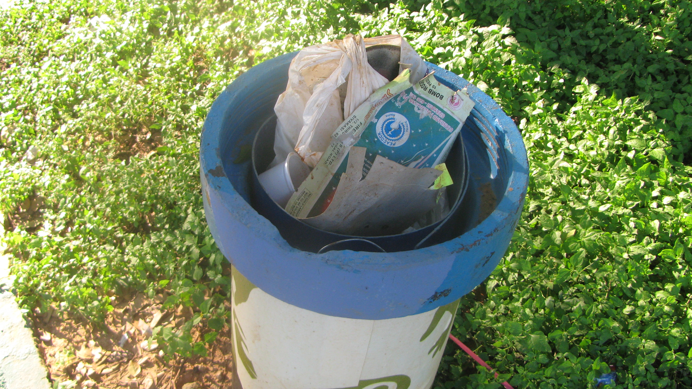
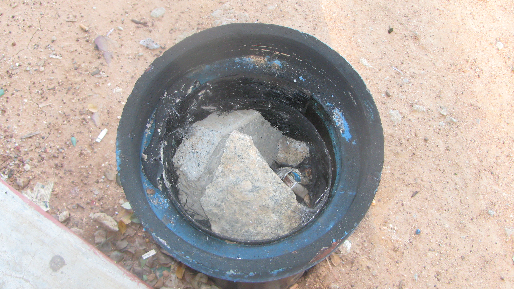
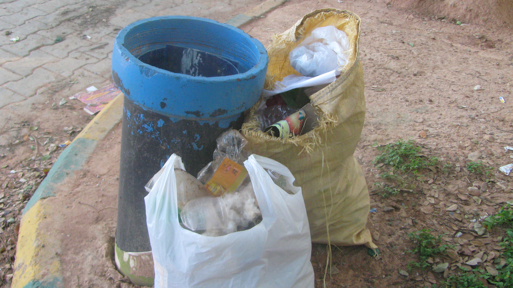
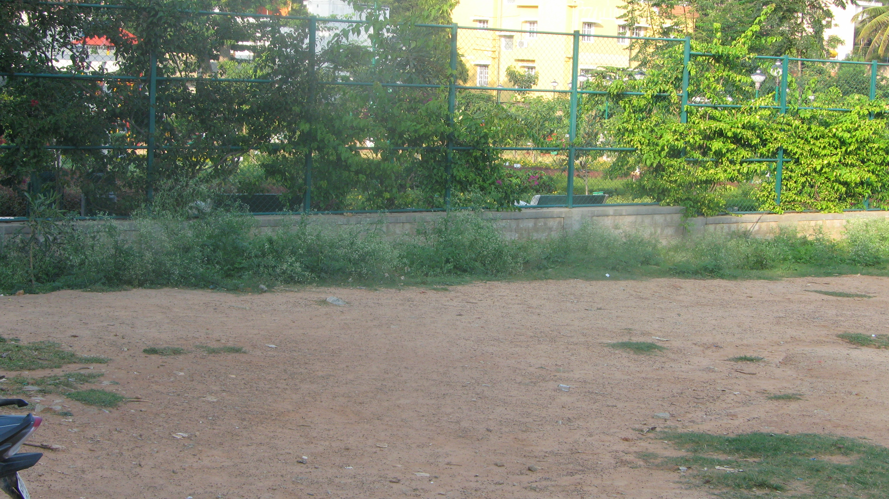

This is Part 2 of the two-part series and continues from [Calling Bangalore: Birthday Presents for The Ugly Indian](http://www.techsangam.com/2011/11/11/calling-bangalore-birthday-presents-for-the-ugly-indian/).

**Nov 10 (Thu) 4pm**: Second visit to playground

Hmm… What do we have here? A quick examination of TereBins #1 and #2 show that the bins have not been emptied since my visit 28 hours ago. The captions in pictures 8 & 9 tell the tale. An audit data point for TUI.

<figure aria-describedby="caption-attachment-463" class="wp-caption aligncenter" id="attachment_463" style="width: 300px">

<figcaption class="wp-caption-text" id="caption-attachment-463">Picture #8: In TereBin#1, loot from yesterday’s collection still remains: plastic bag, discarded slippers, Diwali cracker cartons.</figcaption></figure>

<figure aria-describedby="caption-attachment-464" class="wp-caption aligncenter" id="attachment_464" style="width: 300px">

<figcaption class="wp-caption-text" id="caption-attachment-464">Picture #9: Similar story at Terebin #2: bottles I dropped yesterday still in the bin. The cigarette butt is today’s trash – evidence of at least one person using the bin ☺</figcaption></figure>

<figure aria-describedby="caption-attachment-465" class="wp-caption aligncenter" id="attachment_465" style="width: 300px">

<figcaption class="wp-caption-text" id="caption-attachment-465">Picture #10: Hmm…Two large stones in TereBin #3 (not there y'day) – presumably to prevent the bin from toppling in a thunderstorm?</figcaption></figure>

Okay. Time to invoke TUI’s mantra – **Kaam chalu mooh bandh** (Stop Talking, Start Doing.)

I got the large Nilgiris plastic bag from my car, pressed the cap firmly down on my head and got to work on the greenscape (picture #6 from [Part 1](http://www.techsangam.com/2011/11/11/calling-bangalore-birthday-presents-for-the-ugly-indian/)). Before I knew it, the plastic bag was full and the greenscape was mostly clear – the trash I didn’t retrieve were the ones buried in active anthills and small pieces like Pan Parag wrappers. As I was stuffing the bag down next to the fence, someone called out from the adjoining park “Are you collecting the trash for someone?† I looked up to see an elderly lady (probably in her 60’s). I told her this was a birthday gift for The Ugly Indian – she knew all about TUI from the September SpotFixes and she smiled. The lady turned out to be Mrs. Heble (wife of a retired Air Marshal) who lives opposite the park. Her husband had fought for the park for 11 long years, a fight that included a battle in the High Court – very few good outcomes come about in India without a fight. Mrs. Heble is the patron/manager of the park and the cricket playing college students irk her to no end. She plans to increase the height of the fence to prevent the frequent park incursions caused by the local Yusuf Pathans clouting sixes. She took one look at the carcass of TereBin #4 and declared “those fellows have burned it!”

Mrs. Heble looked at my bulging plastic bag and asked if I needed any help (more plastic bags?) A split-second *dharma-sankat* raged in my head – I had planned on calling it a day but Mrs. Heble’s offer of an additional plastic bag was a sign that I needed to do more. I soon had a largish gunny bag and a ready-to-help Chhotu (Mrs. Heble’s adopted son). I had been ignoring a large pile of rotting and reeking-of-urine discarded clothes – it was now time to deal with that. As Chhotu held the bag wide open, I held my breath and started dumping the clothes into the bag. The gunny bag was not full yet so I did a trash walkthrough behind the gallery and it was full in no time (beer bottles were the new find!) The TereBins wouldn’t have enough space for the 2 bags of trash so I left them resting against Terebin #2 (Picture #11 below).

<figure aria-describedby="caption-attachment-466" class="wp-caption aligncenter" id="attachment_466" style="width: 300px">

<figcaption class="wp-caption-text" id="caption-attachment-466">Picture #11: TereBin #2 has some neighbours outside (hopefully only for a day)</figcaption></figure>

<figure aria-describedby="caption-attachment-467" class="wp-caption aligncenter" id="attachment_467" style="width: 300px">

<figcaption class="wp-caption-text" id="caption-attachment-467">Picture #12: The greenscape after my modest SpotFix</figcaption></figure>

**Nov 11 (Fri) 12:40pm**: Third visit to playground (sans camera)

Pleased to see that TereBin #2’s temporary neighbors have been carted away. The bottles in TereBin #1 still remain – maybe TUI’s policy is for the bin to fill up completely before it’s emptied? TereBin #3 still has the two heavy rocks in them – I didn’t remove them because I wanted to see if any conscientious soul would do in the next few days. I did a walkthrough of the playground – no noticeable littering has occurred since yesterday. That’s it for now. Over and out.

**Happy Birthday, The Ugly Indian! May your tribe increase!**

(Closing note: if you have time to read just ONE page on The Ugly Indian’s site, let it be the [About Us](http://www.theuglyindian.com/about_us.html) page).