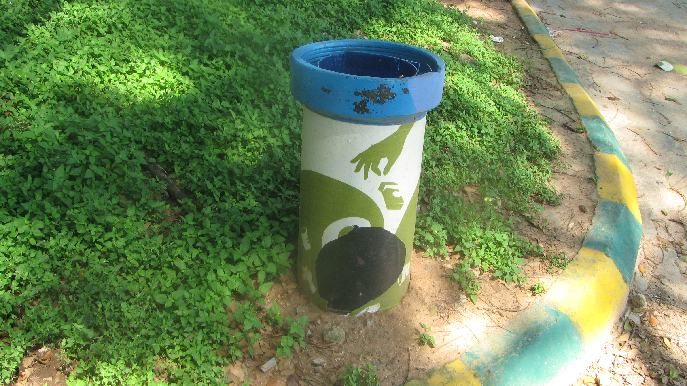
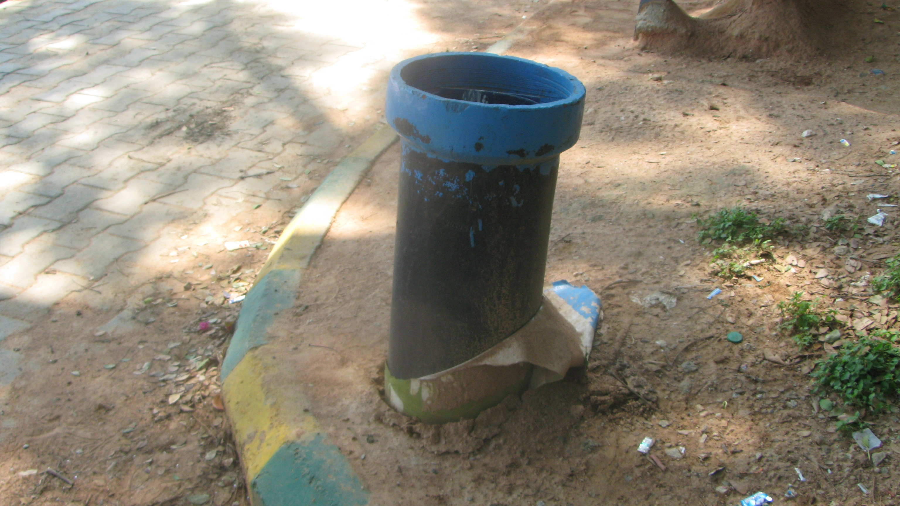
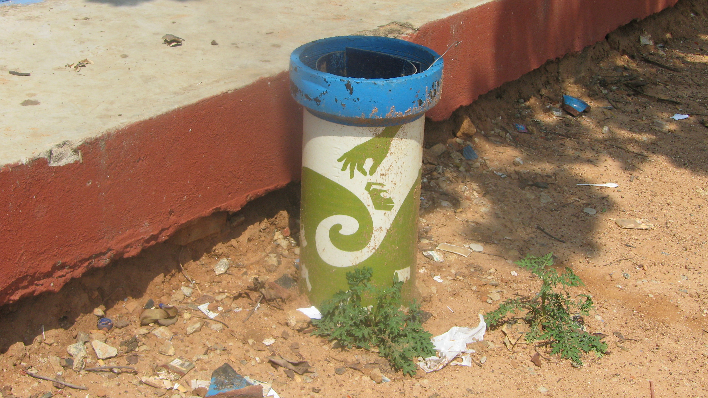
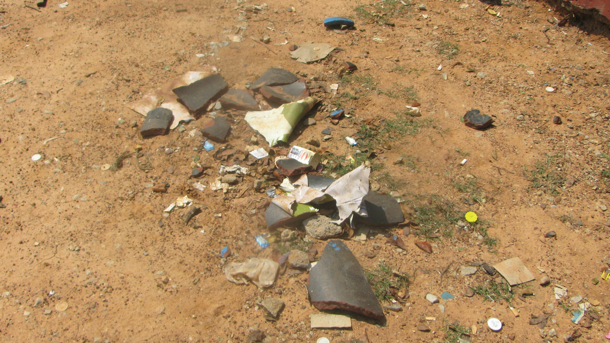
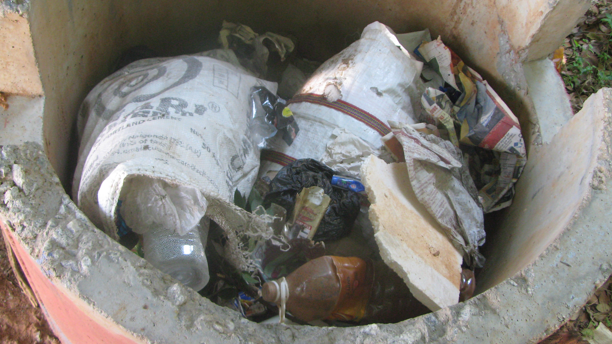
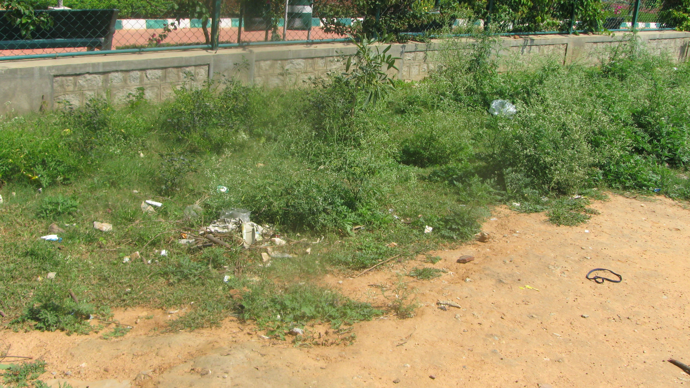
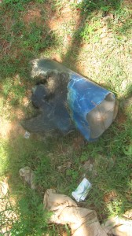

On Tuesday, The Ugly Indian (TUI) posted the following message on their Facebook page (~ 7,000 fans).

> We want a birthday present!  
> Show us you are more than a FB fan – go out and do a small spotfix this week. Outside your home or office. Whichever city you live in. If you’ve enjoyed seeing what we did all year in Bangalore, you now owe us one!
> 
> Do something small – all by yourself. And tell us (theuglyindian@gmail.com) or post it here. With photos, ideally! By Saturday.
> 
> Here are some ideas:  
> Remove a poster from a tree, remove a paan stain from a wall (with soap or paint), move debris or stones that lie around obstructing pedestrians or traffic, remove a poster from an electricity/telecom Blue box, sweep a street corner, pick up litter and put it in a tereBin (or any bin) – ANYTHING that makes a difference, however small.
> 
> Remember: ***Kaam Chalu Mooh Bandh***. Go out there and ‘do’ something.
> 
> Can’t wait for those birthday presents!

The significance of Saturday (Nov 12) is that they turn ONE! If you are scratching your head and wondering what or who “The Ugly Indian” is, I urge you to read this three-part series – a blow-by-blow account of their most recent ‘SpotFix’ starting with [Part 1: The Ugly Indian’s Gift to Bangalore on the occasion of Namma Metro launch](../2011/10/19/the-ugly-indians-gift-to-bangalore-on-the-occasion-of-namma-metro-launch/).

As a blogger, I could just end the post now because my primary responsibility (of ‘informing’ the public) is done. But… I didn’t become a fan of The Ugly Indian’s Facebook page merely to track the amazing work they were doing. While that was satisfying in of itself, I harbored a humble hope that someday I’d start ‘doing’ something instead of just ‘thinking’ or ‘writing’. It’s not that I haven’t done any volunteering or community service in my life. But [rebuilding together](http://www.rebuildingtogethersf.org/) projects 5 years in my past had stopped assuaging my conscience. Okay – enough of my self-indulgence. What gift could I give TUI?

To draw inspiration, I drove to the public playground in Koramangala 3rd Block (next to the Post Office). The playground was a fortunate recipient of a two-part SpotFix by TUI in September – the two videos tell the story in a way words cannot. Just last week, I had walked around the playground and noticed that one of the TereBins had become a Leaning Tower of Pisa (it had to be vandalism) and the outer cover of some of the TereBins was peeling off — made a mental note to email TUI.

<iframe allowfullscreen="true" class="youtube-player" height="394" src="https://www.youtube.com/embed/ejkYP4LVALI?version=3&rel=1&fs=1&autohide=2&showsearch=0&showinfo=1&iv_load_policy=1&wmode=transparent" style="border:0;" width="700"></iframe>

<iframe allowfullscreen="true" class="youtube-player" height="394" src="https://www.youtube.com/embed/66kAvp2ny18?version=3&rel=1&fs=1&autohide=2&showsearch=0&showinfo=1&iv_load_policy=1&wmode=transparent" style="border:0;" width="700"></iframe>

**Nov 9 (Wed) 11:30am**: Armed with a camera, I was ready for the “before” pictures.

<figure aria-describedby="caption-attachment-454" class="wp-caption aligncenter" id="attachment_454" style="width: 300px">

<figcaption class="wp-caption-text" id="caption-attachment-454">Picture #1: Terebin at the playground entrance – outer cover peeled off slightly at bottom, it’s being used though.</figcaption></figure>

<figure aria-describedby="caption-attachment-455" class="wp-caption aligncenter" id="attachment_455" style="width: 300px">

<figcaption class="wp-caption-text" id="caption-attachment-455">Picture #2: TereBin on the opposite side of entrance: outer cover fully peeled off; had some trash in it</figcaption></figure>

<figure aria-describedby="caption-attachment-456" class="wp-caption aligncenter" id="attachment_456" style="width: 300px">

<figcaption class="wp-caption-text" id="caption-attachment-456">Picture #3: TereBin #3 on the side of the left gallery: trash inside and outside (similar story for #5 on the far side)</figcaption></figure>

<figure aria-describedby="caption-attachment-457" class="wp-caption aligncenter" id="attachment_457" style="width: 300px">

<figcaption class="wp-caption-text" id="caption-attachment-457">Picture #4: Oh No! Is that what’s left of TereBin #4?</figcaption></figure>

<figure aria-describedby="caption-attachment-460" class="wp-caption aligncenter" id="attachment_460" style="width: 300px">

<figcaption class="wp-caption-text" id="caption-attachment-460">Picture #5: Lovingly-planted plants (from Sep SpotFix) have given way to garbage!</figcaption></figure>

<figure aria-describedby="caption-attachment-459" class="wp-caption aligncenter" id="attachment_459" style="width: 300px">

<figcaption class="wp-caption-text" id="caption-attachment-459">Picture #6: Another one-time clean-up seems to be in order</figcaption></figure>

<figure aria-describedby="caption-attachment-461" class="wp-caption alignleft" id="attachment_461" style="width: 168px">

<figcaption class="wp-caption-text" id="caption-attachment-461">Picture #7: Carcass of TereBin #4 found behind gallery next to a pair of discarded pants.</figcaption></figure>

**Nov 9 (Wed) 11:40am**: Pictures taken. What next? The procrastinator in me said “Good work with the pictures! Will return tomorrow with a few plastic bags and gloves and get to work on TUI’s birthday present.”  I glanced again at the greenscape in picture #6 and thought ‘maybe’ I’ll clear away some of the more egregious eyesores.  In my first sortie, I picked up bottles, large chunks of newspapers, Red Bull paper cartons, Diwali firecracker boxes, etc. The Koramangala playground (like any other Indian city open playground) has 3-4 cricket games in progress at any given time with mildly interested spectators some of whom cast a few curious looks as I puttered about (visual: laptop bag and camera bag slung over my shoulder, stuffing trash into a plastic bag). I looked at the loot and thought, 10 minutes of trash picking and I haven’t broken a sweat yet. Perhaps I can do more. In my next sortie, I expanded my theater of operations picking up all the bottles and large pieces of trash around the perimeter of the fence. Twenty minutes later I was stuffing an assortment of trash into TereBin #1 when a lizard scampered out – a stowaway from one of the plastic bags!

I surveyed the greenscape (picture #6) again and was not happy with how it looked. Sure, I had cleared some big eyesores but now the smaller eyesores were visible. Clearly TUI’s birthday gift wasn’t complete. I decided to return tomorrow.

Did I really return the next day? And make The Ugly Indian proud? Watch this space for the second and final part of the story. (*Update*: Link to [Part 2](http://www.techsangam.com/2011/11/11/calling-bangalore-birthday-presents-for-the-ugly-indian-part2/))