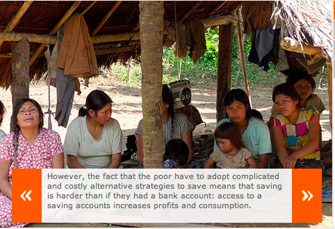

> SKS Microfinance Ltd, India’s largest and only listed microlender, said its losses widened in the second quarter from the preceding three months as repayment rates in Andhra Pradesh, its biggest market, plunged after a local law restricted lending and recovery. The Hyderabad-based lender posted a loss of Rs. 384.54 crore in the three months ended 30 September compared with a loss of Rs.218.74 crore in the preceding quarter, it said in a statement to stock exchanges on Monday. SKS had reported a Rs.80.54 crore net profit in the year-earlier period. \[[Livemint](http://www.livemint.com/2011/11/07194310/SKS-Microfinance-posts-Rs-385.html?h=B) Nov 7, 2011\]

This news flash on a former high-flyer and current poster-child of rapacious-VC-money-corrupting-social-sector caught my attention. Not for the reasons you might think. In chapter 8 (Saving Brick by Brick) of [Poor Economics](http://pooreconomics.com/), Banerjee and Duflo delve into the subject of savings and self-control – why a majority of the poor find it incredibly hard to save. This story (below) of a woman borrowing 10,000 INR (at 24% interest rate) from Spandana and depositing it into a savings account (earning 4% interest) in order to save for her daughter’s dowry years later is baffling yet believable.

> Indeed, if the lack of self-control is sufficiently serious, it would be worth *paying* someone to force us to save. For example, we might prefer to run the risk that the mortar on our freshly built walls might get washed away by the rain so that wouldn’t have to keep the cash on hand and risk that we might, on a whim, use it all for a party. And somewhat paradoxically, some MFI clients may borrow in order to save. A woman we met in a slum in Hyderabad told us that she had borrowed 10,000 rupees ($621 USD PPP) from Spandana and had immediately deposited the proceeds of the loan in a savings account. Thus, she was paying a 24 percent annual interest to Spandana, while earning about 4 percent on her savings account. When we asked her why this made sense, she explained that her daughter, now sixteen, would need to get married in about two years. That 10,000 rupees was the beginning of her dowry. When we asked her why she had not opted to simply put the money she was paying to Spandana for the loan into her savings account directly very week, she explained that it was simply not possible: Other things kept coming up.
> 
> We were still bothered by this rather unusual arrangement and kept asking questions. This attracted a group of other women, who were patently amused by our ignorance. Didn’t we know that this was a perfectly normal thing to do? The point, as we eventually figured out, is that the obligation to pay what you owe to Spandana – which is well enforced – imposes a discipline that the borrowers might not manage on their own.

The other story from Banerjee and Duflo’s book, [Psychology of Savings – How the Poor Save to Buy Fertilizer](http://www.techsangam.com/2011/10/21/psychology-of-savings-how-the-poor-save-to-buy-fertilizer/), highlights a different technique of discipline. It’s sometimes useful to ask the question – would rich or middle-income people do things differently?  As far as savings are concerned, even middle-income people find it equally hard to save. The power of default – i.e. deducting a fixed percentage from salaries for Provident Fund, recurring deposits, etc., by automatically deducting the savings amount even before it reaches the job earner’s hand, works. Designing (and making available) financial products that share the commitment features of the microfinance contracts, without the interest that comes with it, could be of great help to poor people. Are there any out there?