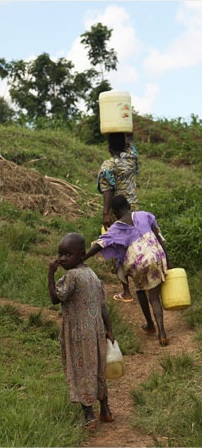

<figure aria-describedby="caption-attachment-478" class="wp-caption alignleft" id="attachment_478" style="width: 202px">

<figcaption class="wp-caption-text" id="caption-attachment-478">Pic: courtesy Pooreconomics.com</figcaption></figure>

If you’ve been following this blog for sometime, you know that I consider Abhijit Banerjee and Esther Duflo’s [Poor Economics](http://pooreconomics.com/) as a bible of sorts — to understand poverty, understand the psyche and motivations of the extremely poor, and the power of Randomized Control Trials (RCTs) to fairly assess efficacy of anti-poverty programs. Several posts on this blog have included excerpts from the book (along with some commentary in some cases). This post is intended to serve as a Table of Contents for all the individual posts already written.

- [For the poor, what could possibly be more important than food?](http://www.techsangam.com/2011/07/14/for-the-poor-what-could-possibly-be-more-important-than-food/) *“Instead of raging against their destiny, they have made things tolerable by reducing their standards. But they don’t necessarily reduce their standards by cutting out luxuries and concentrating on necessities; more often it is the other way around – the more natural way, if you come to think of it – hence the fact that in a decade of unparalleled depression, the consumption of all cheap luxuries has increased.”*
- [Health Insights from Banerjee Duflo’s Poor Economics](http://www.techsangam.com/2011/08/03/health-insights-from-banerjee-duflos-poor-economics/) *“Introduction of piped water, better sanitation, and chlorination of water sources was responsible for nearly three-fourths of the decline in infant mortality between 1900 and 1946 and nearly half the overall reduction in mortality over the same period.”*
- [Supply Demand Wars in Education Policy – Part 1](http://www.techsangam.com/2011/09/02/supply-demand-wars-in-education-policy-part-1/) *“Getting children into school is a very important first step: This is where learning starts. But it isn’t very useful if they learn little or nothing once they’re there. Somewhat bizarrely, the issue of learning is not very prominently positioned in international declarations: The Millennium Development Goals do not specify that children should learn anything in school, just that they should complete a basic cycle of education. The implicit assumption, presumably, was that learning would follow from enrollment. But unfortunately things aren’t that simple.”*
- [Supply Demand Wars in Education Policy – Part 2](http://www.techsangam.com/2011/09/06/the-supply-demand-wars-in-education-policy-part-2/) *“given that this is the part of India probably most notorious for discrimination against women, three years after the recruitment started, girls age five to eleven were about 5 percentage points more likely to be enrolled in school in the villages where there was recruiting. They also weighed more, suggesting that parents were taking better care of them: They had discovered that educating girls had economic value, and were happy to invest.”*
- [Middle ground between the supply-wallahs and demand-wallahs](http://www.techsangam.com/2011/09/07/middle-ground-between-the-supply-wallahs-and-demand-wallahs/) *“A civilized society cannot allow a child’s right to a normal childhood and a decent education to be held hostage to a parent’s whims or greed.  Building schools and hiring teachers is a necessary first step to lower the cost of sending a child to school, but it may not be enough. This rationale explains why most rich countries simply give parents no choice: Children have to be sent to school until a certain age, unless parents can prove they are educating them at home. But this clearly does not work where state capacity is more limited and compulsory education cannot be enforced.”*
- [Pratham’s Contributions to the Indian Education Policy Debate](http://www.techsangam.com/2011/09/10/prathams-contributions-to-indian-education-policy-debate/) *“The program took the twenty children in each classroom who most needed help and sent them to work with the balsakhi, a young woman from the community, on their specific areas of weakness. Despite an earthquake and communal riots, the program generated very large gains in test scores for these children – in Vadodara, about twice the magnitude of the average gains from private schooling that have been found in India. Yet these balsakhis were much less educated than the average private- (or public-) school teacher – many of them had barely ten years of schooling, plus a week’s training by Pratham.”*
- [Elitist School Systems – teachers with high ambition and parents with low expectations (double-whammy)](http://www.techsangam.com/2011/09/21/elitist-school-systems-teachers-with-high-ambition-parents-with-low-expectations/) *“They found that, on average, teachers gave significantly lower grades to lower-caste students when they could see their caste than when they could not. But interestingly, it was not the higher-caste teachers who were doing this. The lower-caste teachers were actually more likely to assign worse grades to lower-caste students. They must have been convinced these children could not do well.”*
- [Operation Magic Carpet and what it can teach us about reengineering education](http://www.techsangam.com/2011/10/06/operation-magic-carpet-and-what-it-can-teach-us-about-reengineering-education/) *“Sixty-five percent of the Ethiopian children had reached twelfth grade without grade repetition, compared to the only slightly higher 74 percent among the Russian emigrants. It turns out that even the most severe disadvantage in terms of family background and early life conditions can largely be compensated for, at least in Israeli schools, where the right conditions are met.”*
- [Psychology of Savings – How the Poor Save to Buy Fertilizer](http://www.techsangam.com/2011/10/21/psychology-of-savings-how-the-poor-save-to-buy-fertilizer/) “If the harvest was sufficient to pay for school fees and provide food for the family, he immediately sold the rest of his crop and used the money to purchase hybrid seeds, and if he had any leftover money, fertilizer. He stored the seeds and the fertilizer until the next planting season. He explained to us that he always bought the fertilizer in advance, because, like the Modimbas, he knew that money kept in the house would not be saved: When there is money in the house, things always happen, he said, and the money disappears.”
- [Voting in developing countries dominated by ethnicity? Banerjee and Duflo answer with.. yes (a RCT)](http://www.techsangam.com/2011/10/28/voting-in-developing-countries-dominated-by-ethnicity-banerjee-duflo-answer-rct/) *“during the 2007 state elections, Abhijit, Donald Green, Jennifer Green, and Rohini Pande worked with an NGO that ran a nonpartisan campaign (using street plays and puppet shows) around a simple slogin, Don’t vote on caste, vote on development issues,  in randomly selected villages. This simple message reduced the probability that voters would choose a candidate from their own caste from 25 percent to 18 percent.”*
- [Borrowing from MFI to save for daughter’s dowry?](http://www.techsangam.com/2011/11/14/borrowing-from-mfi-to-save-for-daughters-dowry/) *“The point, as we eventually figured out, is that the obligation to pay what you owe to Spandana – which is well enforced – imposes a discipline that the borrowers might not manage on their own.”*

  
