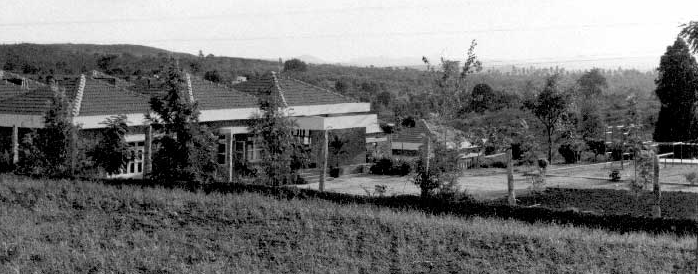

*\[Editor’s Note: This is the first of a 2/3-part series on online education trends and what it means for India. Part 2 will look at trends in the online high school and higher education verticals.\]*

**A young girl’s illustrated primer**

Science fiction novelists must be among the underappreciated visionaries of our times. A strong diet of science fiction novels during one’s teen reading years has the effect of not surprising you by “amazing” advances in technology. Rather, Isaac Asimov and Arthur C Clarke fans tend to be impatient about a technological future that has not yet arrived. Neil Stephenson’s [The Diamond Age: Or, a Young Girl’s Illustrated Primer](http://www.amazon.com/Diamond-Age-Illustrated-Primer-Spectra/dp/0553380966/ref=sr_1_1?s=books&ie=UTF8&qid=1322224981&sr=1-1) is a masterpiece that lays out one such future – a deeply personalized and adaptive learning experience delivered completely through a connected “illustrated primer” – a tablet super computer built with nanotechnology. The primer is designed to educate the daughter of one of the most powerful men in a futuristic “neo-Victorian” society and to teach her how to *think for herself*. Through a quirk of fate the primer is stolen and providentially gets into the hands of young Nell, an underprivileged girl from a dysfunctional family in one of the poorest parts of the world. Outside the realms of traditional schooling, Nell begins learning exclusively from the primer that, among many things, also melds remote mentoring experiences. By the time Nell hits her teens, she’s equipped and ready to lead a subversive movement. And with that teaser, I’ll end the mini book-review.

**Play, Pause and Rewind your Teacher**

<iframe allowfullscreen="true" class="youtube-player" height="394" src="https://www.youtube.com/embed/UuMTSU9DcqQ?version=3&rel=1&fs=1&autohide=2&showsearch=0&showinfo=1&iv_load_policy=1&wmode=transparent" style="border:0;" width="700"></iframe>

If you’ve not yet heard of [Khan Academy](http://www.khanacademy.org/) or the modern era’s best teacher without an education degree, this section is for you. Salman Khan (popularly goes by “Sal”), a whiz kid with three degrees from MIT (BS in math and a BS and MS in computer science), an MBA from Harvard and working on complex algorithms for a Wall Street hedge fund before he accidentally found his “calling”. Sal was giving math lessons to his New Orleans cousin (Nadia) over the phone. When they couldn’t meet, he started creating YouTube videos using Yahoo Doodle. Then came a startling revelation. Nadia preferred watching his YouTube videos instead of the synchronous tutoring sessions by phone/messenger. By pausing and rewinding the video (any number of times) for difficult concepts and skipping the easy bits, Nadia was able to pace her learning. She could do all this without seeming like a “slow learner” in Cousin Sal’s eyes. Replace Cousin Sal with a generic teacher and replace Nadia with millions of shy (or low-on-confidence) kids and the inadequacies of synchronous learning will be evident for all. This is also the reason why after-school coaching programs have become so popular (and necessary) for millions of students. A few distinguishing aspects of Sal’s YouTube videos that quickly made them the most popular channel in Education categories:

- Expert knowledge delivered in “plain speaking”  English
- Whiteboard with moving pen as the only visual and Sal’s voice in the background
- Majority of videos are 7-15 minutes in duration

Six years since the first video was created, Khan Academy now has 2,700+ videos across categories as diverse as math, finance, biology, chemistry and computer science. Four million+ students visit the Academy every month and have cumulatively watched 88 million lesson videos. On average, 150 lessons are being watched *every minute*!

**Learn at home and homework at school?**

Khan Academy’s raging success led them to an interesting experiment at a public school in Los Altos, California. Three schools offered up classes as test subjects – two fifth-grade classes and two seventh-grade classes. Instead of the classic learning-assessment model (bulk of school hours spent on teacher-directed learning and homework assignments), the experiment was to turn this model on its head. The students would learn relevant topics through Khan Academy videos *at home* and work on exercise sets in the classroom. As weird as it sounds, the flipping makes sense. It’s when students are grappling with problem sets that they need the most help. A useful dashboard tool from Khan Academy (with granular student-level analytics) is able to tell precisely where students get stuck. One of the Los Altos 5th grade teachers in the Khan Academy experiment reported stellar results across the board – only 3 percent of her students were classified as average or lower in end-of-year tests, down from 13 percent at midyear. And of course the precocious kids were racing ahead with advanced topics like inverse trigonometry. Khan Academy had crossed the rubicon from being the world’s best remedial education platform to a leading challenger in the mainstream education space or as Bill Gates famously characterizes it – *the start of a revolution*.

**Khan Academy meets Montessori**

<figure aria-describedby="caption-attachment-486" class="wp-caption aligncenter" id="attachment_486" style="width: 560px">

<figcaption class="wp-caption-text" id="caption-attachment-486">Valley School Bangalore (Established 1978)</figcaption></figure>

Closer to home in Bangalore, the quietly famous and eclectic [Valley School](http://thevalleyschool.info/) (one of five schools inspired by the eminent modern philosopher Jiddu Krishnamurti) has weaved the Montessori teaching method into their elementary and middle school programs. Grades 2, 3 and 4 all learn in a single classroom and grades 5, 6 and 7 are likewise grouped into a single classroom. One of the guiding principles of the Montessori method is that younger children act more mature in the presence of older children and vice versa. During one of my Saturday morning long runs earlier this year (a ritual marked by a high quality of intellectual stimulation with fellow runners) I remarked to my friend that the day Khan Academy “meets” Valley School’s Montessori model, education disruption would have reached the next inflexion point. With Sal Khan’s recently stated plans to start a private school where kids wouldn’t be divided by age and negotiation would be taught using board games, that inflexion point is round the corner. His crisp vision is vintage Sal Khan – *This could be the DNA for a physical school where students spend 20 percent of their day watching videos and doing self-paced exercises and the rest of the day building robots or painting pictures or composing music or whatever.*

*This 3-part series continues with:*

- *Part 2 will look at trends in the online high school and higher education.*
- *Part 3: [Peer Instruction Lessons from a Top Harvard Physics Professor](http://www.techsangam.com/2011/12/15/peer-instruction-lessons-from-a-top-harvard-physics-professor/)*