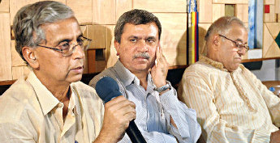

*\[Editor’s Note: Over the past few months*, *I had a series of conversations with Dr. Trilochan Sastry (Academic Dean, IIM-Bangalore). His academic pedigree is as blue-chip as it can get – B.Tech from IIT-Delhi, Ph.D from MIT, MBA from IIM-Ahmedabad, over a decade as faculty at IIM-Ahmedabad before moving to IIM-Bangalore in 2003. This blog post is intended to be a portrait of all the other areas where he’s made outstanding contributions.\]*

<figure aria-describedby="caption-attachment-490" class="wp-caption alignleft" id="attachment_490" style="width: 150px">

<figcaption class="wp-caption-text" id="caption-attachment-490">The game-changing Amul ad campaign</figcaption></figure>

**A brief story of Amul**

I recently finished reading Verghese Kurien’s autobiography [I Too Had a Dream](http://www.flipkart.com/books/8174364072/search-books-i-too-had-a-dream/1?pid=0v23fkmtvc&ref=e42670cb-00ed-4e24-b91e-bf959c33e5bc&_l=CJHVEqJO3veuHytbACc9dw--&_r=_RafKcSgwm750z6C80hKmA--). It’s a captivating and inspiring account of India’s phenomenally successful movement in dairy cooperatives. To provide just a glimmer of the success, GCMMF (Gujarat Cooperative Milk Marketing Federation), India’s largest food products marketing organization and owner of the Amul brand, is a state level apex body of 11,400 village cooperative societies, that roll-up to 12 district cooperatives and 2.36 million producer members. Through the National Dairy Development Board (NDDB), 96,000 dairy cooperatives across multiple Indian states have been integrated into a 3-tier structure called the *Anand Pattern*. In the early 1990s, Kurien and NDDB got the additional mandate of doing for the vegetable oil/oil seeds industry what they had done for dairy farming. By 1994, NDDB had organized 5,000+ Oilseed Growers Cooperatives and close to one million farmers, nineteen Oilseed Growers Unions across seven states, and built several modern oil mills owned by the farmers. The *Dhara* brand of cooking oil is possibly the most popular non-dairy brand that resulted from NDDBs efforts.

Fast forward 20 years and you’ll be hard pressed to find many instances of successful cooperatives outside dairy and sugarcane. In the 7-part series on commodity cooperatives in draught-prone regions published on TechSangam, Dr. Trilochan Sastry outlines several key reasons [Why commodity cooperatives differ from milk or sugar cooperatives](http://www.techsangam.com/2011/08/01/how-commodity-cooperatives-differ-from-milk-sugar-cooperatives/). The other big reason why dairy cooperatives (especially GCMMF/Amul) thrived was because Kurien was able to convince the “powers-that-be”  on the efficacy of the [pump-priming model](http://www.investopedia.com/terms/p/pump-priming.asp#axzz1dwVBLgJM) where millions of tonnes of milk powder, obtained as a gift from European countries, were sold by Amul and the profits reinvested in its operational growth.

<figure aria-describedby="caption-attachment-226" class="wp-caption alignright" id="attachment_226" style="width: 150px">

<figcaption class="wp-caption-text" id="caption-attachment-226">Trilochan Sastry (Academic Dean, IIM-Bangalore)</figcaption></figure>

**Tweaks to the Amul model**

“Nearly everything about cooperatives I learnt from Shashi Rajagopalan and Rama Reddy,”  Sastry told me during our second meeting in July 2011. After a short stint at the Indian School of Business (ISB) and prior to his appointment as Academic Dean of IIM-Bangalore, Sastry started Center for Collective Development (CCD), an NGO promoting the cause of commodity cooperatives in Andhra Pradesh. After 7 years of operation, CCD has established cooperatives in 50 villages in Adilabad and Anantpur districts and enrolled 2,500 members. Last year, the district level cooperatives had a turnover in excess of a few crores. Yet by his own admission, the pace of growth has been deliberately chosen – for sustainability rather than speed and growth.

Sastry is a firm believer of the NDDB/Amul model of cooperative development through value addition.  Value addition for commodity cooperatives within CCD’s roster started with the setting up of *dal* mills. The ultimate goal is the creation of an Amul-like brand in the savory snacks segment. Infrastructure for a manufacturing plant to create snacks, associated brand creation, and marketing are all capital-intensive activities. CCD has raised close to 10 crores to fund these activities. CCD loans  money to the cooperatives – this is how the *dal* mill was set up in Adilabad and also how additional manufacturing plants will be set up. This creates financial responsibility and discipline to generate sufficient surpluses. The other tweak to the classic Amul model that Sastry introduced is that members do not have to sell the entire produce to co-operatives; they can sell part of it in the open market. This flexibility enables lower-income farmers to address their debt.

**Academic turns into a Social Activist**

I always knew I wanted to do something meaningful for society. It just took a bit longer to get started. Sastry told me during one of our meetings. He was referring to his work with CCD and farmer cooperatives. Intellectually he had worked out that impoverished farmers were most in need of a helping hand and Verghese Kurien’s cooperative model as applied to commodity farmers had the greatest potential for lifting entire villages out of poverty. Before his epiphany on farmer cooperatives, Sastry wasn’t *just a successful academic* at IIM-A.

<figure aria-describedby="caption-attachment-491" class="wp-caption alignleft" id="attachment_491" style="width: 345px">

<figcaption class="wp-caption-text" id="caption-attachment-491">Trilochan Sastry (center), at a press National Election Watch conference</figcaption></figure>

Even before the RTI bill was passed by the Indian Parliament in 2005, Sastry had already donned another hat – this time to make a dent in the increasingly ubiquitous criminalization that had permeated Indian politics. The non-profit organization, [Association for Democratic Reforms](http://adrindia.org/) (ADR), was founded in 1999 by Sastry and several professors from IIM-Ahmedabad. Starting with a successful Public Interest Litigation (PIL) in the Delhi High Court and continuing with a series of legal spars with the Government of India, the Supreme Court passed a landmark judgment in March 2003 following which the Election Commission of India passed orders making it mandatory for disclosure of criminal, financial and educational background of Parliament, State, Panchayat and Local Bodies’ elections, *prior to the elections*. Dr. Sastry calls this the Al Capone story – where the FBI eventually nabbed Capone on a mundane charge of tax evasion. The ADR’s seemingly benign disclosures have set off a virtuous cycle of positive impacts in the political establishment. Even though voters are still not paying much attention to criminal cases pending against candidates, the national parties are using it to weed out their ‘really bad’ apples. When ADR started tracking the disclosures for the first election, there were 18% of candidates in Gujarat with criminal record. In the next election, that rate came down to 9%.

**New kind of Business School**

Resting on one’s laurels is a concept entirely foreign to Sastry. During my third meeting, he mentioned that he’s starting a new business school in Bangalore, in partnership with a business house. The school would be structured as a non-profit institution and the profits would be used to fund social causes. The additional social twist to the business school would be that 5-10% of students’ tuition fee would be either highly subsidized or waived altogether.

**Looking for a few good men/women**

A full-time teaching engagement, Academic Dean responsibilities, CCD, ADR, and now a new business school? Where does Dr. Trilochan Sastry find time for all of them? Sastry explained, “The trick is to ensure that you are not starting more than one initiative at the same time.” He’s still involved with ADR of course but the time commitment is significantly reduced as other Trustees and a National Coordinator have taken on more responsibility. While the business school venture is still at a nascent stage, it’s really CCD and its ambitious charter that requires a huge chunk of his time. With a two-year sabbatical approved by IIM-B, Sastry is ready to begin his next inning in early 2012. While CCD would be a top priority, including hiring a few good men and women to co-own and collaborate, during his sabbatical, that’s not all he intends to do. He has plans to write two books, covering topics that haven’t been written about yet. And he’s looking forward to spending quality time in a modest cottage at the foothills of the Himalayas. If there’s one person that exemplifies this Robert Frost classic, it is Dr. Trilochan Sastry.

*The woods are lovely, dark and deep.*

*But I have promises to keep, and miles to go before I sleep.*