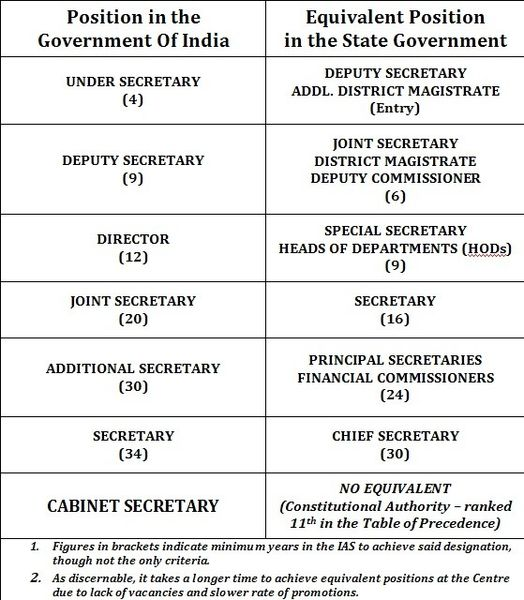
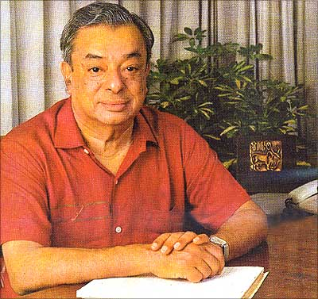

*\[Editor’s Note: One of my favorite policy wonks and Indian foreign policy expert, Nitin Pai, has often argued that the top item on India’s todo list is [Reforms 2.0](http://pragati.nationalinterest.in/2010/12/reforms20/). To the long list of second generation reforms, we propose that a sacred cow from India’s colonial past also be reformed – Indian Administrative Service (IAS). 2012 May 26: Added a very relevant link at the end.\]*

<figure aria-describedby="caption-attachment-497" class="wp-caption alignright" id="attachment_497" style="width: 524px">

<figcaption class="wp-caption-text" id="caption-attachment-497">Pic: Courtesy Wikipedia</figcaption></figure>

Suvojit Chattopadhyay and Doug Johnson make a persuasive case in this [LiveMint article](http://www.livemint.com/2011/11/23130933/Views--Is-the-IAS-a-steel-fra.html) that the IAS institution (originally created by the British under the moniker of Indian Civil Service) has outlived its utility. They write that the British designed it with the explicit goal of allowing a very small number of men to control a very large population. To this end, they concentrated all power and authority in the hands of these very few men with the rest of government acting as a support structure. A visit to the district collector’s office might have the following stereotypical scene:

*As anyone who has ever visited a district collector can attest, the scene is maddening: on a typical day, he engages in non-stopping screaming and signing while an endless stream of petitioners, sycophants and supplicants are marched in and out at a frenetic pace. A successful IAS officer today is seen as a hero, single-handedly fighting the odds when he should just an efficient and effective bureaucrat making the best of the resources available to him.*

**So what ARE the problems?**

The authors cite a few reasons why the ‘hero’ IAS officer is unable to delegate to other competent officers in the government machinery.

- The IAS has a stranglehold on most top positions at the central and state levels via ‘cadre’  designations.
- It could take a non-IAS person decades of dedicated government service to reach a level that IAS officers attain at a relatively early stage of their careers.
- The IAS absolves state governments from the arduous task of building capacity in government departments. Rather than engage in the politically dangerous task of recruiting staff, state governments often ignore departments, knowing that they can rely on the presence of an IAS officer to ensure that the department operates with a minimum of competency.
- In most cases, IAS officers are competent at their assigned positions even if the rest of their office is not. However, there are several departments where just being very smart and hard working is not enough. Managing large IT projects, running multi-crore education and health programs, leadership of cooperative dairy development programs require domain specific knowledge.

The IAS cadre also suffers from corruption (as a minority stakeholder of the government-bureaucrat-industry nexus) but that’s a different story altogether and not within the scope of this blog post.

**Proposed Fixes**

Arvind Panagariya, Columbia University economics professor and an expert on the Indian civil service, proposes two changes.

- *All top secretary level positions should be opened up to competition from at least the state services, if not to outside candidates. Going further and opening up all positions at the joint secretary level is also worth considering.*
- *Specialization should be encouraged. Currently, in decisions regarding promotion and staffing, general competency is valued much more than specialized skills. This may have made sense in the early days of independence but today Indian bureaucrats must oversee the administration of a vastly complicated government apparatus and regulate an equally complicated private sector. In this context, specialized skills are an absolute necessity for an effective civil service. One way of encouraging specialization would be to place a greater weight on candidates’ skills and experience in staffing decisions.*

As the authors note, none of this will be easy. The IAS is arguably India’s most powerful professional association and will very likely resist change.

**A Leaf from Verghese Kurien’s Wisdom Book**

<figure aria-describedby="caption-attachment-498" class="wp-caption alignleft" id="attachment_498" style="width: 300px">

<figcaption class="wp-caption-text" id="caption-attachment-498">Pic: Courtesy Rediff</figcaption></figure>

If one needed inspiration for the virtues of specialization in a government department, look no further than one man (Dr. Verghese Kurien) and an institution that’s synonymous with him – National Dairy Development Board (NDDB). In his autobiography, [I Too Had a Dream](http://www.flipkart.com/books/8174364072/search-books-i-too-had-a-dream/1?pid=0v23fkmtvc&ref=e42670cb-00ed-4e24-b91e-bf959c33e5bc&_l=CJHVEqJO3veuHytbACc9dw--&_r=_RafKcSgwm750z6C80hKmA--), Kurien writes about a clever clause he managed to draft for the Act of Parliament that created NDDB.

> For three decades I was the Chairman of the NDDB and was reappointed every three years. Many political parties came into power and yet whoever came to power in Delhi reappointed me. Yet in 1998, when after careful consideration I decided to pass on my responsibilities and submitted my resignation, all hell broke loose. The Cabinet Secretary in New Delhi and the Principal Secretary to Prime Minister Atal Behari Vajpayee immediately appointed a search committee to look for a successor. Certainly, the corpus must have been a tempting factor, but that money belonged to the farmers. How could I have allowed it to go into the hands of anybody other than whom I had groomed, and in whom the farmers had complete faith? There I was, grooming Dr. Amrita Patel as a successor for over two decades and they appointed a search committee!
> 
> They said they did not want Amrita Patel. They said they did not want somebody who had been groomed by me. But things were not that easy for the bureaucrats, largely because when I had been asked to draft the Act of Parliament, which set up NDDB, I had been rather clever about how it was worded. One of the clauses of the Act stipulated: the Chairman shall be professionally qualified in one or more specialties namely: agriculture, dairying, animal husbandry, rural economics, rural development, business administration or banking.
> 
> That is where they ran into trouble. They knew that they would have to find someone professionally qualified. Yet, the person had to be an IAS officer. It is not at all easy to find an IAS officer who is thus professionally qualified, but finally they identified an officer from Rajasthan.
> 
> Once more, while many bureaucrats tried to put a spoke in the wheel, there were others who supported us. Finally, Amrita Patel was appointed as Chairman, NDDB.

You may or may not agree with Kurien’s view that he alone could groom/select his ideal successor. I actually think that a search committee might well have converged on Dr. Patel as the best candidate. But the refreshingly simple and powerful precedent is that top bureaucrats in government departments should be appointed based on professional qualifications – by writ of law! Not by discretion (as it is with majority of appointments) or by a quirk of fate (Nandan Nilekani for UID)!

*May 26, 2012 Update*:

I stumbled upon this Sep 2011 article with some interesting developments – [Now, a CEO can compete with Bureaucrats for NHAI Chairman’s post](http://www.babusofindia.com/2011/09/now-ceo-can-compete-with-bureaucrats.html). Relevant extract below:

> In a major departure from the existing norms, the government has allowed CEO and COO of private infrastructure companies with a net worth of Rs 2,000 crore, to apply for the NHAI chairman’s post, according to a report appeared in a financial daily. Despite the salary of NHAI chairman is low at about Rs 11 lakh per year, in compared with Rs 60 to 80 lakh yearly remuneration of a CEO of a large infrastructure company, some former bureaucrat-turned CEOs are expected to join the race.In case of the CVC’s post, names of five non-bureaucrats were recommended out of the initial list of 40 probables. The Supreme Court hearing the PJ Thomas case directed a change of the policy and asked the government to consider eminent private persons as well for the job. According to an RTI which got wide publicity in national newspapers, candidates for the CVC’s post included corporate honcho Ajai Chowdhry of the HCL Info Systems whose name was recommended by the department of information and technology. He, however, withdrew his name later. Also, Vice-President’s secretariat recommended the name of the social worker Dr Leo Rebello for the post of the CVC.

