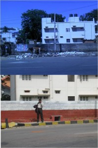
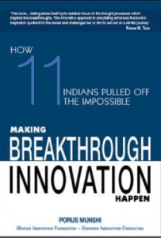
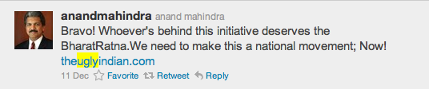

<figure aria-describedby="caption-attachment-505" class="wp-caption alignleft" id="attachment_505" style="width: 198px">
[](../../../../uploads/2011/12/tui_spotfix_oracle_krmgla.jpg)<figcaption class="wp-caption-text" id="caption-attachment-505">SpotFix in front of Oracle Koramangala office (top is “before”, bottom is “after”)</figcaption></figure>

It’s official, folks. The time has come to take my relationship with [The Ugly Indian](http://www.techsangam.com/2011/11/22/five-amazing-things-about-the-ugly-indian/) (TUI) to the next level. But first let me talk about how this relationship has evolved. It started with occasionally viewing their SpotFix videos on Facebook. After I started writing this blog, I made a half-hearted attempt to contact them for an interview post – you know how that ended, right?

Then in mid-October, mere days before the grand opening of Namma Bengaluru’s Metro, their picture-by-picture/comment-by-comment chronicling of their evolving Metro SpotFix caught my attention. And how it caught my attention! I finally “got” their unique modus operandi. With The Ugly Indian’s permission, I packaged their Metro SpotFix into a 5-act play – just adding some catchy section titles and using their pictures and captions, I published a three-part series, starting with [The Ugly Indian Gift to Bangalore on the occasion of Namma Metro launch – Part 1](http://www.techsangam.com/2011/10/19/the-ugly-indians-gift-to-bangalore-on-the-occasion-of-namma-metro-launch/).

On the eve of their first birthday, they sent an intriguing ‘call for birthday presents’ message. I was really “into them” by now so I [promptly obliged](http://www.techsangam.com/2011/11/11/calling-bangalore-birthday-presents-for-the-ugly-indian/). Somewhere at this point,my daily Facebook sessions became more about checking updates on TUI’s page and less about what my friends were up to. Pretty soon, a slew of mainstream news sites started writing about TUI. The venerable New York Times wrote a fairly accurate [Are we all Ugly Indians piece](http://india.blogs.nytimes.com/2011/11/18/are-we-all-ugly-indians/). Of course I had to chime in with my comments which, (obviously) became fodder for yet another TechSangam post – [Five amazing things about The Ugly Indian](http://www.techsangam.com/2011/11/22/five-amazing-things-about-the-ugly-indian/).

A few weeks ago, when my wife asked if I was writing any posts that were NOT related to The Ugly Indian, it seemed like a valid question. Did I have a TUI ‘problem’? Was I obsessed with TUI? If I was obsessed, was it a good thing? Was I over exposing my blog’s “core audience” with coverage of *one* community organization? Does an 8-month old blog even have a “core audience”? These were some of the questions I pondered about… as I continued sharing TUI updates… like this [SpotFix in front of Oracle’s Koramangala office](http://www.facebook.com/l.php?u=http%3A%2F%2Fwww.youtube.com%2Fwatch%3Fv%3D-wAHmk8J6Zk&h=eAQGh47IZAQFFQTEssVTWKCSp9VLzs7SPqnkMYxSu5HFV5w) and this [BBC’s interview ](http://www.facebook.com/l.php?u=http%3A%2F%2Fwww.youtube.com%2Fwatch%3Fv%3D8Jw_ynuyr_Y&h=iAQF78JgxAQFHFkz1Ude3JevF1K0fBk0UUIo58GV0Mq3QuQ)with an anonymous TUI spokesperson.

I didn’t have to introspect too much to realize that TUI had moved me deeply. I had already gone on record with “*The Ugly Indian is doing more for democracy than Anna Hazare’s India Against Corruption!”* Really? *“doing more for democracy?* Well, maybe not just <span style="text-decoration: underline;">*yet*</span>. I truly believe that the concept of TUI is far more powerful than a holier-than-thou, sometimes hypocritical, Team Anna. It inspires and, most importantly, provides a template for citizen action for solving problems that are NOT JUST for government bodies to solve. In many ways, TUI provides a blueprint for changing people’s attitudes and behavior, and start engaging positively with the less-than-perfect environment that is India. The Ugly Indian has nothing to do with corruption yet it has everything to do with the attitude change that Sourabh Thakur writes about in [Who is Corrupt?](http://ulaar.wordpress.com/2011/09/08/who-is-corrupt-essay-by-sourabh-thakur/)

[](../../../../uploads/2011/12/tui_porus_munshi_book.jpg)TUI doesn’t like to call itself a *movement*, so I’ll use phenomenon instead. The TUI phenomenon is going from strength to strength. After 52 weeks of SpotFixes in Bangalore, they’re opening the proverbial kimono, maybe just a wee bit. According to this [audio clip ](http://www.facebook.com/l.php?u=http%3A%2F%2Fwww.youtube.com%2Fwatch%3Fv%3DJDmkseOzZOY%26feature%3Dyoutu.be&h=0AQHHMuLkAQFHACpNXxn-Sxu5Nnt4tqXU7p05Y8aeMu68jQ) they shared recently, we learned that their inspiration was Surat Municipal Commissioner’s SR Rao who transformed Surat from a dirty woebegone plague-ridden city to India’s second cleanest city in 20 months flat! Bangalore-based Porus Munshi, author of [Making Breakthrough Innovation Happen](http://www.infibeam.com/Books/info/porus-munshi/making-breakthrough-innovation-happen-11-indians-pulled-off/9788172237745.html), was so impressed by TUI’s work that he featured them in the book’s Audio CD companion.

Back to my relationship with The Ugly Indian… Raising it to the “next level” means the following:

- Creation of [The Ugly Indian](http://www.techsangam.com/category/the-ugly-indian-2/) category.
- Instead of ad-hoc spur-of-the-moment posts, you can expect a rhythm of one post a week. Current one is Volume #7 because of six previous TUI posts. At the risk of jinxing things, my intention is to publish over the weekend (this post being an exception).
- The content of these weekly “chronicles” shall include a sampling of interesting TUI coverage, recent SpotFixes, and most likely also some older SpotFixes (many older fixes that haven’t received their just due).
- I survived 9 months without a smartphone but that’s going to change soon… not because I need the “web on the go”… because I need to capture all those SpotFix candidates in Bangalore as I’m traipsing around town!

And now for an illustration of the “Ugly Indian Chronicles” coverage you can expect in future posts.

Paul Rako, an engineer and blogger on EDN, weighs in with a compendium post on TUI – [Bangalore tech workers are The Ugly Indian](http://www.edn.com/blog/Anablog/41495-Bangalore_tech_workers_are_the_Ugly_Indian.php). He’s cherry-picked pictures and videos of a diverse set of SpotFixes along with his commentary. My favorite bit – *Like engineers everywhere, they love to solve problems. Like technical folks everywhere, they just wade in and do the work*. TUI loved the coverage but quickly gave the following disclaimer – *The Ugly Indians are anonymous and don’t know, or ask about, each others’ professions or backgrounds. We have no idea whether there are more engineers or bankers in the group, and it doesn’t really matter!*

A series of four tweets demonstrated the power of celebrity tweeters..

```
<span class="Apple-style-span" style="font-family: Georgia, 'Times New Roman', 'Bitstream Charter', Times, serif; font-size: 13px; line-height: 19px; white-space: normal;"><a href="../../../../uploads/2011/12/anandmahindra_tui_tweet0.png"></img></a><a href="../../../../uploads/2011/12/anandmahindra_tui_tweet1.png"></img></a></span>
```

```
<span class="Apple-style-span" style="font-family: Georgia, 'Times New Roman', 'Bitstream Charter', Times, serif; font-size: 13px; line-height: 19px; white-space: normal;"><a href="../../../../uploads/2011/12/anandmahindra_tui_tweet2.png"></img></a><a href="../../../../uploads/2011/12/tharoor_tui_tweet.png"></img></a></span>
```

```
<span class="Apple-style-span" style="font-family: Georgia, 'Times New Roman', 'Bitstream Charter', Times, serif; font-size: 13px; line-height: 19px; white-space: normal;">No prizes for guessing what happened to theuglyindian.com's site a few hours later... Their bandwidth quota with their hosting provider got exceeded and the site experienced some downtime. So, this crack group of UIs will now start paying a higher hosting fee. And no, they don't have any Google Ad Sense on their site either so...what are you waiting for? Go on - adopt some <a href="https://www.facebook.com/photo.php?fbid=243843629008233&set=a.125833837475880.17876.123459791046618&type=1&theater">TereBins in your neighborhood</a>!</span>
```