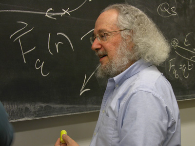
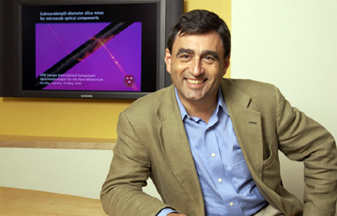

Last week I attended an interesting event on continuing education hosted by the Indian Semiconductor Association (ISA). Speakers at the event included the vice-chancellors of UC Berkeley and Gujarat Technological University (GTU), head of Stanford’s Asia Pacific Research Center, and founder of Seer Akademi.

During the Q&A session, a questioner (from Synopsys) had a rather ‘innocuous’ question. *Noting that MIT had made its OpenCourseWare (OCW) videos available to the general public for years and with millions benefiting, why then wasn’t UC Berkeley just making all their lectures available online instead of this seemingly elaborate partnership with Seer Akademi?* Berkeley’s Dean of Continuing Education Dr. Diana Wu had a simple answer – *Berkeley has also contributed a large set of lecture videos to the public domain. But viewing a lecture is just the start of learning. Since we award a course grade, there will be some kind of assessment, administered by our faculty.* Earlier in the evening, Stanford’s Rafiq Dossani had also shared (via Webex) that lecture content in major US universities tends to be about 15% of students’ activity. The equivalent percentage in Indian universities is a whopping 58% but that’s another story.

**Khan Academy vs. MIT OpenCourseWare**

<figure aria-describedby="caption-attachment-509" class="wp-caption aligncenter" id="attachment_509" style="width: 587px">

<figcaption class="wp-caption-text" id="caption-attachment-509">Pic: Courtesy ocw.mit.edu</figcaption></figure>

MIT [recently announced](http://tech.mit.edu/V131/N57/khan.html) that Sal Khan (Khan Academy’s Founder &amp; Faculty Head) would be delivering the keynote address at MIT’s commencement next year. The article also had an interesting insight. Khan’s videos are typically 10-15 minutes long, focus on very specific topics and were built with online consumption in mind. OCW, on the other hand, are lectures exceeding an hour and cover a gamut of topics. Is it a wonder that Khan Academy’s Youtube views are 3 times higher than OCW’s Youtube channel views in spite of OCW’s 3-year headstart?

The OCW vs. Khan Academy reinforces Diana Wu’s point that a great lecture doesn’t necessarily translate to automatic learning. Which brings us to the title of this blog post – peer instruction. My Bay Area friend and regular TechSangam commenter, Dhana Suresh, shared this wonderful KQED story – [Don’t Lecture me: Rethinking How College Students Learn](http://mindshift.kqed.org/2011/09/dont-lecture-me-rethinking-how-college-students-learn/) – about a group of college physics professors (led by University of Maryland’s Joe Redish) were seeing serious shortcomings of traditional lecture pedagogy and were researching new learning methods. This was the 1970s and 1980s.

<figure aria-describedby="caption-attachment-510" class="wp-caption alignleft" id="attachment_510" style="width: 400px">

<figcaption class="wp-caption-text" id="caption-attachment-510">Dr. Joe Redish, University of Maryland physics professor &amp; education researcher (Pic courtesy: publicradio.org)</figcaption></figure>

*When Redish realized that most of his students were not motivated to learn physics, he reflected on his own college years and recalled that he didn’t learn much from lectures either, most of his learning was from fellow students or from the TA (Teaching Assistant). A lot of students can repeat the laws of physics and even solve complex problems, but many are doing it through rote memorization. Most students who complete a standard physics class never understand what the laws of physics mean, or how to apply them to real-world situations.*

**Birth of Peer Instruction**

In the early 1990s, Harvard physicist Eric Mazur read about Redish’s research and could immediately relate to his own classroom observation – that students were getting through class by rote and not by a fundamental understanding of the concepts. After a class test in which 50% of his students got the answer to a fundamental question wrong, Mazur went the extra mile in re-teaching the concept, complete with elaborate drawing aids. At the end of that teaching session, his classroom still had the same blank look. Resisting the urge to tear out his hair, Mazur reminded himself that ½ his class had answered the question correctly so, on an impulse, he told the students to discuss the question with each other. The rest, as they say, is history.

<figure aria-describedby="caption-attachment-511" class="wp-caption alignright" id="attachment_511" style="width: 425px">

<figcaption class="wp-caption-text" id="caption-attachment-511">Dr. Eric Mazur, Harvard University Physics professor (Pic courtesy: harvard.edu)</figcaption></figure>

The classroom erupted in pandemonium (the students who “got it”  were dying to explain it to the ones who didn’t) and, after just a few minutes of discussion, the class had a much better understanding of the concept. Mazur explains the ironical learning from his experiment.

*Imagine two students sitting next to one another, Mary and John. Mary has the right answer because she understands it. John does not. Mary’s more likely, on average, to convince John than the other way around because she has the right reasoning. Mary is more likely to convince John than professor Mazur! She’s only recently learned the concept and has some feel for the conceptual difficulties unlike Mazur who has learned it a long time ago and no longer understands why somebody has difficulty grasping it. The irony of becoming an expert is that “It becomes not easier to teach, it becomes harder to teach because you’re unaware of the conceptual difficulties of a beginning learner.”*

This, in my opinion, explains why Sal Khan and Khan Academy are so phenomenally successful. For all the expertise that Sal Khan naturally possesses (or has taught himself), his style is clearly that of peer instruction, keenly aware of the conceptual difficulties of a beginning learner.

**Peer Instruction at Harvard**

Mazur now teaches by questioning, instead of telling. Prior to each class, students are assigned reading in the textbook. Many professors assign reading prior to classes but Mazur gives a pop quiz to students *before* they come to class. In the last question, students tell Mazur what confused them. Mazur uses the responses to create a set of multiple-choice questions he uses during class. The class functions as follows:

1. Brief overview of a concept by Mazur.
2. Mazur asks a question (from his pre-created set). Students answer using their mobile within one minute – results are collated on Mazur’s laptop in real-time.
3. Peer instruction time (students talk to their neighbors about the question).
4. Students re-answer the question.
5. Steps 1 through 4 are repeated for all the questions in Mazur’s set.

Australia’s Monash University is using the peer instruction method in a whole range of courses. On a final note, we had previously written about Seer Akademi – [Creating a nation of electronics geeks](http://www.techsangam.com/2011/08/02/creating-a-nation-of-electronics-geeks/). Seer is using an interesting hybrid model of distance education using a notion of “near-peers” — more on that in a subsequent post.

Related post: [Global Online Education Trends and its Import for India](http://www.techsangam.com/2011/11/28/global-online-education-trends-and-its-import-for-india/)