The TUI highlight in the past week is the SpotFix at Prestige St. Johns Wood – behind Oracle’s Koramangala office. This SpotFix merits a ‘Super’ prefix because they also installed a bay of urinals (WonderLoos in ‘Ugly Indian speak’). The TUI released video tells all:  
*Sep 2012 Update: There’s an FAQ on Wonderloos at the end.*

<iframe allowfullscreen="true" class="youtube-player" height="394" src="https://www.youtube.com/embed/m8fikwv3Obg?version=3&rel=1&fs=1&autohide=2&showsearch=0&showinfo=1&iv_load_policy=1&wmode=transparent" style="border:0;" width="700"></iframe>

Some of my friends (on Facebook) are wondering if the WonderLoos will work, how long they will work, etc. All valid questions. To answer them, I thought it will be good to look at the first set of WonderLoos TUI installed on Church Street *10 months ago*. According to comments on TUI’s Facebook page, the WonderLoos are alive, kicking, and still working! I’m meeting somebody at Koshy’s this evening – I’ll be sure to swing by and test-drive one of the Church Street WonderLoos after my meeting. Meanwhile, here’s a sequence of photos TUI shared on Facebook after the Church Street WonderLoo SpotFix – enjoy!

<table><tbody><tr><td><figure aria-describedby="caption-attachment-523" class="wp-caption alignleft" id="attachment_523" style="width: 300px">

[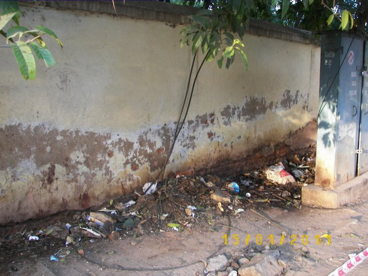](../../../../uploads/2011/12/tui_wloo1.jpg)<figcaption class="wp-caption-text" id="caption-attachment-523">Picture 1: Ugly Wall on Church Street</figcaption></figure>

</td><td>**Picture 1**: This Ugly Wall acts as the urinal on Church Street. It services the needs of urinators all the way from Brigade Rd junction till Amoeba/Blossom Book Shop – a distance of about 300 metres (with over 100 shops &amp; establishments and no public bathroom). It offers privacy, ample space to pick your spot (over 50 metres) and as the Wall has no clear owner (there is no gate or signboard), there is nobody who objects.</td></tr><tr><td><figure aria-describedby="caption-attachment-524" class="wp-caption alignleft" id="attachment_524" style="width: 300px">

[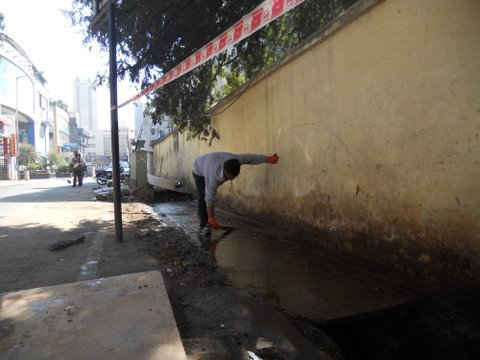](../../../../uploads/2011/12/tui_wloo2.jpg)<figcaption class="wp-caption-text" id="caption-attachment-524">Picture 2: after the wash</figcaption></figure>

</td><td>**Picture 2**: A bunch of Ugly Indians went one day and washed and cleaned the entire footpath. Quite a job! It had clearly never been done before, and several interesting objects and lifeforms were discovered and removed:)</td></tr><tr><td><figure aria-describedby="caption-attachment-525" class="wp-caption alignleft" id="attachment_525" style="width: 300px">

[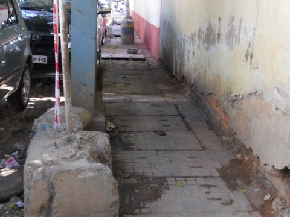](../../../../uploads/2011/12/tui_wloo3.jpg)<figcaption class="wp-caption-text" id="caption-attachment-525">Picture 3: After a day of cleaning and disinfecting</figcaption></figure>

</td><td>**Picture 3**: This is what it looked like after a day of cleaning and disinfecting. Not great, but one could actually stand here and breathe (this wasn’t possible earlier – the entire stretch reeked). Notice how the parked cars, and the telephone pillar make this a nice, quiet nook.</td></tr><tr><td><figure aria-describedby="caption-attachment-526" class="wp-caption alignleft" id="attachment_526" style="width: 220px">

[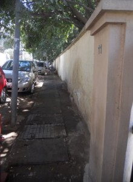](../../../../uploads/2011/12/tui_wloo4.jpg)<figcaption class="wp-caption-text" id="caption-attachment-526">Picture 4: More details on the wall</figcaption></figure>

</td><td>**Picture 4**: It is a long stretch indeed – the length of 12 parked cars. This wall is the rear wall of the Military Rest House, that stands on Rest House Road. As they have no rear gate, this is a crumbling, neglected brick wall, and they are not affected by the ‘activities’ here. Out of sight, out of mind. The neighbouring house – 11, Church Street – is a bungalow from the 1950s (one of the last survivors on Church Street) and its occupants have to suffer this stench everyday.</td></tr><tr><td><figure aria-describedby="caption-attachment-527" class="wp-caption alignleft" id="attachment_527" style="width: 300px">

[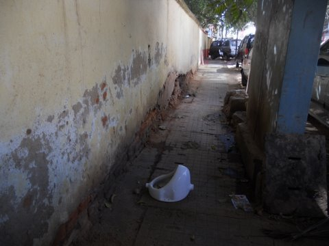](../../../../uploads/2011/12/tui_wloo5.jpg)<figcaption class="wp-caption-text" id="caption-attachment-527">Picture 5: Operation WonderLoo begins</figcaption></figure>

</td><td>**Picture 5**: Operation WonderLOO begins. We speak to the Garrison Engineer at the Military Rest House who agrees that a urinal will solve the problem. Otherwise people will simply go elsewhere. It takes an armyman to appreciate that this is a sensible solution. Most people who complain about people urinating on walls would also NEVER agree to have a urinal on a wall outside their shop or house. Would you? Think about it. Just like people don’t like nuclear plants or garbage landfills near their homes, people don’t like a public urinal either. This is the crux of the matter – finding a piece of land to locate a urinal that is acceptable to the neighbours.</td></tr><tr><td><figure aria-describedby="caption-attachment-528" class="wp-caption alignleft" id="attachment_528" style="width: 300px">

[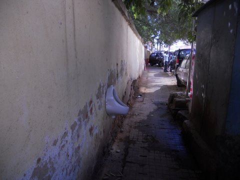](../../../../uploads/2011/12/tui_wloo6.jpg)<figcaption class="wp-caption-text" id="caption-attachment-528">Picture 6: Urinal donated by Military Rest House</figcaption></figure>

</td><td>**Picture 6**: This urinal is donated by the Military Rest House. The BSNL telecom engineers who work in this muck everyday (yes, the poor chaps have to repair phone connections in that blue box) also like the idea, and provide us the power drill to fit the urinal in the wall. Everyone believes that a well-maintained urinal will solve the problem, and gives us a chance to try this experiment.</td></tr><tr><td><figure aria-describedby="caption-attachment-529" class="wp-caption alignleft" id="attachment_529" style="width: 300px">

[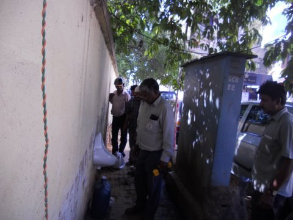](../../../../uploads/2011/12/tui_wloo7.jpg)<figcaption class="wp-caption-text" id="caption-attachment-529">Picture 7: final inspection</figcaption></figure>

</td><td>**Picture 7**: The BSNL telecom engineers and the Military personnel do a final inspection, and give their seal of approval.A local dealer in rubber goods donates rubber mats, and the cybercafe offers plywood pieces, and his carpenter, to construct the urinal structure.</td></tr><tr><td><figure aria-describedby="caption-attachment-530" class="wp-caption alignleft" id="attachment_530" style="width: 220px">

[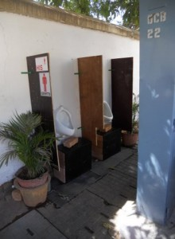](../../../../uploads/2011/12/tui_wloo8.jpg)<figcaption class="wp-caption-text" id="caption-attachment-530">Picture 8: WonderLoo ready to receive customers</figcaption></figure>

</td><td>**Picture 8**: Voila! WonderLOO is ready to receive customers! Notice that the entire wall is painted and cleaned, the telephone box is cleaned and painted too, the floor is dry and spotless, the floor mats are in place, it actually smells nice (citronella phenyl), and is actually quite inviting.</td></tr><tr><td><figure aria-describedby="caption-attachment-531" class="wp-caption alignleft" id="attachment_531" style="width: 220px">

[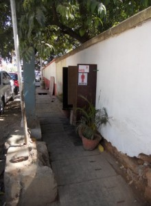](../../../../uploads/2011/12/tui_wloo9.jpg)<figcaption class="wp-caption-text" id="caption-attachment-531">Picture 9: WonderLoo hidden from view from the road</figcaption></figure>

</td><td>**Picture 9**: The WonderLOO is hidden from view from the road. The sign HIS helps first-timers discover that it is a loo.If you walk along the footpath, you can actually walk through the loo without realising it is a loo. Several people do that everyday!</td></tr><tr><td><figure aria-describedby="caption-attachment-532" class="wp-caption alignleft" id="attachment_532" style="width: 220px">

<figcaption class="wp-caption-text" id="caption-attachment-532">Picture 10: Parked cars provide privacy</figcaption></figure>

</td><td>**Picture 10**: The parked cars continue to provide privacy, and the tree above makes for a nice setting. You can hear the birds above when you use the WonderLOO!And because it is open-air, and normally quite breezy, there is no foul smell.</td></tr><tr><td><figure aria-describedby="caption-attachment-533" class="wp-caption alignleft" id="attachment_533" style="width: 220px">

[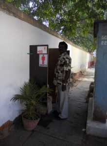](../../../../uploads/2011/12/tui_wloo11.jpg)<figcaption class="wp-caption-text" id="caption-attachment-533">Picture 11: the area’s BBMP Sanitary Inspector</figcaption></figure>

</td><td>**Picture 11**: This gentleman is the BBMP Sanitary Inspector of the area. He is one of our biggest supporters, and endorses this project. With this WonderLOO, the job of the sweepers who report to him is so much easier and more dignified. Earlier, women sweepers had to clear the muck in the vicinity everyday – now they find their job much easier and the results are more visible. The entire sanitation team on Church Street is a huge supporter of the Wonderloo.</td></tr><tr><td><figure aria-describedby="caption-attachment-534" class="wp-caption alignleft" id="attachment_534" style="width: 220px">

[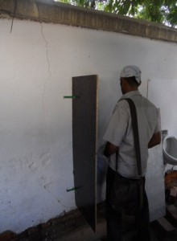](../../../../uploads/2011/12/tui_wloo12.jpg)<figcaption class="wp-caption-text" id="caption-attachment-534">Picture 12: volunteer who agreed to be photographed</figcaption></figure>

</td><td>**Picture 12**: This is a volunteer who agreed to be photographed. We have dozens of more photos of users – the next time you take a walk on Church Street, take a peek here and you will see a user. There are queues in the evenings, when pub-goers go here as groups to relieve themselves.What is most fascinating is that the place is kept very clean by users. No paan stains, no ciggie butts, no spillage and no vandalism.</td></tr><tr><td><figure aria-describedby="caption-attachment-535" class="wp-caption alignleft" id="attachment_535" style="width: 300px">

<figcaption class="wp-caption-text" id="caption-attachment-535">Picture 13: View from the other side</figcaption></figure>

</td><td>**Picture 13**: A view from the other side. The WonderLOO is located near the red parked car behind the group of girls, and near a sign which says P!This is an important part of the design. Locate the WonderLOO somewhat out of sight of passersby, but make it visible enough for those who really need to use it. As it doesn’t smell, it is quite easy to walk by without even knowing it exists.There was a lot of trial and error in getting this right – the design, the installation, the maintenance. But once installed on Jan 26, 2011, the Wonderloo has served well for 10 months! Go take a look sometime. Many more WonderLOOs will soon come up.</td></tr></tbody></table>

**Wonderloo FAQ**  
Some of the questions (and answers) – harvested from TUI’s Facebook page..

Q: How do you flush the Wonderloos?  
A: Flushing is not required. Open-air toilets are well ventilated, and we ensure no stagnation of urine through daily cleaning. A ‘urinal cake’, some naphthalene balls, and some water/phenyl once a day – and it can handle over 300 uses, without giving off any odour. Hard to believe – but there is chemistry at work here. Urine gives off an odour (ammonia) only when exposed to sunlight – if you ensure liquid flow through cleaning there is no odour at all. Our Chuirch Street loos are outside some pubs and have seen heavy usage the past 11 months – they are cleaned just once every morning.

Q: Didn’t the WonderLoo construction require permission from BBMP?  
A: Technically the WonderLOO is an encroachment on public property. The BBMP is within their right to confiscate it. We just know they won’t, as they fully understand what this is about. We took ‘informal’ no-objection, and told them they could remove it if they did not like it. They also know that we maintain it better than they ever could, that we are not deriving any commercial revenue from it, that we actually rescued the footpath and made it walkable, and that it actually solves a problem they cannot solve (there simply is no land available here to erect a ‘proper’ public bathroom). Most TUI solutions are true ‘solutions’ that deal with the uncertainties of our cities and archaic laws – as it is not feasible for the government to provide a similar solution.

Q: Is there a garden planned on the footpath? That beautification may attract a few people who still walk on the street.  
A: In the longer-term. There are certain upstream and downstream issues still to be resolved – ugly spots on either side of this place. The entire street is incredibly ugly, and we are chipping away one spot at a time. There is no other way – the dynamics and stakeholders for each ‘spot’ are different.

Q: Dear TUI, Would you also address the goshala owners , on why they would leave the cows on road ?or I guess just removing their food will automatically resolve the issue?  
A: We have spoken to a few of them. There are somewhat complex and sensitive livelihood issues involved (cows eating garbage is the least of their concerns – they KNOW it is not good for their cows), and we are working on them. Will report once we make a breakthrough – these things take time:)