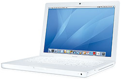

 Apple's 1st line of Intel-powered (Core Duo) MacBooks

When I turned my back on a corporate career and embarked upon a protracted stint as a full-time blogger, I knew I had to make some adjustments. I was mentally prepared for the 12-18 months of cash flow impact but that was only the first adjustment.

I reached into my inner ‘Indian middle class’ roots for inspiration. My wife was convinced that those roots were long dried up. She fully expected me to outfit myself with the latest MacBook Pro (I’ve been a Mac user since 2003) and the latest smartphone before I hit *Publish* on my first blog post.

As it turned out, I surprised myself as much as I did my wife. I dusted off my 2006 MacBook (heavily used for its first two years, lightly used for the next three) and my 2007 Nokia N75 (then one of the ‘leading lights’ among camera phones), bought new batteries and got to work. Nine months later, these antiquated bad boys haven’t made me feel like I belong in the twentieth century. Eschewing a smartphone and sticking with the N75 has been a game changer but…that’s a story for another day (this one’s about my MacBook – MB).

As I subjected the venerable MB to a daily regimen of two browser windows (with a gazillion open tabs), Word, Excel and an occasional iPhoto, it started creaking, whining and groaning (literally and figuratively)! The creaks were tended to easily enough with a judicious use of scotch tape. The whining and groaning? MB was not getting any younger and it was still running Tiger (Mac OS 10.4) so… A few weeks after Apple fanboys were urgently upgrading to Lion (the latest latest version), I finally upgraded MB to Snow Leopard (Mac OS 10.6). Boy! what a difference that upgrade made. Everything became significantly faster – booting up, shutting down, application loading and context switching!

What didn’t change was the cooling fan behavior. Perhaps my usage of MB changed after the Snow Leopard upgrade… I suppose I had started running more applications simultaneously and since Google Chrome was a heck of a lot more stable than Firefox, I was possibly using more tabs than before? I started noticing that once the cooling fan came on, it would just not switch off until MB went to sleep mode or shut down. Since there were so many open tabs (with so many half-read articles), to preserve my blessed “context”, I found myself doing less and less shutdowns – my procrastination was reaching the level of an art form.

A few weeks ago, MB started speaking up. Above the regular whirring of the fan, I would occasionally hear other sounds – sudden high pitched wails lasting a few minutes to irregular tap-taps that sounded like a hard drive in distress. I was alarmed of course. My backup frequency changed from weekly to daily. I also started getting selective about which applications remained open throughout the day. The number of open tabs on the Chrome browser perceptibly reduced.

Then 2 days ago, in the midst of a rather innocuous work session, MB abruptly shutdown. This had NEVER happened in MB’s 5 years and 6 months of existence (application and system hanging – yes! but not this!). After a 1-hour break, I booted up MB again – it worked fine for the rest of the day (non-continuous usage though).

The next day, abrupt shutdowns happened twice. It now increasingly appeared that MB’s days might be numbered. A few hours after the last shutdown, it suddenly dawned on me that I was no longer hearing the whirring of the cooling fan. The fan must have got fried and the overheated circuitry was probably triggering emergency shutdowns! A few Bing searches later, my speculation had turned into a real hypothesis. So what next? In a few days I’ll be taking MB to an Apple care center and will find out if my hypothesis is right.

In the last few days of MB’s unpredictable behavior, my usage of MB changed rather significantly. Since the abrupt shutdown could happen anytime after an hour of continuous usage, I found myself being a lot more deliberate about my ‘next hour of computer time’. Did I really need to start that second browser window? If I clicked on an interesting Twitter link, I would either finish reading the article (if it sustained interest) or would close the new tab (if not interesting). Since the first hour of computer time was more deterministic than subsequent sessions, it made more ROI sense to work on the most important tasks (making progress on a blog post instead of catching up on Twitter-verse).

MB’s abrupt shutdown behavior has presented me with *“what would I do if I had only one hour of connected computer time available”*. One hour at a time, with some R&amp;R breaks thrown in between the hourly sessions. The real test starts after MB returns from the Apple service center. Would I return to my old ADD-context-switching ways or accept that the next computing hour could well be the last…before an expensive and context-switching reboot?

<iframe allowfullscreen="true" class="youtube-player" height="394" src="https://www.youtube.com/embed/cHWv4B2tN0A?version=3&rel=1&fs=1&autohide=2&showsearch=0&showinfo=1&iv_load_policy=1&wmode=transparent" style="border:0;" type="text/html" width="700"></iframe>

(circa 2007: one of my few successful DIY moments — replacing memory modules on a MacBook)

*Update (Jan 1, 2012)*: A trip to the Apple Customer Care yielded mixed results. They ran the basic diagnostic utility (Apple Server Tools) which gave a clean-chit to MB. Uh – what? “Not possible. The cooling fan ain’t coming on.” I told the technician. The technician allowed for the possibility that something was wrong but…running the next-level (more elaborate) diagnostic check would cost 1,500 INR. There was one catch though…the technician pointed me to the “VIN” prefix against MB’s serial number on her console. “VIN” = vintage which means that even if they determined that the cooling fan was indeed busted, Apple was no longer carrying the parts. Yikes! I suppose with all the iPhone frenzy in the market, a 5-year old MacBook certainly warrants the ‘vintage’ tag. Crestfallen, I returned home.

*Update (Jan 3, 2012)*: I wasn’t giving up so easy. If not Apple, there must be some resellers still carrying replacement parts, right? I wasn’t in a terrible hurry since I had commandeered my wife’s personal laptop… Today, I fired up MB and lo and behold! the cooling fan switches on within 15 minutes! Uh – what? The plot thickens.. To be continued.
