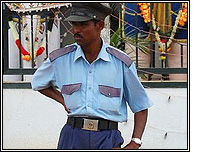

*\[Editor’s Note: Apologies for the 9 days of hiatus in blogging. It was my first vacation since I started writing this blog. To pile on the excuses, it was my first vacation where my wife was working – so there! Wishing you all a Happy New Year and pledging that I’ll continue to strive to be a better and more prolific blogger.\]*

For bloggers writing about anti-poverty and social impact initiatives, there’s a clear danger of becoming an ‘armchair intellectual’. While there’s no near-term danger of my becoming an intellectual (at least in ‘my’ eyes), there’s no such thing as too many “field trips.” Field trips to observe/interview the rural poor require some planning. Urban poor, on the other hand, are a lot more accessible. There are ample opportunities – whether it’s the security guard in one’s apartment building, the parking attendant outside Koshy’s, the beggar on a street corner, or the waiter in a restaurant – all you need is a few minutes and a patient ear.

This post marks the beginning of the [Field Reports](http://www.techsangam.com/category/field-reports/) category and is based upon a series of conversations (in Telugu) with Bala Raju. Raju is a 55-year old (estimated age) security guard in Koramangala 1st block with a daughter and son. Raju walks with a strong limp – a daily reminder of a debilitating paralysis that afflicted half his body years ago. As it often happens with the poor, recovering from the paralysis severely affected the family financially. His current job as a security guard (for one of the businesses) only pays him Rs. 3,500 a month. (Security guard salaries have a wide band apparently – some pay as high as Rs. 7,000 depending on the company &amp; the responsibilities.)

Raju’s wife is also handicapped and doesn’t work. His son dropped out of school before high school and works as an assistant in a pharmacy shop, earning Rs. 6,500 a month. It turns out that Raju’s daughter is the family genius. She finished her Pre-University Course (aka 12th grade) from SJB College with an overall 95%! By any yardstick, that’s brilliant. She now attends engineering college (majoring in Electrical &amp; Electronics) in the Jainagar neighbourhood of Bangalore. That’s not all this kid does – she attends college in the *evening* and works during the day!

I asked Raju how he managed to pay his daughter’s tuition. He replied, “With the *bidda* (child) showing such academic promise, how could we NOT support her? We manage to raise the amount somehow.”

I had two immediate thoughts after listening to Raju’s story.

- Raju’s daughter and, by corollary, his family would greatly benefit from a [Help-A-Child scholarship](http://www.techsangam.com/2011/07/06/somaiya-trust-help-a-child-scholarship-for-college-students/) (or something similar)
- Surely Raju’s son could complete a vocational training course from Bangalore-based [Unnati](http://www.unnatiblr.org/) that would lead to a higher-paying job?

I shared my thoughts with Raju and he nodded his head politely but in a manner that suggested “Yeah. Talk is good but what can you REALLY do for me?” I tried to get more details about his children (college name, location, age, etc.) and repeated that I would make inquiries on the scholarship and vocational training fronts.

As I turned to walk towards my car, Raju sheepishly grinned and asked if I could spare him some lunch money. Without any demur, I gave him twenty Rupees. Can’t really blame Raju for asking. After all, talk *is* cheap. These vague notions of scholarships and vocational training were concepts in a nebulous future that may or most likely not happen. However, what’s tangible and undeniable is that if I *did* give him money, he would definitely have a superior (than usual) lunch. On a related closing note, [for the poor what could possibly be more important than food?](http://www.techsangam.com/2011/07/14/for-the-poor-what-could-possibly-be-more-important-than-food/)