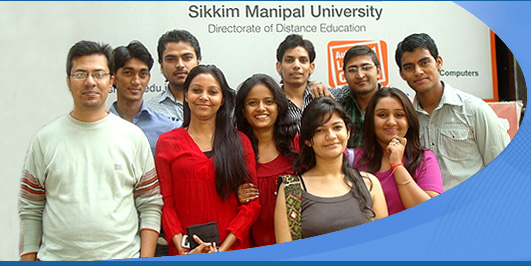

<figure aria-describedby="caption-attachment-548" class="wp-caption aligncenter" id="attachment_548" style="width: 531px">

<figcaption class="wp-caption-text" id="caption-attachment-548">Pic: distancelearningdelhi.com</figcaption></figure>

Abhay Mishra (name changed for this story) is 24 years old. He’s halfway through his MBA program at Sikkim Manipal University after completing a 2-year computer course and a B.A. degree. He has never worked in his life.

Abhay’s father, Mishra-ji (name changed), is a man in his mid-50’s and works as a security guard at the National Games Village (NGV) housing complex in Koramangala, Bangalore. Mishra-ji earns Rs. 6,500 per month and has been working in Bangalore for 3 1/2 years. Mishra-ji hails from the Ballia district of Uttar Pradesh, a district which borders with Bihar, and drove an auto-rickshaw in Madhya Pradesh for 20 years before night vision problems forced him to look for another profession. He chose Bangalore because several folks from his village in Ballia were already here.

Mishra-ji lives in a 1-room tenement that he shares with an unspecified number of people. He didn’t really want to talk about himself or his living conditions. What he *did* want to talk about was his son. With a mixture of pride and trepidation, he told me about his son (an only child). The trepidation was subtle and was only betrayed when he asked me (in Hindi) ‘*Saab, MBA ke baad acchha job mil jayega na*?’ (translates to “*After he finishes MBA, he will get a good job, right?*“)

I answered in the affirmative, cautiously though, and mentioned that it also depended on which MBA school his son was attending. He didn’t know which school his son was attending so I noted his mobile number. A few days and SMS’s later, I learnt that it was Sikkim Manipal, a distance education university with a center in Delhi. When I next met Mishra-ji, I told him that Sikkim Manipal was a reputable university and, while I didn’t know their placement rate, was more confident in reassuring him about Abhay’s prospects.

Mishra-ji sends Rs. 5,000 per month to his son for his tuition and living expenses. How does he manage that with his meager monthly salary? His father, a retired employee of Calcutta Port Trust, earns a monthly pension of Rs. 10,000 so that helps. I asked him whether I could be of any assistance to his son or him. His answer was on these lines – *No need to worry about my job but if you can guide my son or help with his job search, that would be much appreciated*.

\*\*\*\*\*\*\*\*\*\*\*\*\*\*\*

**Closing thoughts/actions**

- It’s great to see yet another instance of the poor investing so strongly in their progeny’s education.
- Need to find out what the placement rate of the Delhi center of Sikkim Manipal’s MBA program.
- I intend to stay in touch with Abhay especially as he gets closer to graduation. Any Delhi readers of this blog interested in becoming Abhay’s mentor, just leave a comment please! Thanks.

\*\*\*\*\*\*\*\*\*\*\*\*\*\*\*

**Jan 13, 2012 Update**: Had a brief chat with Mishra-ji today. He was looking extra haggard today. His shift starts at 7:30am and ends 12 hours later with a one hour lunch break. Rs. 6,500 Rs. per month for a twelve-hour workday, all 7 days a week. It’s not back-breaking work but sitting on a chair for 80% of your shift doing ‘largely’ nothing can drive you insane. A toll booth attendant has a more interesting work day. Mishra-ji doesn’t like this job but he bears it — all because of the brighter future he dreams for his only son. I learnt a few more things today:

- The total cost of the 2-year MBA program at Sikkim Manipal is Rs. 60,000 — which Mishra-ji has pre-paid the amount fully. The Rs. 5,000 he sends to Abhay every month are for his living expenses. I barely contained my surprise but, as I thought about it some more, realized that the reason is not very different from how poor farmers buy fertilizer – see [Psychology of Savings – How the Poor Save to Buy Fertilizer](http://www.techsangam.com/2011/10/21/psychology-of-savings-how-the-poor-save-to-buy-fertilizer/).
- Mishra-ji has made the Rs. 60,000 tuition pre-payment without borrowing from anyone and is obviously proud of the fact.
- Abhay still has 1 more year to go before graduation. The interesting thing is that, along the way, he’s also writing all manners of examinations (Bank officers, Air Force, etc.). He has told his father that he wants to get a government job. If that really is true, then why is doing an MBA? Also, why didn’t he try to get a job after he completed his 2-year computer course? Mishra-ji also alluded to the fact that Abhay may need some (intensive?) coaching to improve his English. These are all worrying questions that only Abhay can answer. Time to call him.

  
