> “The results of this survey are both worrying and encouraging.”

As I read the above gem from the transcript of Prime Minister Manmohan Singh’s speech on the release of the HUNGaMA report (see [What we can expect from the HUNGaMA s](http://www.techsangam.com/2012/01/10/what-we-can-expect-from-naandi-foundation-landmark-hungama-survey/)urvey), I was reminded of my high school civics textbook — “Our constitution is rigid and flexible” and other similar poppycock-sounding statements. But let’s grant that, as leader of the country, one has to frequently couch the bad news with some good. Let’s look at another gem:

> “Problem of malnutrition is a matter of national shame.”

Couldn’t agree more, Mr. Prime Minister. I would go one step further and say that it should be a matter of “national Kolaveri.” (For the 1% of readers who have successfully shut their ears and eyes to the Kolaveri sensation, Kolaveri (in Tamil) translates to “murderous rage”.)

The above gem from the Prime Minister’s speech, widely tweeted on Twitter and systematically headline’d in all the mainstream media sites, was the inspiration for this post. I mean, this is not the first time we heard a Prime Minister, a Cabinet Minister, or any number of (even non-politician) Indians start a sentence with “\[BLAH\] is a national shame”. Â Incidentally, the last time Prime Minister Singh called something a “national shame” was as recent as Dec 24, 2011 (a mere 17 days ago), regarding the falling “sex ratio” data from the 2011 census data.

Instead of curating my own list of India’s national shames, I decided to enlist Google’s help. Â Here then is the list, in no particular order.. Sorry… I meant to say, “Google results order”. All the screenshot images link to the original story. (Viewer discretion advised, especially if you look at India with rose-colored glasses.)

<figure aria-describedby="caption-attachment-555" class="wp-caption aligncenter" id="attachment_555" style="width: 511px">

[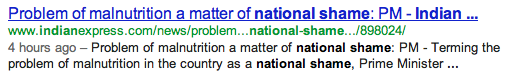](http://www.indianexpress.com/news/problem-of-malnutrition-a-matter-of-national-shame.../898024/)<figcaption class="wp-caption-text" id="caption-attachment-555">Malnutrition a matter of national shame</figcaption></figure>

<figure aria-describedby="caption-attachment-556" class="wp-caption aligncenter" id="attachment_556" style="width: 518px">

[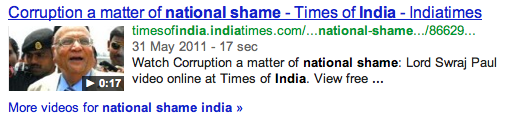](http://timesofindia.indiatimes.com/videos/news/Corruption-a-matter-of-national-shame-Lord-Swraj-Paul/videoshow/8662927.cms)<figcaption class="wp-caption-text" id="caption-attachment-556">Corruption a matter of great national shame</figcaption></figure>

<figure aria-describedby="caption-attachment-557" class="wp-caption aligncenter" id="attachment_557" style="width: 512px">

<figcaption class="wp-caption-text" id="caption-attachment-557">Commonwealth games - India's national shame</figcaption></figure>

<figure aria-describedby="caption-attachment-558" class="wp-caption aligncenter" id="attachment_558" style="width: 523px">

<figcaption class="wp-caption-text" id="caption-attachment-558">Of rapes and sexual assaults: India's national shame</figcaption></figure>

<figure aria-describedby="caption-attachment-559" class="wp-caption aligncenter" id="attachment_559" style="width: 517px">

[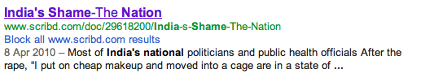](../../../../uploads/2012/01/nat_shame_prost_aids.png)<figcaption class="wp-caption-text" id="caption-attachment-559">Of prostitution and AIDS - India's national shame</figcaption></figure>

<figure aria-describedby="caption-attachment-560" class="wp-caption aligncenter" id="attachment_560" style="width: 496px">

[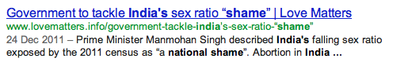](http://www.lovematters.info/government-tackle-india%E2%80%99s-sex-ratio-%E2%80%9Cshame%E2%80%9D)<figcaption class="wp-caption-text" id="caption-attachment-560">914 girls to 1000 days: India's falling sex ratio national shame</figcaption></figure>

<figure aria-describedby="caption-attachment-561" class="wp-caption aligncenter" id="attachment_561" style="width: 523px">

[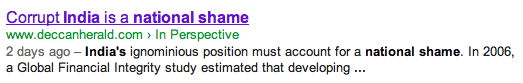](http://www.deccanherald.com/content/177111/content/196937/a-treat-deccan-heralds-facebook.html)<figcaption class="wp-caption-text" id="caption-attachment-561">Corrupt India (black money) is a national shame</figcaption></figure>

<figure aria-describedby="caption-attachment-562" class="wp-caption aligncenter" id="attachment_562" style="width: 516px">

[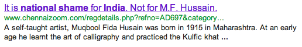](http://www.chennaizoom.com/regdetails.php?refno=AD697&category=General)<figcaption class="wp-caption-text" id="caption-attachment-562">On M.F.Hussain and religious intolerance: India's national shame</figcaption></figure>

<figure aria-describedby="caption-attachment-563" class="wp-caption aligncenter" id="attachment_563" style="width: 509px">

[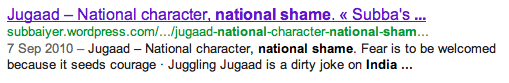](http://subbaiyer.wordpress.com/2010/09/07/jugaad-national-character-national-shame/)<figcaption class="wp-caption-text" id="caption-attachment-563">(On a different level) Jugaad - National Character, National shame</figcaption></figure>

<figure aria-describedby="caption-attachment-564" class="wp-caption aligncenter" id="attachment_564" style="width: 506px">

[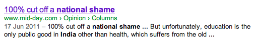](http://www.mid-day.com/opinion/2011/jun/170611-Delhi-University-100-percent-cut-off.htm)<figcaption class="wp-caption-text" id="caption-attachment-564">100% cutoff in premier educational institutions - national shame</figcaption></figure>

<figure aria-describedby="caption-attachment-565" class="wp-caption aligncenter" id="attachment_565" style="width: 517px">

<figcaption class="wp-caption-text" id="caption-attachment-565">Cash for votes, 2G: national shame</figcaption></figure>

<figure aria-describedby="caption-attachment-566" class="wp-caption aligncenter" id="attachment_566" style="width: 527px">

[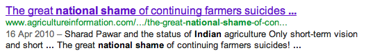](http://www.agricultureinformation.com/mag/2010/04/the-great-national-shame-of-continuing-farmers-suicides/)<figcaption class="wp-caption-text" id="caption-attachment-566">The great national shame: continuing farmer suicides</figcaption></figure>

<figure aria-describedby="caption-attachment-567" class="wp-caption aligncenter" id="attachment_567" style="width: 514px">

<figcaption class="wp-caption-text" id="caption-attachment-567">A national shame called "ragging"</figcaption></figure>

<figure aria-describedby="caption-attachment-568" class="wp-caption aligncenter" id="attachment_568" style="width: 462px">

<figcaption class="wp-caption-text" id="caption-attachment-568">Gujarat riots a national shame</figcaption></figure>

<figure aria-describedby="caption-attachment-569" class="wp-caption aligncenter" id="attachment_569" style="width: 473px">

[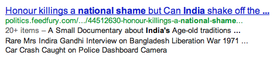](http://politics.feedfury.com/content/44512630-honour-killings-a-national-shame-but-can-india-shake-off-the-horror-of-honour-killing-video-documentary.html)<figcaption class="wp-caption-text" id="caption-attachment-569">Honour killings a national shame</figcaption></figure>

<figure aria-describedby="caption-attachment-570" class="wp-caption aligncenter" id="attachment_570" style="width: 517px">

[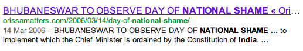](http://orissamatters.com/2006/03/14/day-of-national-shame/)<figcaption class="wp-caption-text" id="caption-attachment-570">Bhubaneshwar: day of national shame (movement against bonded labour)</figcaption></figure>

<figure aria-describedby="caption-attachment-571" class="wp-caption aligncenter" id="attachment_571" style="width: 533px">

[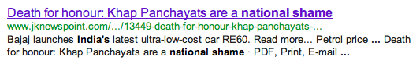](http://www.jknewspoint.com/index.php/forum/op-ed/13449-death-for-honour-khap-panchayats-are-a-national-shame-)<figcaption class="wp-caption-text" id="caption-attachment-571">Khap panchayats are a national shame</figcaption></figure>

After ploughing through 26 pages of Google search results data, I’m going to give this a rest. And rediscover my optimism tomorrow.