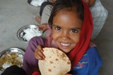
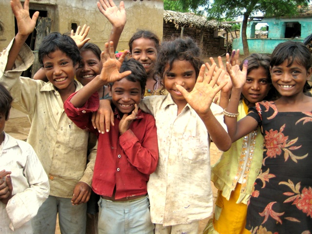

<figure aria-describedby="caption-attachment-575" class="wp-caption alignleft" id="attachment_575" style="width: 160px">

<figcaption class="wp-caption-text" id="caption-attachment-575">For a few nutrients more.. (Pic courtesy hungamaforchangechange.org)</figcaption></figure>

In our continued coverage of Naandi Foundation’s HUNGaMA survey, we’ll look at the nine key takeaways in this post. *\[For the truly brave, here’s the link to the [139-page PDF](http://hungamaforchange.org/HungamaBKDec11LR.pdf) that we’ll continue to harvest for additional insights.\]* The earlier post in this series was [What we can expect from Naandi Foundation’s HUNGaMA survey](http://www.techsangam.com/2012/01/10/what-we-can-expect-from-naandi-foundation-landmark-hungama-survey/).

But first some definitions and key stats.

**Defining HUNGaMA**

In Hindi, a ‘***hungama’*** is a ‘stirâ’ or a ‘ruckus’. A hungama can come from a celebration or a festival, or any situation that brings people together with excitement, energy, and enthusiasm.

We want to create a new kind of *hungama* – a hungama for change that targets the problem of hunger and malnutrition. The HUNGaMA nutrition survey is the first step of that journey.

**Key Stats**

- 9 states, 112 rural districts, 3,360 villages, 74,020 mothers, 73,670 households, 109,093 children
- The 112 districts surveyed by HUNGAMA are divided into 3 categories:

- 100 focus districts (from six states: Bihar, Jharkhand, Madhya Pradesh, Orissa, Rajasthan, and Uttar Pradesh)
- 6 best districts from focus states
- 6 best districts from 6 ‘best’ states (Himachal Pradesh, Kerala, and Tamil Nadu)

- In the 100 Focus Districts, 42% of children are underweight and 59% are stunted.
- Survey provides reliable estimates of child nutrition covering nearly 20% of Indian children.
- Data collection took place between October 2010 and February 2011

**Data Collected in HUNGaMA survey**

**Insight #1: Child malnutrition is widespread across states and districts:** In the 100 Focus Districts, 42 per cent of children under five are underweight and 59% are stunted. Of the children suffering from stunting, about half are severely stunted. In the best district in each of these states, the rates of child underweight and stunting are significantly lower – 33% and 43% respectively.

<figure aria-describedby="caption-attachment-576" class="wp-caption alignright" id="attachment_576" style="width: 300px">

<figcaption class="wp-caption-text" id="caption-attachment-576">For a few nutrients more… (Pic courtesy hungamaforchange.org)</figcaption></figure>

**Insight #2: A reduction in the prevalence of child malnutrition is observed:** In the 100 Focus Districts, the prevalence of child underweight has decreased from 53% (DLHS, 2004) to 42% (HUNGaMA 2011); this represents a 20% decrease over a 7 year period with an average annual rate of reduction of 2.9%.

****Insight #3:** Child malnutrition starts very early in life:** By age 24 months, 42% of children are underweight and 58% are stunted in the 100 Focus Districts; birth weight seems to be an important risk-factor as the prevalence of underweight in children born with a weight below 2.5 kg is 50% while that among children born with a weight above 2.5 kg is 34%; the corresponding figures for stunting are 62% and 50% respectively;

****Insight #4:** Household socio-economic status has a significant effect on children’s nutrition status:** The prevalence of malnutrition is significantly higher among children from low-income families, although rates of child malnutrition are significant among middle and high income families. Children from households identifying as Muslim or belonging to Scheduled Castes or Schedule Tribes generally have worse nutrition;

****Insight #5:** Girls’ nutrition advantage over boys fades away with time:** Girls seem to have a nutrition advantage over boys in the first months of life; however this advantage seems to be reversed over time as girls and boys grow older, potentially indicating feeding and care neglect vis-a-vis girls in infancy and early childhood;

****Insight #6:** Mothers’ education level determines children’s nutrition:** In the 100 Focus Districts, 66% mothers did not attend school; rates of child underweight and stunting are significantly higher among mothers with low levels of education; the prevalence of child underweight among mothers who cannot read is 45% while that among mothers with 10 or more years of education is 27%. The corresponding figures for child stunting are 63% and 43% respectively. It was also found that 92% mothers had never heard the word malnutrition .

****Insight #7:** Giving colostrum to the newborn and exclusive breastfeeding for first 6 months of a child’s life are not commonly practised:** In the 100 Focus Districts 51% mothers did not give colostrum to the newborn soon after birth and 58% mothers fed water to their infants before 6 months.

****Insight #8:** Hand washing with soap is not a common practice:** In the 100 Focus Districts 11% mothers said they used soap to wash hands before a meal and 19% do so after a visit to the toilet;

****Insight #9:** Anganwadi Centres are widespread but not always efficient:** There is an Anganwadi centre in 96% of the villages in the 100 Focus Districts, 61% of them in pucca buildings; the Anganwadi service accessed by the largest proportion of mothers (86%) is immunization; 61% of Anganwadi Centres had dried rations available and 50% provided food on the day of survey; only 19% of the mothers reported that the Anganwadi Centre provides nutrition counseling to parents.

Do watch this space for several additional insights that we’ll glean from the rest of the survey (only 12 out of 139 pages were perused in the making of this blog post).