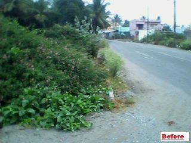
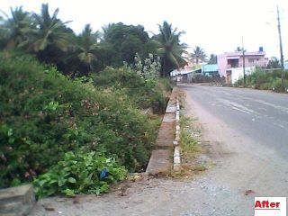

Things are a bit quiet… over in The Ugly Indian corral. Almost like the calm ***after*** the storm? Surely after 60-odd consecutive weeks of SpotFixes and maybe some well-deserved revelry over the holidays, TUI is resting on their laurels? Nah! These are not the “resting on laurels” types. More likely this is the calm ***before*** the storm, a fresh new storm to be unleashed against ugliness in 2012.

Times of India selected “The Faceless Ugly Indians” as one of 4 Bangaloreans that made a difference – [Bangalore movers on the go](http://timesofindia.indiatimes.com/city/bangalore/Bangalore-movers-on-the-go/articleshow/11273207.cms).

**Interesting Facebook conversation #1**:

> A critic friend of one Ms. Dutt asked this question of TUI – “Can you tell me what is the chance of increasing the first 12 km stretch.” Would you please tell me how much distance you group might have covered by now? And if you have any yearly targets…”
> 
> TUI: We solve problems. We don’t have targets. It’s not about kms. Please ask your critic friend to read our website and see what we say about cynics. We are optimists and believe that there is hope. Period.
> 
> Ms. Dutt: Thank you so much… It is wonderful to see you all put in so much work ethic into your work… “just keep chugging… and one day we will all wake up to a cleaner road, neighborhood, city…. ”
> 
> TUI: Not ‘one day’. Today. There are many people who woke up to a cleaner road today and do so everyday because they took the trouble to fix it. That’s what this is about – each one of us taking ownership of the road in front of our home/apartment/office, and not waiting for the government, a neighbour or TUI to come and fix it. It is a simple idea – and those who get it, are enjoying the fruits of their labours in ways nobody else can fully appreciate.

**Interesting Facebook conversation #2**:

> Rakesh (proposes the use of SeeClickFix.com, a collaboration platform, for TUI’s ongoing efforts) – please check out the facebook app they have for this. we can create a map area and watch all the issue that is being reported. already some watchers are there… we will get notifications for any new issues. we can comment on the issue itself in the facebook app. we can discuss how to fix the issue there itself and fix date and time and go and fix things. no need to send mail and go round about. this will help in scaling to 1000 fixers ! also we can create a widget that we can put up in out website. we can still post pictures, vids in our fb page.
> 
> TUI: thanks for your posts. The reality is that identifying spots to be fixed is the least of the issues here in Bangalore. A software tool or platform isn’t really needed – you can pick any road, have coffee with the Garbage Inspector or Road Engineer at the spot to be fixed, and he will probably still be unable to fix it. All our spotfixes involve co-operation with the officials in charge, and we work on problems that are well-known to all in the area. A look at the responses on seeclickfix Bangalore is quite revealing (in a full year there have been only a handful of fixes reported, and from what we can gather, almost none have been fixed). [http://seeclickfix.com/<wbr>ind\_bangalore/issues/recent</wbr>](http://seeclickfix.com/ind_bangalore/issues/recent)
> 
> Rakesh: ya thats correct .. but collaboration is easier isn’t it ?, once a issue is there in the app.. people can comment on it and chat live on it .. they can decide how to fix it .. when they can go etc. visualize it like this .. 10 issues – each in different place. 50 people login. each issue is close to each person. they can choose to work on and join that group and fix it. anonymous + less travel + more work Efficiency. as of now i have to wait for someone to reply to my mail .. and let me know whats the plan and where the work is going to be done .. if its far for me or if its on a date i am not free then i cannot participate.. all these issues can be addressed with a platform like this ..
> 
> TUI: thanks once again. We get what you’re saying and the advantages are obvious if spotfixing was an activity that anyone could simply do by congregating at a specified point. The way we do spotfixing is not suited to such a collaborative platform – every spotfix is preceded by weeks of background research, homework and relationship building by a local experienced ‘spot owner’, the spotfix is simply a 3-hr managed and planned event, that is followed again by weeks of fine-tuning and follow-up and finally a ‘transfer’ to a local stakeholder. Each spotfix alters the local environment permanently and needs time to fructify and sustain – so we plan our spotfixes slowly and surely. We are not yet at the point where we can ‘scale’, and we are in no hurry either. Better to get it right and give it the time it takes, than to run too fast and trip.

**Bheema’s Sidewalk SpotFix in Kembattahalli**

<table><tbody><tr><td><figure aria-describedby="caption-attachment-580" class="wp-caption alignleft" id="attachment_580" style="width: 300px">

<figcaption class="wp-caption-text" id="caption-attachment-580">Kembattahalli sidewalk (before spotfix)</figcaption></figure>

</td><td><figure aria-describedby="caption-attachment-579" class="wp-caption alignright" id="attachment_579" style="width: 300px">

<figcaption class="wp-caption-text" id="caption-attachment-579">Kembattahalli sidewalk (after spotfix)</figcaption></figure>

</td></tr></tbody></table>