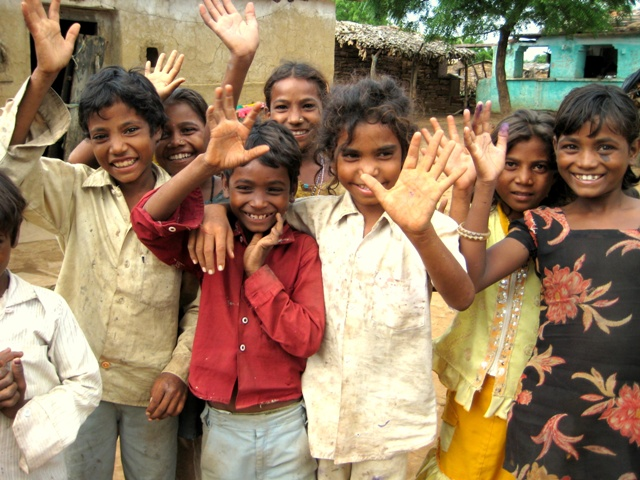

> The best time to plant a tree was 20 years ago. The second best time is now.

<figure aria-describedby="caption-attachment-588" class="wp-caption alignleft" id="attachment_588" style="width: 300px">

<figcaption class="wp-caption-text" id="caption-attachment-588">Pic courtesy: hungamaforchange.org</figcaption></figure>

If you’ve lived in America, India, perhaps even Europe, chances are you’ve read that on a bumper sticker. The movement to combat malnutrition, Citizens Alliance Against Malnutrition, needs a similar rallying cry. My humble submission – *The best time to save millions of desperately poor and malnourished Indians was 20 years ago. The second best time is now*.

Here are just two extracts from the recently released [Hungama survey on hunger and malnutrition](http://www.techsangam.com/2012/01/11/nine-key-takeaways-from-hungama-survey-on-hunger-and-malnutriti/) that remind us why malnutrition matters:

> Malnutrition is associated with about half of all child deaths worldwide. Malnourished children have lowered resistance to infection; they are more likely to die from common childhood ailments like diarrhoeal diseases and respiratory infections; and for those who survive, frequent illness saps their nutritional status, locking them into a vicious cycle of recurring sickness, faltering growth and diminished learning ability. – UNICEF Report
> 
> Children who are undernourished in early childhood are at much higher risk of, and less able to recover from infections than healthy children. As a result, they have a much higher risk of early death. Indeed, undernutrition is associated with a third of all child deaths globally. It is estimated that 150 million years of healthy life were lost to poor nutrition in 2004 – five times that lost to malaria. – DFID Report (2009)

Insight #7 from the report particularly stood out – *Giving colostrum to the newborn and exclusive breastfeeding for first 6 months of a child’s life are not commonly practised*. This might surprise you at first.. until somebody told you that an overwhelming majority of new mothers have to return to work within 2-3 days after they gave birth. So who takes care of the baby while the mother is in the fields resuming her regimen of back-breaking work? A kindly grandmother (in most cases) or some other kindly relative. When I stumbled upon this [quintessentially Indian picture](http://www.techsangam.com/2012/01/12/this-picture-needs-a-caption-help/), I asked my social graph to submit captions. A whole gamut of submissions, from the poignant to the mundane to the witty, flowed in. My purpose was to find out how many noticed that it was the grandmother (and not the mother) with the baby. You can view all the responses in the body of this [follow-up post](http://www.techsangam.com/2012/01/20/the-story-behind-this-picture-reader-comments/)).

The primary protector of an infant’s health is her mother. How can she protect her infant’s life during the crucial first six months when she’s absent for the better part of the day? There are two main reasons that explain the [grandmother-infant picture](http://www.techsangam.com/2012/01/20/the-story-behind-this-picture-reader-comments/). The first reason is economic, the second education. Insight #6 (*Mother’s education level determines children’s nutrition*) speaks directly to the second reason.

I have a healthy modicum of skepticism regarding the UPA government’s NREGA job guarantee program. A recent article from Rediff’s Sheela Bhat ([A day in a UP village: Why the polls don’t matter here](http://www.rediff.com/news/slide-show/slide-show-1-a-day-in-a-up-village-why-the-polls-dont-matter-here/20120119.htm)) highlights a key reason why I’m not a fan of NREGA. Santosh Kumar, the elected pradhan of Paharpur has this to say about NREGA (aka “MNREGA”):

> “MNREGA has changed everything. It has created a corrupt society. People just don’t want to work. They get registered in MNREGA and take Rs 120 per day. Work for one or two hours and go home.”
> 
> “MNREGA ensures 100 days of work in a year. Out of the Rs 120 they spend half of it on alcohol and chicken.”

A former *pradhan* (Tiwari) has this to say about MNREGA:

> “To get a project approved under MNREGA,” says Tiwari, “we beg, borrow or steal to give bribes to government departments. But we never take bribes for work we do or from the villagers.”
> 
> “However, we do fake labour jobs under the scheme because our villagers are just not ready to work hard,” he confesses. “If a small pond exists, we will do a little job around it and show it as a new job.”

Ok. So MNREGA is rife with corruption (and the above article is not the only authority). But that’s not the point… at least for *this* post. During one of the numerous brainstorming meetings coordinated by the Citizens Alliance Against Malnutrition, a novel suggestion had come up – *Is it possible to dovetail into the MNREGA scheme and guarantee 6 months of wages for a new mother?*

I may not be a fan of the overarching schema called MNREGA but would fully back a targeted  plan benefiting new mothers. Too bad nobody’s asking me.