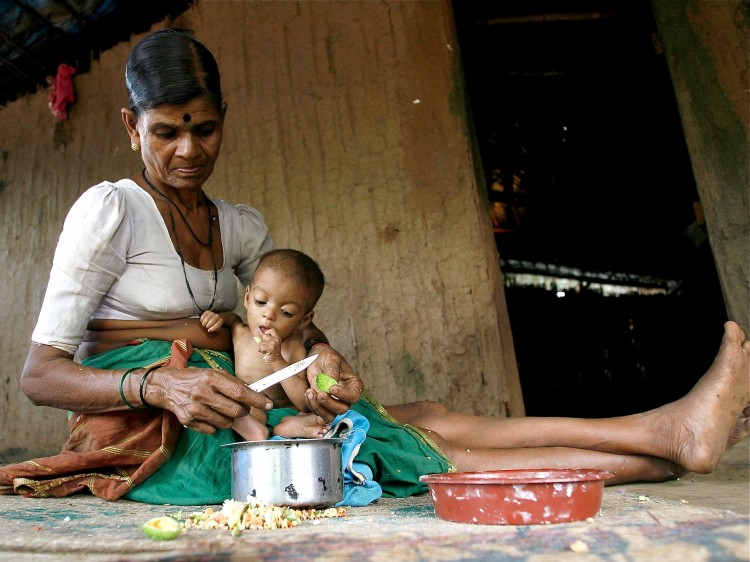

Last week, I posted [this picture](http://www.techsangam.com/2012/01/12/this-picture-needs-a-caption-help/) asking for your help in suggesting captions. A whole gamut of submissions, from the poignant to the mundane to the witty, flowed in. My purpose was to find out how many noticed that it was the grandmother (and not the mother) with the baby. You can view all the caption suggestions (from blog comments, emails and Facebook) below the picture.

<figure aria-describedby="caption-attachment-591" class="wp-caption aligncenter" id="attachment_591" style="width: 600px">

<figcaption class="wp-caption-text" id="caption-attachment-591">Story behind this picture</figcaption></figure>

Caption suggestions from readers:

- Is there enough in the bowl to feed us all today?
- Din khali bartan khali hai…
- I really appreciate the quiet determination in her eyes
- ‘Show me the fool who says Rs. 32 will be enough for today’
- Are we (who are seeing this photo here) blessed or what?
- I hope my daughter gets work today, then we’ll be able to feed this child tomorrow
- You are all I have
- Their greed affecting our need
- I will teach you to endure, I will pray you survive
- Mujhe nahi pata tumhare paas kya hai…mere paas grandma hai!
- Malnutrition and India’s children: hidden in plain sight
- We ignore this story of India’s development
- State of inclusive growth – a life of stunted growth
- India’s real masterchef!
- Is this my future?
- Ek main aur ek tu
- The kid on her lap, nesting safely and comfortably
- The knife in her hand cutting/peeling the vegetable to feed but also signifies as a weapon in the hands of someone ready to protect/defend
- Her seemingly complete disconnect with things
- Her strong sense of confidence in herself or about herself…
- And a shayari: Bhook se maari he uski bebasi kaise dekhu, mushkilo me ji rahi hai, zindagi kaise dekhu, cheen le beenaii ye de de zara sa zar mujhe apni, maa ki main wo maili orhni kaise dekhu (mohsin aftab)