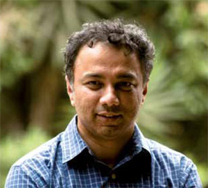

<figure aria-describedby="caption-attachment-594" class="wp-caption alignleft" id="attachment_594" style="width: 300px">

<figcaption class="wp-caption-text" id="caption-attachment-594">Dr. Harish Hande, Founder &amp; Managing Director (Selco) - Pic courtesy selco-india.com</figcaption></figure>

Selco Solar’s Harish Hande was one of the standout acts at the [recent Villgro conference](http://www.nextbillion.net/blogpost.aspx?blogid=2607) on social enterprises. Without mincing any words, he declared that it was dangerous for investors to dictate what entrepreneurs should do. It was time, he said, for entrepreneurs to say “no”  to certain types of investors. He was dead serious when he announced his intention to write a book about the investors that have led to the failure of entrepreneurs. The [Color of Money](http://www.techsangam.com/2011/12/16/color-of-money/) post provides a bit more detail on this topic.

In a comprehensive [Forbes India feature](http://forbesindia.com/article/work-in-progress/selcos-harish-hande-wants-to-spread-the-light/32048/0) today, we learn that at least ONE of those investors Hande loves to hate is Gaia Kapital. But the real scoop was Hande’s raising of a $10 million impact investing fund with a focus on enterprises in sustainable energy. Some very interesting nuggets from the Forbes article:

**New fund details**

- Social investing today operates on two ends: Grants which are free, and equity investors who expect a return of 8-10 percent, which is expensive for a social venture. The gap in the middle is what Hande is trying to fill.
- Besides Hande himself, the fund leadership includes Selco’s COO &amp; CFO (Ashis Kumar Sahu and K. Ravathi respectively). Sahu will help train new entrepreneurs and Revathi will manage the fund.
- First million dollars, committed by clean-energy-focused Halloran Philanthropies, will be used to seed the first five enterprises.
- Hande: “There are enough philanthropists who made their riches from being entrepreneurs. We can convince them to convert the money that they give as grants into taking equity in the venture. This lowers the cost of capital for the entrepreneur and since the money is not free, forces him to think of sustainability. The idea is to allow enough experimentation and lower barriers to entry for entrepreneurs.”

**Selco Solar**

- To date, Selco Solar has sold lighting solutions to 100,000 households and will end the current financial year with revenue of Rs. 17 crores and profit of Rs. 1.2 crore.
- In October 2003 (one of Selco’s nadir moments), Gaia Kapital held 90% of Selco’s equity! Hande used his personal relationship and goodwill at International Finance Corporation (IFC) to get Gaia off his back. He then raised $3 million from investors like Good Energies and E&amp;Co who were better aligned with Selco’s mission. This reduced Gaia’s share to a minority and eventually it exited the company.)
- In 2006 (another nadir year), Hande got a meeting with one of the world’s largest social investors. It was ready to sign a $1 million cheque, but had one condition: Selco should scale to a million households in the next few years. Hande refused the offer. Scaling up for the sake of it had never been his belief.
- Two notable reasons for Selco’s success: One, it gave the poor what they needed instead of selling what was available. Earlier, manufacturers would sell only two-light or four-light solutions. But if a consumer wants, or can afford just one light, that’s what Selco sells him. Two, Selco made financing available at the customer’s doorstep by tying up with banks to extend them loans