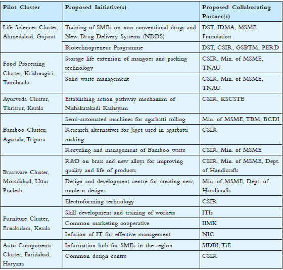

<figure aria-describedby="caption-attachment-598" class="wp-caption alignleft" id="attachment_598" style="width: 300px">

<figcaption class="wp-caption-text" id="caption-attachment-598">Pic courtesy: indianews99.com</figcaption></figure>

If the corporate world lives by the mantra “death by Powerpoint”, the Indian Government’s mantra is “death by PDFs”. The first year report of National Innovation Council (NInC) was released by Prime Minister Manmohan Singh in November 2011. We did a brief write-up then, focusing on NInC’s [primary vehicle to finance innovation – India Inclusive Innovation Fund](http://www.techsangam.com/2011/11/16/indias-largest-social-enterprise-creates-india-inclusive-innovation-fund/). The rest of this post includes progress blurbs from NInC’s 58-page PDF report on the seven other thrust areas.

**Increasing Skills &amp; Productivity of Micro, Small &amp; Medium Enterprises through Innovation Clusters**: *Pilot activities have commenced at the Ayurveda cluster in Thrissur, and the Food Processing cluster in Krishnagiri.* *Activity at the Auto Components cluster, Faridabad; Bamboo cluster, Agartala; Brassware cluster, Moradabad;* *Furniture cluster, Ernakulam; and the Life Sciences cluster, Ahmedabad will begin in November 2011.*

**Meta University**: a redefinition of the university model for the 21st century by leveraging India’s National Knowledge Network to enable multi-disciplinary learning and collaborative knowledge creation. Indian Express reports that [DU, IIT, JNU and JMI are taking the first step](http://www.indianexpress.com/news/du-iit-jamia-jnu-take-first-step-to-plan-first-meta-university/890220/) towards the formation of a meta university. Under the pilot program, the collaborating universities will provide and recognise credits to the students for different courses and facilitate student mobility across disciplines.

**University Innovation Clusters**: NInC proposes to identify and facilitate the development of 20 University Innovation Clusters. An initial pilot with University of Delhi has commenced and received overwhelming response from the student community.

**Innovation Scholarships**: Ministry of Human Resource Developed has approved 1000 Innovation Fellowships to be awarded at the School Level (Classes 9-12). On a related (but sketchy on details) note, *“Introducing the Mapping of Local History, Local Ecology and Local Culture and Heritage by all High Schools”* – any idea what this means?

**Rural Broadband in 250,000 Panchayats**: Government approved the proposal to connect all panchayats through optic fibre and the rural broadband plan. NInC will work on applications for rural broadband in collaboration with Ministries of Rural Development, Panchayati Raj, HRD, Health and the Prime Minister’s National Council on Skill Development. NInC has begun work on applications through a pilot in Ajmer district in Rajasthan and proposes to enlarge this to one district in each State.

**India Innovation Portal**

The alpha version of [India Innovation Portal](http://innovation.gov.in/innovation/fetchAllHomeItems.action) has been live since Aug 2011. It’s meant to be a collaboration platform of sorts, has a respectable Google Page Rank of 4 (which suggests there are other curious folks too), and allows anyone to register for an account. What’s *on* the site today is just a set of articles (all PDF links in case you forgot this was a Government of India site). The Users tab shows five different types – Academia, Entrepreneur, Government, Civil Society, Industry. The registration flow I went through didn’t ask for a user type so there’s a bit of a disconnect.

**Industry Innovation Clusters**

**National Knowledge Network**

The [National Knowledge Network](http://www.nkn.in/) (NKN) is a high-speed multi gigabit network that’s intended to connect educational and research institutes in the country and global research networks like TEIN 3, CERN and GLORIAD. At the time of NinC report publication, 405 nodes were connected, according to NKN’s website (which boasts a highly respectable Page Rank of 7) the number is now 603 and includes all the usual suspects and then some more.

**Members of National Innovation Council**

- Dr. Sam Pitroda, Chairman and Advisor to PM
- Arun Maira and Dr. K. Kasturirangan (Members, Planning Commission)
- Dr. Ramesh Mashelkar, National Innovation Foundation
- Kiran Karnik, Former NASSCOM President
- Dr. Devi Shetty, Narayana Hrudalaya Founder
- R. Gopalakrishnan, Tata Sons Executive Director
- Ms. Kiran Mazumdar Shaw, Biocon Chairman
- Shekhar Kapur, Filmmaker
- Saurabh Srivastava, CA Technologies Chairman
- Dr. Anil Gupta, National Innovation Foundation
- Dr. Sujatha Ramdorai, TIFR Professor
- Chandrajit Banerjee, CII Director General
- Dr. Rajiv Kumar, FICCI Secretary General
- Dr. Samir Brahmachari, CSIR Director General
- Dr. Sanjay Dhande, IIT Kanpur Director
- R. Gopalakrishnan, Additional Secretary to GOI