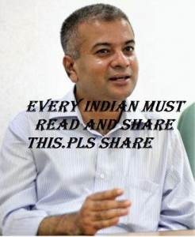

*Update (Jul 27, 2012): Wrote a follow-up post – [What’s up with Raju Narayana Swamy these days?](http://www.techsangam.com/2012/07/27/so-whats-up-with-raju-narayana-swamy-these-days/)*

An appeal (see below) is making the rounds on Facebook today. An academic pedigree to die for, top of the class at every step of the academic ladder, and a squeaky clean IAS officer who doesn’t even spare his own father-in-law. I prefix the post with “not so curious” because this kind of professional profile usually leads to a series of roadblocks. Hitting against the political-bureaucrat-media corruption nexus is merely a question of “when” not “if”. When the moment of truth hits the honest bureaucrat, how they react and what they choose to do next is what sets them apart.

[Aruna Roy](http://globalsuccessclub.blogspot.com/2008/05/aruna-roy-is-indian-political-and.html) (IAS batch 1968) quit after a mere 6 years and moved to the NGO sector, some of her more famous accomplishments include her leadership of Mazdoor Kisan Shakti Sanghatan (MKSS), NCPRI, Right to Information bill, and currently National Advisory Council (NAC).

[J. K. Tripathy](http://chennaionline.com/City360/Interviews/20115608095635/Commissioner-Tripathy-speaks-to-Chennaionline.col) (IPS batch 1985) would keep getting transferred every two years (standard operating procedure for honest officers). When Tripathy was assigned to Trichy, a unique city with 33% each of Hindus, Muslims and Christians and a history of communal tensions, he knew exactly how much time he had (2 years!) to make a difference. And what a difference he made!

As Raju Narayana Swamy contemplates whether he should accept a plum United Nations assignment that will take him to Paris, the real question is this – “What are some credible career options (in India) for a pedigreed IAS officer with a clear moral compass?”

<figure aria-describedby="caption-attachment-600" class="wp-caption alignleft" id="attachment_600" style="width: 246px">

<figcaption class="wp-caption-text" id="caption-attachment-600">Pic: courtesy Facebook campaigns</figcaption></figure>

> First Rank in State in Secondary School Examination  
> First Rank in University in Plus Two  
> First Rank in IIT Entrance Examination  
> First Rank in All India IIT Computer Science  
> First Rank in IAS Entrance Examination  
> First Rank in IAS Training Institute
> 
> On passing out from IIT Chennai Mr. Narayanaswamy was offered scholarship by the prestigious Massachusetts Institute of Technology , USA .. He who came from a middle class family believed that he had a moral obligation to give something in return for the lakhs of rupees the government spent on him as an IIT student. He had the intelligence and conviction to realize that this money came also from the poorest of the poor – who pay up the excise duty on textiles when they buy cloth, who pay up customs, excise and sales tax on diesel when they travel in a bus, and in numerous other ways indirectly pay the government. So he decided to join IAS hoping he could do something for the people of this country. How many young men have the will power to resist such an offer from USA ? Narayanaswamy did never look at IAS as a black money spinner as his later life bears testimony to this fact.
> 
> After a decade of meritorious service in IAS, today, Narayanaswamy is being forced out of the IAS profession. Do you know why?
> 
> A real estate agent wanted to fill up a paddy field which is banned under law. An application came up before Narayanaswamy who was sub collector the, for an exemption from this rule for this plot of land. Upon visiting the site he found that the complaint from 60 poor families that they will face water logging due to the waste water from a nearby Government Medical College if this paddy field was filled up was correct. Narayanswamy came under intense political pressure but he did what was right – refused permission for filling up the paddy field. That was his first confrontation with politicians.
> 
> Soon after his marriage his father-in-law closed down a public road to build compound wall for his plot of land. People approached Narayanaswamy with complaint.
> 
> When talking with his own father-in-law did not help, he removed the obstructing wall with police help. The result, his marriage broke up.
> 
> As district Collector he raided the house of a liquor baron who had defaulted Rupees 11 crores payment to government and carried out revenue recovery. A Minister directly telephoned him and ordered to return the forfeited articles to the house of the liquor baron. Narayanswamy politely replied that it is difficult. The minister replied that Narayanaswamy will suffer.
> 
> In his district it was a practice to collect crores of rupees for earthen bunds meant for poor farmers, but which were never constructed. A bill for rupees 8 crores came up before Narayanaswamy. He inspected the bund. He found it very weak and said that he will pass the bill after the rainy season to ensure that the bund served the purpose. As expected the earthen bund was too weak to stand the rain and it disappeared in the rain. But he created a lot of enemies for saving 8 crores public money. The net result of all such unholy activities was that he was asked to go on leave by the government. Later such an illustrious officer was posted as “State Co-Ordinator, Quality Improvement Programme for Schools”. This is what the politician will do to a honest officer with backbone – post him in the most powerless position to teach him a lesson. Since he found that nothing can be achieved for the people if he continued with the State Service he opted for central service. But that too was denied on some technical ground.
> 
> What will you do when you have a brilliant computer career anywhere in the world you choose with the backing of several advanced technical papers too published in international journals to your credit?  
> When you are powerless to do anything for the people, why should you waste your life as the Co-Ordinator for a Schools Programme?  
> Mr. Narayanaswamy is on the verge of leaving IAS to go to Paris to take up a well paid United Nations assignment. The politicians can laugh thinking another obstacle has been removed. But it is the helpless people of this country who will lose – not Narayanaswamy. But you have the power to support capable and honest bureaucra ts like Narayaswamy, G.R.Khairnar and Alphons Kannamthanam who have suffered a lot under self seeking politicians who rule us. You have even the power to replace such politicians with these kind of people dedicated to the country. The question is will you do the little you can do NOW? At least a vote or word in support of such personalities?