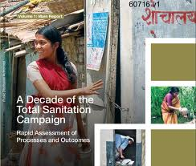
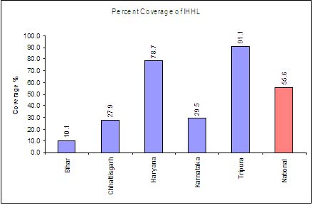

*\[Possibly TechSangam’s 1st Oops moment*: *A friend/reader just alerted me to the fact that the WaterAid report, on which this post is based of, is from 2008 and not 2012 as I had assumed. Will hunt for more recent insights and update/link accordingly. Apologies!\]*

<figure aria-describedby="caption-attachment-604" class="wp-caption alignleft" id="attachment_604" style="width: 244px">

<figcaption class="wp-caption-text" id="caption-attachment-604">Pic: courtesy indiawaterportal.org</figcaption></figure>

[WaterAid India](http://www.wateraid.org/india/) is shortly expected to release a report on how India’s Total Sanitation Campaign is doing. The good folks at WaterAid came up with this [report review](http://infochangeindia.org/environment/analysis/india-s-total-sanitation-campaign-half-full-half-empty.html) and, of course, since I expect most of this blog’s readers to not read it fully, below are the most interesting insights. 🙂

The Total Sanitation Campaign (TSC) aims at improving the quality of life of people in rural areas through the creation of open-defecation-free (ODF) and fully sanitised villages. The program was launched in 1999. The report studied five states -Â Bihar, Chhattisgarh, Haryana, Tripura and Karnataka.

- TSC envisaged the construction of 12 crore individual household latrines (IHHLs), of which 4.7 crore have already been constructed. This means that in roughly four years the government must construct around 7.3 crore latrines; that’s approximately 40,000 IHHLs every day!
- India still has no clear stated national policy on sanitation other than the TSC guidelines. Likewise, most state governments too do not have a stated policy on sanitation; none of the sample states visited had a state-level sanitation policy
- The involvement of schoolchildren and young people in implementation has been a key feature of many implementation strategies. For example, in Sirsa district, a students’ vigilance cell called Chatra Jagruk Dal*Â* was formed in the village. Members would blow a whistle whenever they saw anybody defecating out in the open!
- In Chattisgarh and Karnataka, an innovative approach has been the involvement of 3,000 postmen who were trained as ‘sanitation ambassadors’. The department of information carried out a multimedia campaign simultaneously in 27 districts, over a period of 40 days, covering 2,100 villages, which helped spread the sanitation message in these areas.
- TSC guidelines provide subsidies to BPL (Below Poverty Line) households. Bihar and Chhattisgarh have made subsidy provision for above the poverty line (APL) households as well. Both these states are driven by the dominant policy perspective that subsidy for hardware is one of the campaign’s key drivers.
- According to an Indian Institute of Mass Communication survey, in 1998, only 2% of respondents agreed that a subsidy was motivation to construct a toilet; 30% were motivated by convenience; and 21% by the idea of privacy that a toilet in the house offers. 40% of rural households were willing to contribute around Rs 500 towards construction of a toilet; 20% of households were willing to pay more.
- Haryana presents the opposing view (from Bihar &amp; Chhattisgarh) that sanitation is a basic need for all, irrespective of APL-BPL distinctions which therefore must be removed in TSC subsidy targeting. The present need is for a demand-driven, community-owned approach to sanitation. There has therefore been a conscious downplay of the subsidy provided within the TSC in Haryana, with encouraging results on the ground.

<figure aria-describedby="caption-attachment-605" class="wp-caption aligncenter" id="attachment_605" style="width: 440px">

<figcaption class="wp-caption-text" id="caption-attachment-605">Graph courtesy: ddws.gov.in (via infochangeindia.org)</figcaption></figure>

- The above figure shows that the high subsidy has not worked in Bihar and Chhattisgarh whereas Haryana boasts a high coverage of 79%. However, me thinks the economic differences between states could also be a factor.
- Technology paradox – “smaller pits fill up quickly hence a drive towards wider deeper pits but..growing evidence to suggest that deeper pits likely to cause faecal contamination of sub-surface water sources.”

**Nirmal Gram Puraskar (NGP) doing more harm than good**

An incentive program to award fully sanitized and open-defecation-free gram panchayats, blocks and districts was started in 2003. There were 41 awardees in 2005; the figure rose to 769 in 2006, and 4,959 in 2007. This year, around 30,000 nominations have been received. Due to the prestige associated with the awards, there’s now a desperate rush to secure NGP status for the panchayat.. at the expense of quality. Characterizing this mad rush are the construction of inappropriate and unsafe IHHLs, building school toilets and community complexes without genuine demand, usage and behaviour change aspects of sanitation being totally ignored and manipulated during presentation to visiting verification teams.

Actual TSC implementation and monitoring is largely limited to constructing individual household latrines, which is only one of the components of the campaign. An important aspect of the study has been that other components such as solid and liquid waste management and proper drainage, have been neglected in actual programme implementation on the ground, notably in Bihar, Chattisgarh and Karnataka.

Against the backdrop of Gujarat’s [early signs of success in Rurbanization](http://www.techsangam.com/2011/05/14/rurbanization-in-gujarat-early-signs-of-success/)Â (plans which also include solid and liquid waste treatment), it would be useful to find out how Gujarat is doing on TSC.