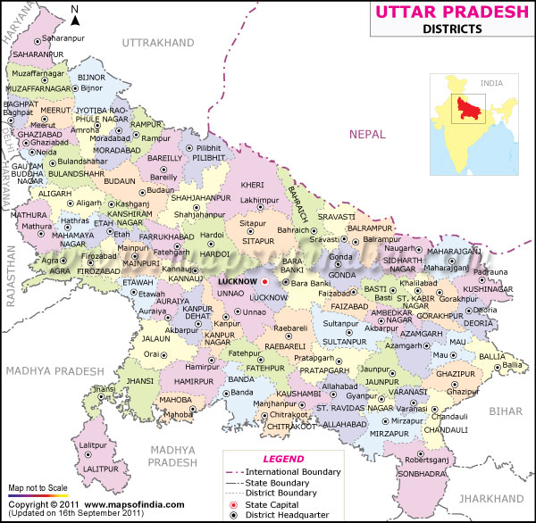
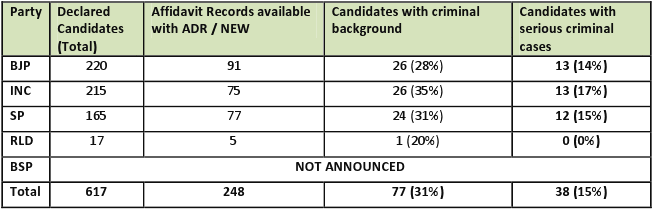

<figure aria-describedby="caption-attachment-610" class="wp-caption alignleft" id="attachment_610" style="width: 300px">

<figcaption class="wp-caption-text" id="caption-attachment-610">Uttar Pradesh's districts (Map courtesy mapsofindia.com)</figcaption></figure>

National Election Watch (NEW), a nationwide campaign comprising of more than 1200 NGO and other citizen led organizations working on electoral reforms, improving democracy and governance in India has been monitoring the candidates for 2012 Uttar Pradesh Assembly Election declared by political parties. Association for Democratic Reforms (ADR), Uttar Pradesh Election Watch (UPEW) and NEW looked at following lists declared by various political parties and checked the records of these candidates with over 75,000 records that ADR and NEW has been accumulating since 2003.

- A total of 617 candidate names were released in the first list by all major parties except BSP.
- BJP: 220
- Congress: 215
- Samajwadi Party: 165
- RLD: 17

- Of the 617 candidates, NEW found matching affidavits for 248 candidates from earlier elections (2007 Assembly or 2009 Lok Sabha)
- 38 candidates have *serious criminal cases* against them (“Serious” = Murder | Attempt to Murder | Robbery | Theft | Kidnapping)

The table provides a party-wise comparison of candidates’ criminal records. The number and percentage of candidates with criminal (and serious criminal) charges is nearly identical for BJP, Congress and Samajwadi Party.

<figure aria-describedby="caption-attachment-609" class="wp-caption aligncenter" id="attachment_609" style="width: 655px">

<figcaption class="wp-caption-text" id="caption-attachment-609">Party-wise look at candidates' criminal background</figcaption></figure>

It’ll be interesting to see the numbers for Bahujan Samaj Party (BSP). I’ve not been following Uttar Pradesh politics but, from what little I’ve read, Mayawati might have a stronger penchant for firing party MLAs accused of criminal misconduct.

To summarize, 77 candidates (31% of the total) and 38 candidates (15%) in the fray have criminal background and serious criminal cases respectively. So what can one do about it? In the past 12 months, Team Anna is the only pan-India organization that has challenged the political status quo and has the credibility (despite the reduced momentum) to highlight the issue of criminalization. But, for obvious and unfortunate reasons, Team Anna is fixated on just ONE issue (passing the Jan Lok Pal)!

In a recent [Arvind Kejriwal interview](http://www.firstpost.com/politics/how-much-samajwad-is-there-in-samajwadi-party-asks-kejriwal-197415.html), FirstPost asked a very relevant question: *What if a candidate with corrupt or criminal background comes out in support of Jan Lokpal?* Kejriwal’s response: *Let’s see if they do it. It is a hypothetical question.*

Let’s first examine the question. There’s such a strong correlation between corruption and criminalization. Isn’t criminalization a tool of choice for the ‘less sophisticated’ (and more determined) corrupt politicians? Why must Kejriwal and Team Anna hesitate in condemning criminalization, especially when there’s little risk in the dilution of their core message and existential goals?