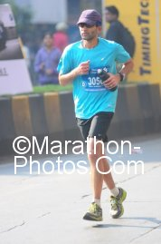

Writing a post-marathon race report is a bit like \[insert-metaphor\]. Write it too soon and it runs the risk of coming out shallow and half-baked, wait too long and it might never see the light of day. A fortnight after completing Standard Chartered Mumbai Marathon (SCMM), I’m right at the dangerous cusp. I often describe SCMM to my non-running friends as the *Vaishno Devi* for marathon aficionados – ‘nuf said!

I didn’t have a perfect race. If I did, a single tweet would have sufficed. As I recently observed in this blog post, one learns more from an imperfect race than a perfect one – hence this blog post. 🙂 I had a good and exciting race. What I didn’t bank on was that the excitement would start well before race start.

What if the auto-driver had arrived at my friend’s place on time. What if I had managed to catch the express train (instead of the slower local) from Kurla to CST. What if the security guards at gate #4 had allowed me to enter Azad Maidan without my bib. In the hour before race start, the three “what ifs” came together for a perfect storm of anxiety. Not just for me but also for my friend Jothi. The underlying blunder had already been committed the previous day when I requested Jothi to pick up my race kit and bring with him the next morning.

**Before race start**

Reached gate #4 at 5:25 am. I knew it was a mere 15 minutes to the starting gun but I wasn’t freaking out just yet. However, I was feeling guilty for having put Jothi in a tricky predicament. After a series of phone calls between Jothi and me, Jothi rushed towards gate #4, only to not find me because.. he had been misdirected to gate #5. If Jothi had left my bib and timing at the baggage counter and tried to make it to the starting line on time, I would have totally understood but he’s too cool a friend (Here’s Jothi nonchalantly talking about the episode in [his race report](http://jothi-reflections.blogspot.com/2012/01/scmm-2012.html)). It was 5:35am when Jothi told me to come to gate #5. I sprinted the 600 meter odd distance from gate#4 to gate #5. Jothi quickly handed over my bib/timing chip and hurried to the starting line while I rushed to the baggage counter. As I fixed the timing chip to my shoe, one of the baggage counter guys helped with my bib. In a moment of insanity, I coolly asked the baggage counter guy “where are the restrooms?” He gave me an incredulous look and said “Sir, hurry to the starting line or you might miss the cutoff!”

**Off to the races**

Azad Maidan at 5:45am bore a deserted look. I sprinted the 600m odd distance from the baggage counter to the starting line along with 4-5 fellow late starters. When my timing chip recorded its beep at the starting mat, the gun time was 5:52am. I was 12 minutes behind the pack, my running partner (Jothi) was a few minutes ahead but I visibly relaxed. Whew! I had made it – there was just a little matter of running 42.195km.

I took stock of my situation. I reminded myself that this was my *ninth* marathon so the issue was less about finishing and more about my finishing time. Adjustments were needed to my running pace but how much? Before talking about my race day adjustments, a quick look at my training plan and the method behind setting a goal pace.

**Training Plan Recap**

I had been following Hal Higdon’s [Advanced 1](http://halhigdon.com/training/51141/Marathon-Advanced-1-Training-Program) training plan. I picked an ‘Advanced’ plan instead of an Intermediate plan, not because I’m an advanced runner but because I wanted a plan which incorporated interval runs and a weekly mileage higher than what I was normally accustomed to. Of course I made changes galore to the plan. At the half-way mark, when I was supposed to run a half-marathon at goal pace, I ran a 50k (my first Ultra marathon!). During the three weeks of highest mileage (85k+), I ended up missing at least one middle-of the-week run with the result that those weeks became 60k+ and 70k+ weeks instead. A cold Hyderabad morning and recalcitrant lungs conspired for a DNF on my final 32k training run.

**On goal pace and the inevitable adjustments**

I used this popular [goal pace calculator](http://www.mcmillanrunning.com/index.php/site/calculator) to set my initial goal. A common trait shared by all goal pace calculators is a disclaimer that reads something like this – *“Of course these are estimates’ of what you can run. Actual results will vary depending on the course, the weather, if it’s your day or not and a myriad of other factors.”* Thanks Sherlock! To give you a sense for how ridiculous these calculators can be, consider this! When I inputted my fastest recent 10k (a little under 48 minutes), the calculator spat out 3:45 as my goal pace. Which suggested that I could cleave a whopping 41 minutes from my PB – crazy! Psychologically, anything faster than 3:59 was irrational exuberance so I decided to train for a 5:40 goal pace FULLY aware that adjustments would be forthcoming.

I had known about the [benefits of interval training](http://sportsmedicine.about.com/od/tipsandtricks/a/Intervals.htm) for a while but this was the first time I incorporated into my training regimen. I missed a few long runs, a few tempo runs and several easy runs but I didn’t miss a single interval run. The other thing I did differently was to run all my weekday runs on the treadmill. This was driven by a constraint (early morning time paucity) rather than any deliberate strategy. As the Higdon plan recommended, I ran at least two of my interval runs as [Yasso 800’s](http://www.runnersworld.com/article/0,7120,s6-238-244-255-624-0,00.html). Running most of my intervals (including the Yasso 800s) at 4:00 pace, albeit on the treadmill, gave me the confidence that maybe (just maybe! my goal pace was not terribly unrealistic.

In the final week of taper, as I broodingly looked at the “plan” vs. “actual” spreadsheet and saw the numerous deviations and reflected on the fact that my current PB was 4 hrs 26 min, I decided that a goal finish of 4 hrs 10 min (average pace of 5:56) was more realistic.

*The rest of the race report continues here…. [For a few minutes less: running the Mumbai Marathon 2012](https://www.ulaar.com/2012/02/07/for-a-few-minutes-less-running-the-mumbai-marathon-2012/)*

