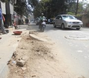
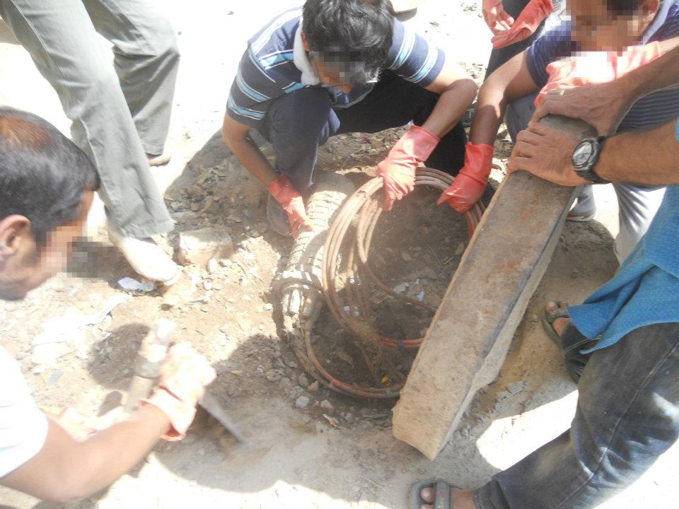
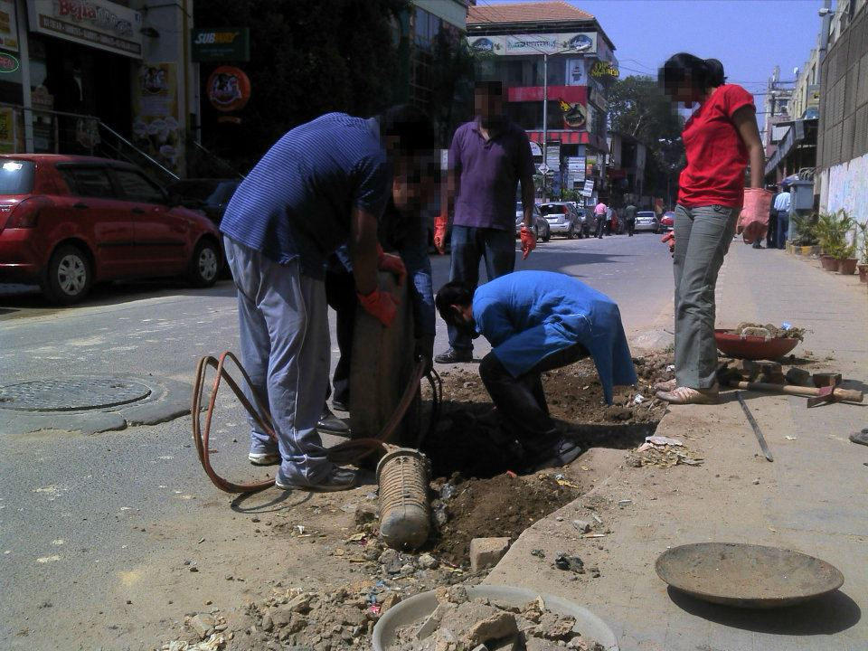
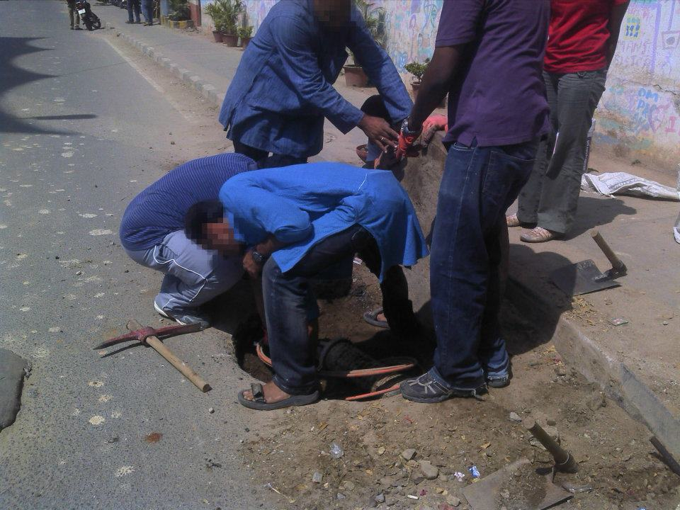
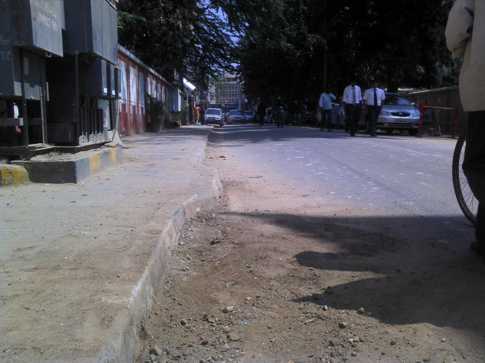
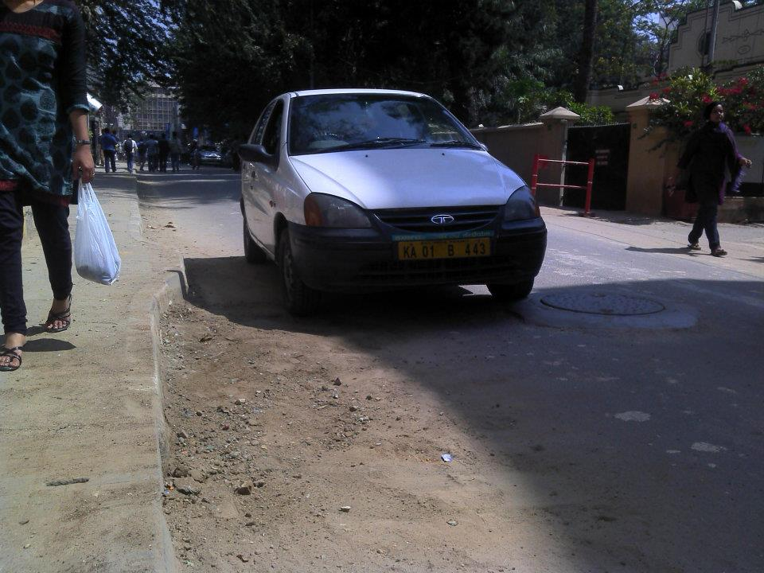
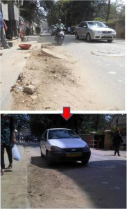

The first few news articles I read this morning were depressing ones about the UP elections. That probably explains my less than cheerful [previous post](http://www.techsangam.com/2012/02/06/understanding-the-medieval-battle-for-uttar-pradesh/). “A quick Facebook session should lift my spirits,” I told myself. And boy, did it? My favorite uncategorizable community organization, The Ugly Indian, had made a foray into a new area – road usability/reclamation. In slightly over one hour, a few able-bodied Ugly Indians fixed a jutting manhole cover and freed up 20% of the width of Church Street, Bangalore – woohoo! Take a bow, guys!

<table><tbody><tr><td>

</td><td> **Picture 1** : A manhole cover jutting out is a traffic hazard, eats up 20% of the road, and gathers muck. This particular cover on Church Street has been like this for over a year – and nobody has done anything about it. Everyone here knows about it and complains (the businesses, the police, the shopkeepers, the public…)</td></tr><tr><td>

</td><td> **Picture 2** : There’s only one way to know what lies beneath!  
Warning: these concrete covers are HEAVY and need 3-4 people.  
Surprise – this is not a sewerage chamber (as most people assume) – we unearth a Tata Indicom telecom cable junction! This is part of the high-speed broadband network here!</td></tr><tr><td>

</td><td> **Picture 3** : The city’s roads and footpaths have been mauled by our telecom companies (Tata Indicom, Airtel, RIL and others). They have done an incredibly shabby job in this case.  
The team of UIs sets about creating a neat hole to pack the cables and replace the cover. It is a delicate business (we have to keep the wires protected) and takes a fair amount of trial and error.</td></tr><tr><td>

</td><td> **Picture 4** : The manhole cover seating is broken – so we do a jugaad job using stones and bricks (We will return to do a pucca job later).</td></tr><tr><td>

</td><td> **Picture 5** : An hour later, the road is rescued and the manhole cover is deliberately covered in a layer of dirt – to attract cars to use this part of the road.</td></tr><tr><td>

</td><td>**Picture 6** : It works! The impact is immediate.  
20% of the road is rescued.</td></tr><tr><td>

</td><td>**Picture 7** : Not bad for an hour’s hard labour:)  
Try it sometime – surely, there’s a poorly placed manhole cover near your home/office! All you need is a crowbar and a few enthusiastic people.</td></tr></tbody></table>