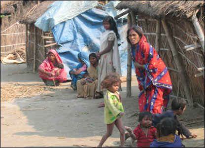

<figure aria-describedby="caption-attachment-615" class="wp-caption alignleft" id="attachment_615" style="width: 300px">

<figcaption class="wp-caption-text" id="caption-attachment-615">Scene from UP’s Kushinagar – constituency with most # of criminal background candidates (Pic: courtesy bbc.co.uk)</figcaption></figure>

Last week we learnt, from a perusal of an Association for Democratic Reforms (ADR) report, that out of the 617 candidate names released in the first list, [31% and 15% had criminal cases and serious criminal cases registered against them](http://www.techsangam.com/2012/01/31/up-election-candidate-insights-from-adr-national-election-watch/). If you thought this was sobering, the news gets better with ADR’s addendum report on red alert constituencies (constituencies with 3 or more candidates with declared criminal cases).

- A whopping 36% (41 out of 114) of constituencies are red alert constituencies. With 3 or more candidates from major parties with declared criminal cases, what kind of choice do voters have to select an honest candidate?
- Out of the 41 red alert constituencies, 28 have 3 candidates with declared criminal cases, 10 have 4 such candidates, 2 have 5 candidates and..(drum roll) ONE where all the 6 analyzed candidates have criminal cases.
- ALL candidates from Mehdawal constituency in Sant Kabir Nagar district have declared criminal records in their affidavits. These ‘Special 6’ are from Congress, BSP, BJP, SP, JD(U), and Peace Party. Came across this [Mehdawal Election Results since 1977](http://mehndawal.blogspot.in/2011_04_01_archive.html) post which informs us that the incumbent (SP’s Abdul Kalam) was elected for 3 consecutive terms since 1996. The seat was previously held by a BJP candidate, again for 3 consecutive terms.
- Kushi Nagar is the district with the highest number of candidates (21) with declared criminal cases out of a total of 42 candidates. Yes – that’s 50%!

While Samajwadi Party rules the roost (51% of its candidates have criminal records), the other major parties are not too far behind – BSP (39%), BJP (36%), and Congress (32%). According to their financial asset declarations, 41% are crorepatis. In 2007, a ‘mere’ 22% were crorepatis.

Rediff’s Sheela Bhatt wrote a depressing piece that [this election is certainly NOT about the future of UP](http://www.rediff.com/news/slide-show/slide-show-1-is-there-a-bigger-brahmin-than-rahul-gandhi-sheela-bhatt/20120206.htm). The future of *180 million* is involved but the battles are being waged along caste and communal lines.

> - All political parties, the media and many voters are feeding the monster of casteism. Candidates only speak about composition of communities in their region. Reporters are left with no choice but to ask what caste combination votes candidates are confident of.
> - If Mulayam Singh Yadav’s Samajwadi Party comes to power it will be the rule of Yadavs and Muslims; if Mayawati’s Bahujan Samaj Party retains power it will be dominated by her Dalit agenda; if the Bharatiya Janata Party is part of the government or lends support from outside, the upper castes and a section of middle-class Hindus will feel elated.
> - Such is the weight of identity here in India’s heartland that Rahul Gandhi brought into the UP battleground even Sam Pitroda — the Chicago native and technocrat — who says he is proud to be born in a carpenter’s family.

During the last UP elections, Abhijit Banerjee (MIT economist and co-author of [Poor Economics](http://pooreconomics.com/)) and some researchers partnered with an NGO to conduct a Randomized Control Trial (RCT). The trial was to run a nonpartisan campaign (using street plays and puppet shows) around a simple slogan, *Don’t vote on caste, vote on development issues, * in randomly selected villages. This simple message reduced the probability that voters would choose a candidate from their own caste from 25 percent to 18 percent. You can read more on this topic here – [Voting in developing countries dominated by ethnicity? Banerjee and Duflo answer with.. (yes) a RCT](http://www.techsangam.com/2011/10/28/voting-in-developing-countries-dominated-by-ethnicity-banerjee-duflo-answer-rct/).

An RCT is all fine and dandy but who’s going to take a non-partisan *“Don’t vote on caste, vote on development”* message to the 180 million UP voters?

Or, better still, can we have the next round of electoral reforms to prevent candidates with criminal background from entering politics?