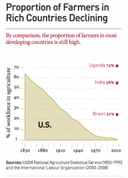
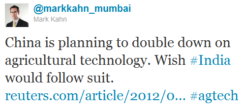

If you have time, you really should read the complete text of the [2012 Annual Letter from Bill Gates](http://www.gatesfoundation.org/annual-letter/2012/Pages/home-en.aspx). But I know you live in a multi-screen world with thousands of tweets, status updates, and vids clamoring for your attention every waking moment so I’ll do some of the heavy lifting (sorry, “curating”) instead.

The Gates letter covers 4 broad areas – Innovation in Agriculture, Global Health, US Education, and Foundation Updates. This post includes insights from the first section.

- Right now, just over 1 billion people (about 15 percent of the people in the world) live in extreme poverty. On most days, they worry about whether their family will have enough food to eat. There is irony in this, since most of them live and work on farms. The problem is that their farms, which tend to be just a couple acres in size, don’t produce enough food for a family to live on.
- Fifteen percent of the world in extreme poverty actually represents a big improvement. Fifty years ago, about 40 percent of the global population was poor. Then, in the 1960s and 1970s, in what is called the Green Revolution, Norman Borlaug and other researchers created new seed varieties for rice, wheat, and maize (corn) that helped many farmers vastly improve their yields.
- We have the ability to accelerate this historic progress. But we won’t advance if we don’t continue to fund agricultural innovation, and I am very worried about where those funds will come from in the current economic and political climate. My annual letter this year is an argument for making the choice to keep on helping extremely poor people build self-sufficiency.
- Gates Foundation devoted almost $2 billion to helping poor farm families, most of which are led by women, boost their productivity while preserving the land for future generations. Those funds are invested in many areas of innovation, ranging from sustainable land management, to better ways to educate farmers, to connecting farmers to functioning markets
- Proportion of farmers in rich countries declining but it’s still high in developing countries (see related graphic).
- Only $3 billion per year is spent on researching the seven most important crops. This includes $1.5 billion spent by countries, $1.2 billion by private companies, and $300 million by Consultative Group on International Agricultural Research (CGIAR)
- Because farmers plant seeds that give them the highest yields, the diversity of crop varieties in fields is quite limited. This creates a perfect opportunity for disease to spread (e.g. European potato blight epidemic in 1840s, southern corn leaf blight in United States in 1970s).
- Currently, 4 million tons of rice are lost to flooding every year in Bangladesh and India. But as farmers in the region adopt Swarna-Sub1 (a new rice seed which is both very productive and can survive in flooded fields), they will grow enough extra rice to feed 30 million people.
- There is also an extremely important revolution – based on understanding plant genes – taking place in the plant sciences. The tools that enable this revolution were created to help cure human diseases. The field of agriculture is just now in the process of figuring out how to take advantage of these tools, but it’s clear that they will greatly accelerate the pace of plant research. It is hard to overstate how valuable it is to have all the incredible tools that are used for human disease to study plants.

Shortly after the Gates Letter, Reuters reported (in [this article](http://www.reuters.com/article/2012/02/01/us-china-agriculture-idUSTRE81016L20120201)) that the Chinese government would be investing in agricultural innovation to improve food security. The central government estimates that China’s national grain consumption will reach 572.5 million tonnes by 2020. Although China is largely self sufficient in wheat, it is not in soybeans and corn. In 2010, China returned to importing corn in earnest after years of blocking foreign grain, buying a record 1.57 million tonnes, up 18 times from the previous year because domestic production couldn’t keep up with demand.

Omnivore Capital’s venture partner and Godrej Agrovet EVP Mark Kahn tweeted the below in relation to the Chinese decision (Amen!):

Part 2 of our review continues here – [Key nuggets from Bill Gates’ Annual Letter 2012 – Global Health](http://www.techsangam.com/2012/02/09/key-nuggets-from-bill-gates-annual-letter-2012-global-health/).