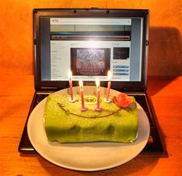

Yup – 4 years! To celebrate my 4-year blogging anniversary, I migrated my WordPress-hosted [wordpress.ulaar.com](http://ulaar.wordpress.com/) blog to [ulaar.com](https://www.ulaar.com/). I’m sure it’s an event the blogosphere’s been looking forward to with joyous anticipation but guy… don’t know how to break it you… I’m not doing any press interviews. And yeah – don’t send any TV crews either (especially those with Burkha Dutt imitators).

If you really *must* know where I do most of my blogging, here’s a hint. Koramangala. There are a lot of coffee shops in Koramangala though. Not as many as within a quarter mile radius of a Los Angeles or Manhattan neighborhood..but close.

I’ve also been known to blog from my car as I wait to pick up my son from his school or art class. You may not know which car I drive or which school my sons go to. Then again, you might have read [Hum do humare do… bina exhaust ke](https://www.ulaar.com/2010/06/27/hum-do-humare-do-bina-exhaust-ke/), this drama-in-real-life [The Janus Man](https://www.ulaar.com/2009/07/17/the-janus-man/), or [The curious case of the traveling chairman](http://www.ulaar.com/2008/10/16/the-curious-case-of-the-traveling-chairman/).

Now that I’ve cleared the air on *how you can’t easily find me in Koramangala*, let me share some blog statistics and highlight some other posts.

My blogging journey started with [A time to Qik](https://www.ulaar.com/2008/02/07/a-time-to-qik/) on Feb 8, 2008. The 2nd post ([Etymology of ulaar](https://www.ulaar.com/2008/02/22/etymology-of-ulaar/)) followed soon enough. Things kinda languished for a few months until the primary [Returning to India](https://www.ulaar.com/category/returning-to-india/) meme emerged in May 2008. [Why are we moving back to India now](https://www.ulaar.com/2008/06/02/why-are-we-moving-back-to-india/) remains an all-time popular post; a more recent guest post by Vasantha Gullapalli, [Our Return Ticket 16 Years Later](https://www.ulaar.com/2011/02/21/our-return-ticket-16-years-later/), was another widely read post on the R2I meme.

It took me 2 years to reach the magic milestone of 50 posts. Fittingly, post #50 was [The Art of Returning to India](https://www.ulaar.com/2010/02/20/the-art-of-returning-to-india/), which also marked the change of my blog’s tagline from *Return to accustomed earth* to *The Art of Returning to India…and Staying Put*.

[The darndest things you see in India](https://www.ulaar.com/2010/06/11/the-darndest-things-you-see-in-india/) photo blog post was one of the largest traffic drivers in 2010. It also garnered a modicum of fame when BlogAdda, an Indian blog network, featured it as a [Spicy Saturday pick](http://blog.blogadda.com/2010/06/19/indian-blogs-bloggers-best-posts).

The 100 post milestone was crossed in Feb 2011 (a speedy 12 months compared to the previous 50). Post #100, [As I shuttled between San Francisco and Bangalore in 2010](https://www.ulaar.com/2011/02/05/as-i-shuttled-between-bangalore-and-san-francisco-in-2010/), was on the troubling topic of homelessness. In a coincidental way, this post can be considered as a segue to my new [TechSangam](https://www.techsangam.com/) blog, which I started in March 2011.

TechSangam’s inspiration (and first) post was [Evolution of the Human Race](https://www.techsangam.com/2011/03/11/evolution-of-the-human-race-3/). It took a mere 8 months for TechSangam to hit the 100 post milestone. Comparing TechSangam (official blog) with ulaar (personal blog) is not fair since the former was *supposed* to be a full-time gig. Unsurprisingly, the blog cadence on ulaar suffered in the first 6 months of TechSangam’s evolution but it started picking up steam in Sep 2011. The [ulaar](https://www.ulaar.com/) blog is now batting n.o. at 137 (including today’s post) and [TechSangam](https://www.techsangam.com/) is batting at 133. Gotta keep a healthy competition between the two… are you listening, Dr. Jekyl?

*Closing Note*: This post was conceived on Feb 7 and written in fits and spurts on Feb 9 (today) – first in a Costa Coffee, then in front of my son’s school, followed by a brief session in Au Bon Pain, and a briefer session on a tree-lined Koramangala street. I’m hitting the Publish button in the comfort of my home office. Boy! it’s been a hot February day.

