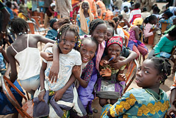
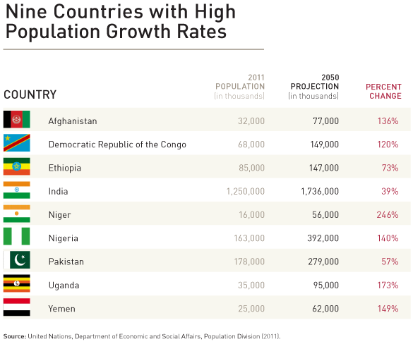

<figure aria-describedby="caption-attachment-631" class="wp-caption alignleft" id="attachment_631" style="width: 292px">

<figcaption class="wp-caption-text" id="caption-attachment-631">Children waiting to be vaccinated against meningitis (new vaccine). Pic: courtesy @Path, Gabriel Bienczycki/Gates Foundation</figcaption></figure>

This is Part 2 of TechSangam’s review of the [2012 Annual Letter from Bill Gates](http://www.gatesfoundation.org/annual-letter/2012/Pages/home-en.aspx). The Gates letter covers 4 broad areas – [Innovation in Agriculture](http://www.techsangam.com/2012/02/08/key-nuggets-from-bill-gates-annual-letter-2012-innovation-in-agriculture/), Global Health, US Education, and Foundation Updates and this post includes key insights from the Global Health area.

- When Melinda and I started this work more than a decade ago, we were inspired by the conviction that all lives have equal value. So one of the first things we invested in was vaccines, which protect all children who receive them, no matter how rich or poor they may be. In short, vaccines work. Two years ago, Melinda and I called on the global health community to make this decade the “Decade of Vaccines.”
- The Gates Foundation helped GAVI (Global Alliance for Vaccines and Immunisation), organization responsible for helping poor countries introduce new lifesaving vaccines, in raising $4.3 billion in pledges over a 5-year period. This money will save 4 million lives by 2015. GAVI is now supporting two relatively new vaccines, rotavirus (to combat diarrhea) and pneumococcus. By 2015, these vaccines will prevent 190,000 diarrheal deaths and 480,000 respiratory deaths.
- Global coverage of basic childhood vaccines is around 80 percent, which is good compared to many other health interventions but leaves one out of five children unprotected.
- First recipient of the Gates Vaccine Innovation Award is Dr. Asm Amjad Hossain, a district immunization medical officer from Bangladesh. Within one year, he raised immunization rates in two districts by a whopping 20 percentage points (to 85 and 79).
- India has reached a huge milestone. The country had only one case in 2011, which was recorded on January 13 in West Bengal. So on January 13, 2012, India celebrated its first year of being polio free. In Nigeria our biggest problems are low-quality campaigns and the fact that some parents don’t trust that the vaccine is safe. In Pakistan these problems are compounded by the security situation.
- [The Global Fund](http://www.theglobalfund.org/en/), to fight AIDS, Tuberculosis, and Malaria, has saved millions of lives. Between 2008 and 2010 the Global Fund gave $8 billion for AIDS (57%), malaria (29%), and tuberculosis (14%). The Gates Foundation is the biggest non-Government supporter of The Global Fund.
- More than 6.6 million people are alive today because they are taking ARV (AntiRetroViral) drugs. Ten years ago it looked as if almost all of these people would die because the drugs were only available in rich countries. Credit to Global Fund and US program PEPFAR.
- <figure aria-describedby="caption-attachment-632" class="wp-caption alignright" id="attachment_632" style="width: 300px">

<figcaption class="wp-caption-text" id="caption-attachment-632">Graphic courtesy gatesfoundation.org (Source: United Nations)</figcaption></figure>
  
  Melinda (Gates) has focused a lot of her foundation time on family health issues, including maternal and infant health, nutrition, and family planning. In 2012 and beyond, she will really emphasize family planning – giving women the tools they need to plan how many children they have and when they have them. Developing countries have a chance to benefit from “demographic dividend” – the idea that as parents bring their family size down, countries can invest more in educating young people.
- The (family planning) tools that are likely to have the highest adoption rates in sub-Saharan Africa are implants or injectables, not the oral contraceptives that are popular in the United States. Indonesia has made implants broadly available, and more than 1.7 million women are using implants today. The foundation has helped fund quality assurance for a lower-cost implant, Sinoplant II, which is registered today in more than 17 countries and costs 60 percent less than the alternatives.
- Our goal is that every woman should have the ability to choose when she wants to have children. The result will be healthier mothers and children and more prosperous nations.