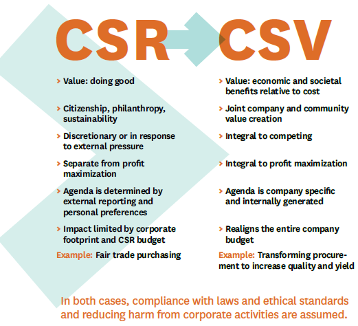

Earlier this week, I wrote an [overview post on Creating Shared Value](http://www.techsangam.com/2012/02/14/just-what-exactly-is-shared-value/). In the foreword, I loosely described the Shared Value concept as ‘CSR on steroids’. As though anticipating such loose characterizations, the authors of the Shared Value paradigm included a section that visually summarizes the key differences between CSR and CSV. I reproduce that graphic from Porter and Kramer’s [Creating Shared Value](http://www.fsg.org/tabid/191/ArticleId/241/Default.aspx?srpush=true) report.

Perhaps the best Indian example of a company that illustrates CSV is ITC’s Agro Business Division (ABD). Once a fledgling division on the verge of being shutdown, its [pioneering eChoupal initiative](http://www.techsangam.com/2011/09/20/itc-e-choupal-model-to-increase-farmer-revenue-and-its-own-bottomline/) has been critical to its reinvention and now drives 17% of the company’s overall revenue.

On a related note, you might be interested in perusing the [CSR Ratings of the largest 500 public Indian companies](http://www.techsangam.com/2011/09/25/csr-ratings-of-the-largest-500-indian-companies/).