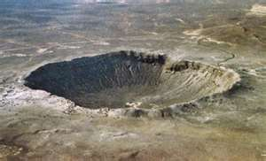

<figure aria-describedby="caption-attachment-649" class="wp-caption alignleft" id="attachment_649" style="width: 300px">

<figcaption class="wp-caption-text" id="caption-attachment-649">Pic: courtesy universetoday.com</figcaption></figure>

*Editor’s Note: I should caution readers that this is a work-in-progress topic. The primary purpose of this post is to complete the contender list in each category. Ever since I [called bullshit on Forbes’ List of Top 30 Social Entrepreneurs](http://www.techsangam.com/2011/12/05/calling-bullshit-on-forbes-list-of-top-30-social-entrepreneurs/) this post has been languishing in my Drafts folder – today I decided enough dust had collected! For some obvious reasons, I’ve excluded Amul/GCMMF (and all milk cooperatives) and Fab India from the list.*

**Impact Definition**

Our criterion of impact is “reach”, a category independent metric which is intended to highlight the social enterprises who’ve had the most traction. The company specific reach metrics (# of farmers, # of households, etc.) were either picked up from their websites or via recent email exchanges. How efficiently the social enterprises are increasing their reach is a separate question — their financial metrics could well speak to that.

**Energy**

- [Husk Power Systems](http://www.huskpowersystems.com/): it has installed 60 mini-power plants that power ~ 25,000 households in more than 250 villages and hamlets and impact lives of approximately **150,000 people** in rural India. On average, each power plant serves about 400 households and replaces ~ 42,000 litres of kerosene and 18,000 litres of diesel per year. As of August 2010, HPS has already sequestered 50,000 tons of CO2
- [Selco Solar](http://selco-india.com/): Sold, serviced, and financed **135,000+** solar home lighting systems in 15 years. SELCO currently employs about 170 employees in Karnataka and Gujarat spread across 28 energy service centers.
- [First Energy](http://www.firstenergy.in/): Approximately 500,000 Oorja stoves have been sold to BoP households since 2006.
- [Envirofit](http://www.envirofit.org/): Sold over 300,000 stoves. Today over 1 million people breathe healthier air, spend less time and money on cooking fuel, place a smaller demand on their forests, and emit less greenhouse gases.
- [D.Light Design](http://www.dlightdesign.com/): Looking for data..
- [Greenway Grameen Infra](http://www.grameeninfra.blogspot.in/): Waiting for data.

**Agriculture/Rural Services**

- [ITC eChoupal](http://www.techsangam.com/2011/09/20/itc-e-choupal-model-to-increase-farmer-revenue-and-its-own-bottomline/): As of 2011, there were **6,500** e-Choupal installations reaching **4 million farmers** across **40,000 villages** in 10 states.
- [IFFCO Kisan Sanchar Limited](http://www.iksl.in/) (IKSL): Joint venture between Indian Farmers Fertilizer Cooperative Limited (IFFCO), a federation of 40,000 cooperative societies and 60 million farmers, and Airtel. The actual # of farmers using Airtel’s VAS is still TBD.
- [Jain Irrigation Systems](http://www.jains.com/Agricultural%20services/micro%20irrigation%20systems.htm): 55% market share in India. Revenue from its micro-irrigation division, which started in 1989, represents 55% of its overall revenue
- [GEWP](http://www.techsangam.com/2011/06/29/global-easy-water-products-journey-to-profitability-and-beyond/): Over **300,000 farmers** have benefited from GEWP’s micro-irrigation products in the past 7 years.
- [Reuters Market Light](http://reutersmarketlight.com/) (RML): Service reaches over 2 million farmers across 13 Indian states and early research indicates that it has helped increase the incomes of more than 60% of them. The verbiage on RML’s website suggests that the number of actual subscriptions might be well below 2 million (lot of SMS forwarding I suppose – how does one prevent that?)
- [Champion Agro](http://championagro.com/):
- [Janani Foods](http://jananifoods.com/):
- [Tirumala Milk Products](http://tirumalamilkproducts.com/):

**Financial Exclusion** (excluding MFIs)

- [Eko Financial Services](http://www.techsangam.com/2011/07/10/eko-india-financial-services-raises-5-5-million-round-from-creation-investments/): Has served nearly a million customers through its network of 1,300+ retail outlets across three states.
- [FINO](http://www.techsangam.com/2011/09/22/fino-branchless-banking-and-financial-inclusion-products-delivered-via-agent-network/): With over **44 million customers** and 22,037 transaction points in 399 districts across 25 states, FINO is the market leader in delivering products and services to first and last mile. Their core banking products include SBI no-frills banking, money transfer, life insurance, NREGA electronic transfer, and microloans.
- [A Little World](http://www.alittleworld.com/) (ALW): 3 million customers on the ‘Zero Platform for Branchless Banking’ across 20,000 villages in 18 states. 25 banks on the Zero Platform. The Zero accounts are used for biometrics identity, cash disbursal of social security pensions and wages under NREGA, small value credit, domestic money remittances by migrants, recurring deposits, insurance premium payments.

Who else should be on this long list? Please leave a comment.