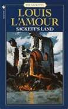

<figure aria-describedby="caption-attachment-1334" class="wp-caption alignleft" id="attachment_1334" style="width: 115px">

<figcaption class="wp-caption-text" id="caption-attachment-1334">Pic: courtesy paperbackswap.com</figcaption></figure>

In [Sackett’s Land](http://www.louislamour.com/novels/sackettsland.htm) (first of the 17-volume Sackett series) Ivo Sackett (father of Barnabas Sackett) giving some sage advice to his son…

> “You will see many women, and often you will think yourself in love, but temper passion with wisdom, my son, for sometimes the glands speak louder than the brain. Each man owes a debt to his family, his country and his species to leave sons and daughters who will lead, inspire and create.”