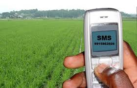

<figure aria-describedby="caption-attachment-653" class="wp-caption alignleft" id="attachment_653" style="width: 280px">

<figcaption class="wp-caption-text" id="caption-attachment-653">Pic: courtesy agricorner.com</figcaption></figure>

Reuters Market Light (RML). ITC eChoupal. Ekgaon Technologies. IKSL. TCS mKrishi.

These are some of the leading social enterprise initiatives from established companies or startups that are attempting to deliver relevant information (crop prices, subsidies, weather, crop diseases, etc.) to India’s farmers so they can make better decisions. There’s no better to understand the final impact on farmers’ decisions than to read some good old-fashioned testimonials. Here’s a subset of farmer testimonials from RML’s [social impact page](http://reutersmarketlight.com/impact.php):

> I have subscribed for RML service on my mobile for one year. I wanted to buy Rotavator, but was unable to buy it, because it was too costly. Then, one day, I got a message from RML that the government is giving subsidy on Rotavator. I contacted the agriculture officer and bought the Rotavator and I got Rs. 20,000/- off on that. – Mandhir Singh (RML Subscriber, Punjab)
> 
> I cultivate potatoes and Basmati in my fields and use RML service. After harvesting my potato crop, a local trader wanted to purchase my potatoes at the rate of Rs. 365/- per bag. But since I knew the market rates of potatoes sent by RML on my mobile, I sold them at the rate of Rs. 427/- per bag. With this I got good rate for 2500 bags of my potatoes and made a got a profit of Rs. 1,55,000/-. – Jaswinder Singh (RML Subscriber, Punjab)
> 
> I, Mahendra Singh, am a farmer growing wheat and cumin seeds (jeera). I have planted variety 1121 of paddy. My paddy was infested by a disease of which I did not find a solution anywhere. Then my friend suggested about RML and I subscribed to it on my mobile phone. I followed the suggestions I received through it. My crop is disease free now. I am pretty happy about the benefits I received through this service. – Mahendra Singh (RML Subscriber, Haryana)
> 
> I cannot resist myself visiting this office as RML messages, more particularly News and Weather Updates helped me earn profit to the tune of Rs.100,000. RML has contributed to my social esteem immensely as I am now considered to be a leader of small group of progressive farmers in my village. They come to me for suggestions and advice on agriculture – subsidies by the government, availability of fertilizers, market intelligence, weather forecast, etc. while earlier I was a laughing stock in the village for referring to RML SMSes. – Raj Kishore Choudhary (RML Subscriber, Madhya Pradesh)
> 
> I had got the RML card activated on my mobile due to which I received a message at 8’O Clock in the morning that within the next 24 hours rains were expected. After being cut, the paddy was lying in the fields which I collected in the store and got covered with the haystacks. This spared my paddy in 35 acres from being spoilt which saved me from loss of thousands of rupees. I regularly receive the rates of the Mandis. – Devnarayan Yadav (RML Subscriber, Madhya Pradesh)
> 
> After starting RML service, I’ve received information on Potato and Mustard seed. I’ve particularly benefited a lot from the crop advisory sent in March for Potato. I received the message on how to control wilt in potato and through that message I saved my crop from wilt. I’m thankful to RML for saving my crop. – Fanaji Solanki (RML Subscriber, Gujarat)