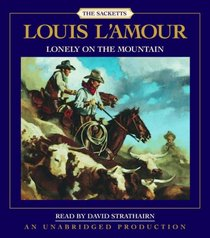

A friend and running fanatic (Partha) once told me a story about one of his friends (let’s call him Jake). Jake is one of those annoyingly gifted athletes — excellent at whatever sport he played. Needless to say, he routinely beat Partha at every sport they played. When Partha moved back to India and sometime after he’d run a couple of marathons, he had a conversation with Jake (who lives in United States and runs a successful physical fitness business) which went something like this.

> Jake: “How’s it going in Bangalore, Partha? Are you up to any good or working on a beer belly?”
> 
> Partha: “Not bad. I’m into running these days. I’m really enjoying myself.”
> 
> Jake: “Ha! Guys with zero talent in any other sport take up running!”
> 
> Partha: “Actually I’m into long distance running – think ‘marathons’. In fact, I ran two full marathons in the past year.”
> 
> Jake (laughing and openly taunting now): “You know what? It’s the really slow runners that take up long distance running!”

<figure aria-describedby="caption-attachment-1351" class="wp-caption alignleft" id="attachment_1351" style="width: 210px">

<figcaption class="wp-caption-text" id="caption-attachment-1351">Pic: courtesy paperbackswap.com</figcaption></figure>

Not sure how exactly the conversation ended but knowing Partha to be the perfect gentleman, I don’t think he switched to French. I bristled with righteous indignation after hearing this story. Partha should not have taken it lying down. So I told him this doggone-never-give-up Sackett story from Louis L’Amour’s [Lonely on the Mountain](http://www.amazon.com/Lonely-Mountain-Sacketts-Louis-LAmour/dp/0553276786):

> “Why, there was a man over at Tellico whupped one of them boys one time. Sure enough, come Saturday night, here was that Sackett again, and the feller whupped him again. An’ ever’ Saturday night, there was Sackett awaitin’ on him, an’ ever’ time he whupped that Sackett, it got tougher to do. Finally, that feller just give up and stayed to home. He was afraid to show his face because Sackett would be waitin’ on him.
> 
> “Finally that feller from Tellico, he just taken out and left the country. Went down to the settlements and got himself a job. He was a right big man, make two of Sackett, but it was years before he stopped jumpin’ if you came up behind and spoke to him. ‘Made a mistake,’ he said after. ‘I should have let him whup me. Then I’d of had some peace. Worst thing a man can do is whup a Sackett. They’ll dog you to your dyin’ day.'”

Are you a long distance runner with a ‘Jake’ in your life? Go on! Challenge him to race you in a full marathon! If he does beat you, you DO know what to do next, right? You have two choices:

- \[The ultra marathon way\] Challenge him for a 50k race the next time. And if that fails, 75k then 100k. (you get the drift…)
- \[The Japanese Kaizen way\] Challenge him for another full marathon. And keep doing it until you either beat him or he drops out.