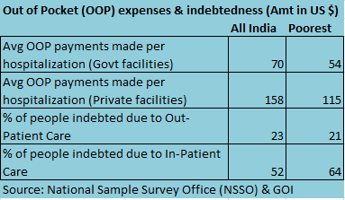

<figure aria-describedby="caption-attachment-644" class="wp-caption alignleft" id="attachment_644" style="width: 160px">

<figcaption class="wp-caption-text" id="caption-attachment-644">The RSBY smart card for BPL families</figcaption></figure>

*\[Editor’s Note: RSBY expands to Rashtriya Swasthya Bima Yojna (Hindi for “National Health Insurance Policy”). The brainchild of IAS officer and Director General of *Ministry of Labour and Employment,* Anil Swarup, the scheme was formally launched in 2008 to provide health insurance coverage for Below Poverty Line (BPL) families. I first heard Anil Swarup speak on a panel at the [2011 Sankalp Forum](http://www.techsangam.com/2011/05/09/if-i-was-looking-for-inspiration-i-found-it-at-sankalp-forum/). Recently, a good friend and editor of [Health.India.com](http://health.india.com/) *shared Anil Swarup’s detailed RSBY presentation from* the Health 2.0 conference. This post is based on Swarup’s presentation and related research.\]*

These days we’re hard pressed to chance upon any good news that can be directly attributed to good governance or sound government policy. Whether it’s the latest in a [long series of national shames](http://www.techsangam.com/2012/01/10/welcome-to-india-a-nation-of-national-shames/) or an education policy that [aims to scuttle India’s demographic dividend](http://acorn.nationalinterest.in/2012/02/21/cheap-tablet-unaffordable-mistake/), can the government get ANYTHING right?

The RSBY program might just be one of those good news. On that note of cautious optimism, let’s get started. Did you know that 94% of India’s workforce is unorganized? Is it then a wonder that most of the things that we digerati take for granted (automatic savings, loans, life insurance, health insurance, etc.) are unavailable to the unorganized sector? Overall, health insurance coverage in India is abysmally low – 83% of health spending is Out of Pocket.

There’s no shortage of evidence showing that healthcare expenses are among the top reasons for poor families descending into abject poverty. According to a 2004 Duke University study, [between one-half to two-thirds of poor households attribute illnesses, accidents, and health-related expenditures](http://www.techsangam.com/2011/03/19/escaping-poverty-and-becoming-poor-who-gains-who-loses-and-why/) to their descent into poverty. The NSSO data quantifies this further – 64% of India’s poorest become indebted due to in-patient care (aka “hospitalization”).

The genesis of the RSBY scheme is to provide health insurance to India’s poorest (“BPL family lists sourced from states”), specifically to mitigate the economic impact of hospitalization expenses. A total sum of Rs. 30,000 insures a BPL family (up to a maximum of five family members). No diseases (including pre-existing) are excluded from coverage. A smartcard (pictured above) enables cashless transactions and service delivery through an [elaborate automated RSBY process workflow](http://www.techsangam.com/2012/02/22/the-complete-rsby-process-flows/).

**Who pays what?**

75% of the program cost and the Rs. 60 smartcard cost is borne by the central government while 25% of the program cost and administrative costs are borne by the participating state. The state has an option to fund additional benefits. The BPL beneficiary pays a yearly registration fee of Rs. 30 and can choose from private or public hospitals.

**Key Adoption Stats** (as of Feb 20, 2012)

- Cards issued: **27.673 million**
- Approximately 27,000 incremental new cards are being issued monthly

- People benefited so far: **3.192 million**
- Hospitals empaneled: **9,697**
- States participating in RSBY: **25**
- Insurance companies involved: **12**

Using the 2011 census data and state-level lists of empaneled hospitals, I created a [comparative view of RSBY adoption in the 25 states](http://www.techsangam.com/2012/02/22/empaneled-hospitals-in-rsby-network/) sorted by *Hospitals-per-BPL-population (million)*. UP, Gujarat and Maharashtra lead in terms of total number of empaneled hospitals but it’s more interesting to look at the *Hospitals-per-BPL-population* metric. Mizoram (at 215) is an over-achiever. Himachal, Chhatisgarh, Haryana, Meghalaya, Gujarat and Punjab fall in the healthy band with hospitals-per-BPL-pop ranging from 50 to 79. A large group of 10 states (notably Bihar, UP, Maharashtra, Orissa) have low numbers ranging from 13 to 30. Rajasthan and Tamil Nadu are conspicuous with their low numbers, presumably because they are at an early stage of RSBY enrollment.

**Other/State Health Insurance Programs**

As part of my research for last year’s [post on Vaatsalya healthcare](http://www.techsangam.com/2011/06/20/vaatsalya-affordable-high-quality-healthcare-formula-smaller-towns/), I learnt that there are several other state and central insurance programs for the poor – Karnataka-based [Yeshaswini](http://www.hsprodindia.nic.in/retopt2.asp?SD=21&SI=4&ROT=4) (started by Narayana Hrudalaya Foundation; covers 17 lakh+ farmers) and [Vajpayee Arogyasri](http://stg2.kar.nic.in/healthnew/SAST/Home.html) (9 lakh+ BPL families), [Rajiv Arogyasri](https://www.aarogyasri.org/ASRI/index.jsp) (Andhra Pradesh’s flagship healthcare inclusion program covering 2 crore BPL families), [National Rural Health Mission](http://india.gov.in/citizen/health/national_rural.php) &amp; [Janani Suraksha Yojana](http://india.gov.in/citizen/health/janani_suraksha.php) (for neonatal and maternal care), [Arogya Raksha Yojana](http://www.arogyarakshayojana.org/), Sampoorna Surakhsa Yojana. This long list of BPL/healthcare inclusion programs highlights yet another Indian theme – lack of a coherent overarching program. Vaatsalya’s Dr. Ashwin observed that many of these programs overlap in terms of coverage and demographics so there’s a clear opportunity for consolidation for greater efficiencies.

**Impact**

The initial impact, as self-assessed by Swarup and team, is multi-fold.

- Private sector is creating health infrastructure in remote rural areas due to the demand created by RSBY
- Since public sector hospitals are competing with private hospitals for BPL customers, they are improving as well
- Quality of states’ BPL lists improving due to exposure
- For expenditures above Rs. 30,000, state governments are linking with other schemes
- Disease profiling at district level

**Err…About those scams**

I wish I could end the post with *“this is the ONLY Government of India program with ZERO leakage.”* Based on my conversations with a few healthcare folks and a few targeted web searches later, my assessment is that RSBY fraud doesn’t appear to be widespread (it’s all ‘relative’, you know!) This [Nov 2011 TOI story](http://articles.timesofindia.indiatimes.com/2011-11-15/surat/30400687_1_insurance-scam-rsby-scheme-bpl-card) is about a Surat-based homeopathy doctor who was claiming fictitious allopathy treatments for BPL card holders in Navsari district. A [Headlines Today sting in several UP hospitals and nursing homes](http://indiatoday.intoday.in/story/up-hospitals-misusing-rsby,-treating-men-for-gynaecological-diseases/1/110828.html) uncovered a more blatant case of fraud where gynecological procedures were being claimed against male patients. Clearly, the RSBY claim systems were lacking some elementary fraud detection modules. When I last checked [rsby.gov.in](http://rsby.gov.in/), 158 hospitals had been de-empanelled from their network – I presume (hope?) the list includes those UP nursing homes.