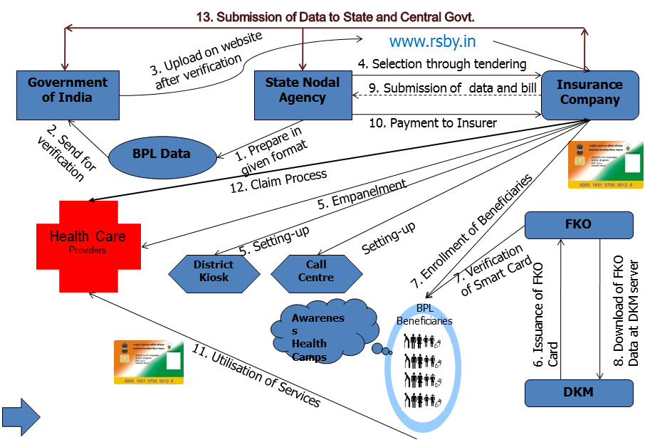

<figure aria-describedby="caption-attachment-660" class="wp-caption aligncenter" id="attachment_660" style="width: 906px">

<figcaption class="wp-caption-text" id="caption-attachment-660">RSBY: Rashtriya Swasthya Bima Yojna, FKO: Field Key Officer, DKM: District Key Manager</figcaption></figure>