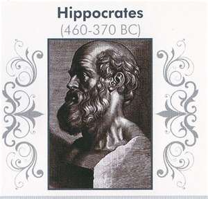

<figure aria-describedby="caption-attachment-667" class="wp-caption alignleft" id="attachment_667" style="width: 300px">

<figcaption class="wp-caption-text" id="caption-attachment-667">Hippocrates (460-370 BC) Pic: courtesy osmanian.com</figcaption></figure>

On the final day of the [Acara Summer Institute 2011](http://www.techsangam.com/2011/06/28/acara-summer-institute-2011-day-1-highlights/), after the teams had made their final presentations, this appeal from [Dr. Trilochan Sastry](http://www.techsangam.com/2011/12/04/the-many-lives-of-trilochan-sastry-%e2%80%93-academic-social-activist-social-entrepreneur/) stayed with me:> Whether you sell drip irrigation or polytunnel kits to farmers or build toilets for slum dwellers, could you ensure that the potential downside to your target users is covered? Whatever happens to your social business, could you ensure that their situation doesn’t get worse?

I don’t recall whether he made a direct reference to SKS and farmer suicides but the import of his comments weren’t lost on the audience.Earlier today, I read a damning Washington Post article on SKS Microfinance – their own [internal probe linked its agents to borrower suicides, despite company denials](http://www.washingtonpost.com/world/asia-pacific/ap-impact-indian-lender-sks-own-probe-links-it-to-borrower-suicides-despite-company-denials/2012/02/24/gIQA1tfCXR_story.html). Whistleblowers at SKS are being targeted and no official spokespersons at SKS or any of its leading VC investors responded to this story.

When you are building a product or service for any customer segment (other than the [BOP](http://www.techsangam.com/2011/03/31/the-various-connotations-and-implications-of-bop-bottom-of-pyramid/)), the cost of a failed product is not high and rarely debilitating to the customers. But the BOP customer is very fragile, so fragile that even a few days of hospitalization can push them into a vicious cycle of indebtedness (see [this post](http://www.techsangam.com/2012/02/22/rsby-government-initiative-that-mostly-works/) for context). It behooves social entrepreneurs (especially those creating market-based solutions to BOP customer needs) to internalize this fully before they start promising things they cannot sustain over the long term.

What better way to anchor oneself than via a hippocratic oath? I present you the [original oath](http://en.wikipedia.org/wiki/Hippocratic_Oath), translated from Latin to English:

> I swear by Apollo, the healer, Asclepius, Hygieia, and Panacea, and I take to witness all the gods, all the goddesses, to keep according to my ability and my judgment, the following Oath and agreement:To consider dear to me, as my parents, him who taught me this art; to live in common with him and, if necessary, to share my goods with him; To look upon his children as my own brothers, to teach them this art; and that by my teaching, I will impart a knowledge of this art to my own sons, and to my teacher’s sons, and to disciples bound by an indenture and oath according to the medical laws, and no others.
> 
> I will prescribe regimens for the good of my patients according to my ability and my judgment and never do harm to anyone.
> 
> I will not give a lethal drug to anyone if I am asked, nor will I advise such a plan; and similarly I will not give a woman a pessary to cause an abortion.
> 
> But I will preserve the purity of my life and my arts.
> 
> I will not cut for stone, even for patients in whom the disease is manifest; I will leave this operation to be performed by practitioners, specialists in this art.
> 
> In every house where I come I will enter only for the good of my patients, keeping myself far from all intentional ill-doing and all seduction and especially from the pleasures of love with women or with men, be they free or slaves.
> 
> All that may come to my knowledge in the exercise of my profession or in daily commerce with men, which ought not to be spread abroad, I will keep secret and will never reveal.
> 
> If I keep this oath faithfully, may I enjoy my life and practice my art, respected by all humanity and in all times; but if I swerve from it or violate it, may the reverse be my life.
> 
> 

Do you have a submission for the hippocratic oath for social entrepreneurs? If so, please leave a comment.