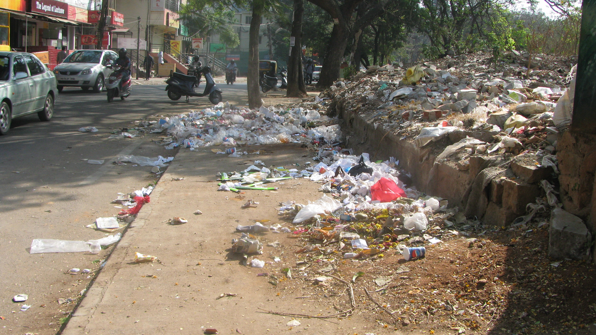
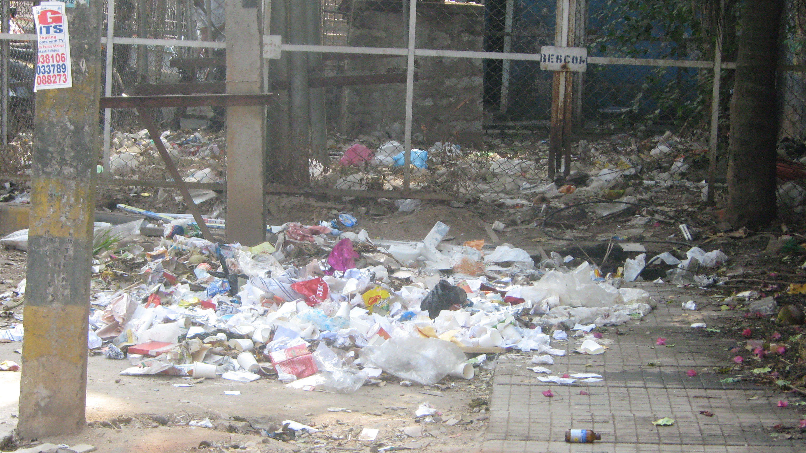
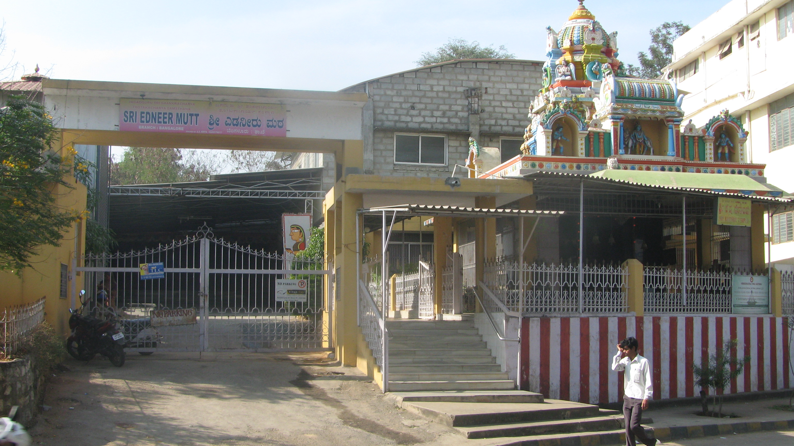
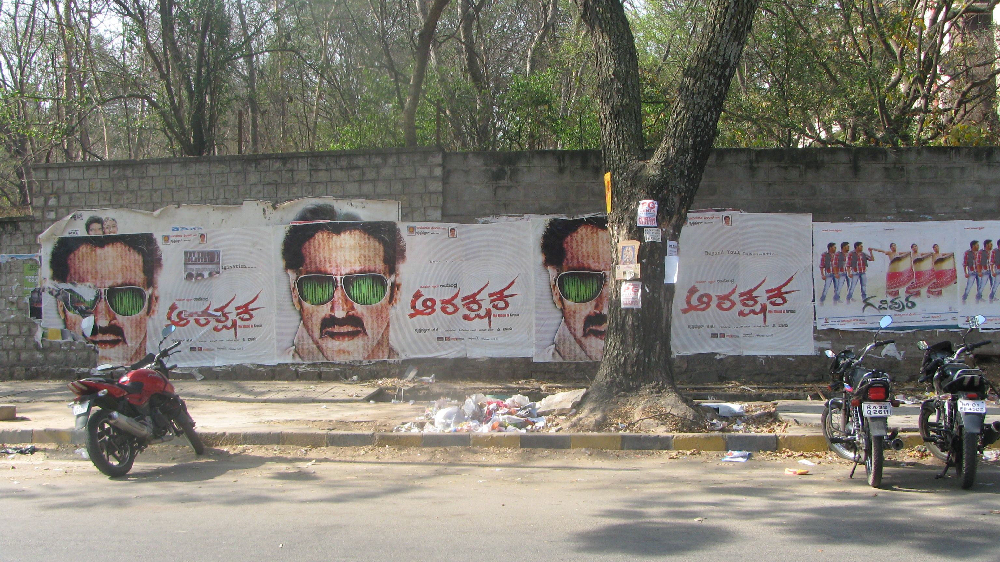
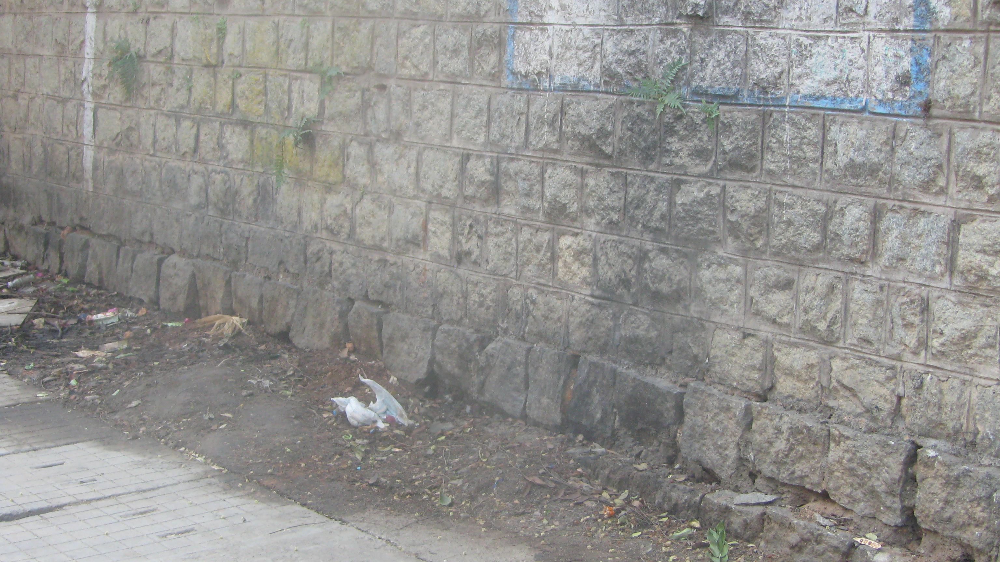
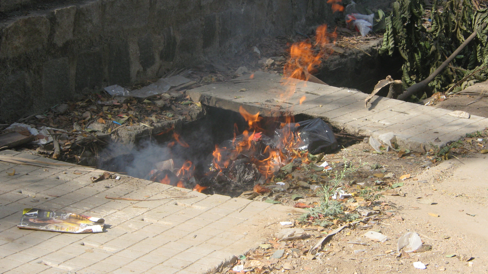
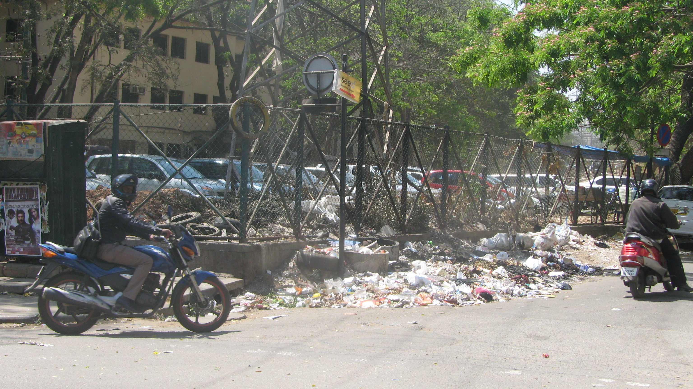
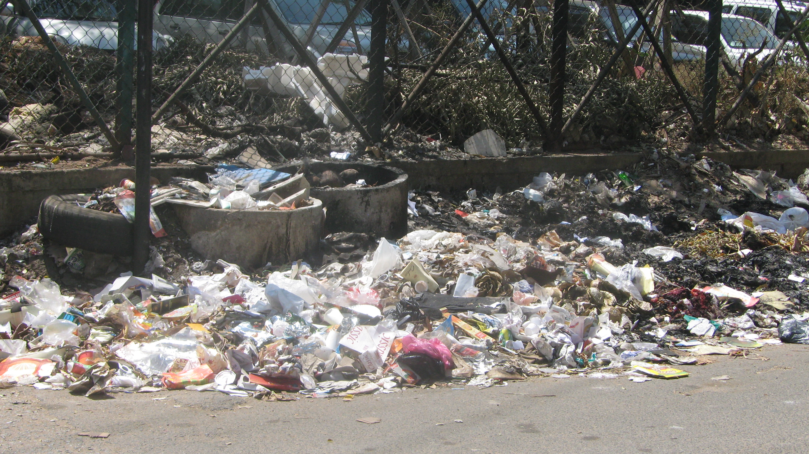
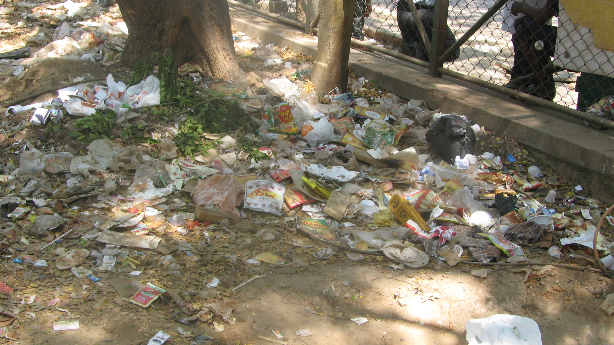

This past week, I shifted my theater of operations — from *Koramangala 3rd Block cafes on 80 Feet Road* to *Koramangala 5th block cafes on 1st Cross Road*. Why did I do that? Maybe I needed a change… maybe the traffic gnarls on 80 ft road due to the 7th Cross road dig was finally getting to me… or just maybe it was that subliminal voice piping up with “What have you done for [The Ugly Indian](http://www.techsangam.com/category/the-ugly-indian-2/) lately?” W*ho the heck knows how the mind works anyway?*

1st Cross Road is popularly known as Jyoti Nivas College Road – even though the college main entrance is actually off a cross street. In the past year, this road has become a bustle of activity thanks to the mushrooming of new restaurants.. and cafes. With the recent opening of a Costa Coffee branch, it completes the Barista/Cafe Coffee Day/Costa troika. An inevitable effect of increased footfall is rise of garbage.

Mornings spent in 3 different cafes on 3 different days gave me an opportunity to walk different stretches of the road, talk to a host of shopkeepers, and most importantly, observe the waxing and waning patterns of the garbage dumps. Of course, I was armed with my point-and-shoot, the venerable [Canon Powershot TX1](http://www.dpreview.com/news/2007/2/22/canontx1). The rest of the post is organized into 4 sections of pictures.

**Ugly Spot #1**: Opposite William Penn/Barista

<table><tbody><tr><td>
<dl class="wp-caption aligncenter" id="attachment_670" style="width: 310px;"><dt class="wp-caption-dt">

</dt></dl></td><td>**Picture 1**:The view as you face the oncoming traffic. The garbage on the pavement making it off limits for pedestrians. You can also see an open lot with ‘older’ garbage which also doubles up as an open urinal. This garbage pile is not ‘big’ enough to warrant daily BBMP pickup.</td></tr><tr><td>

</td><td>**Picture 2**: A smaller garbage pile outside a BESCOM enclosure – also not ‘big’ enough to warrant daily BBMP pickup.</td></tr><tr><td> </td><td>**Picture 3**: The Sri Edneer Mutt temple complex. Local *panshopwallah* told me that the attached marriage hall routinely dumps garbage. Clearly, cleanliness is NOT next to godliness.</td></tr></tbody></table>

**Posters and Urination**: Jyoti Nivas College Side Walls

<table><tbody><tr><td> </td><td>**Picture 1**: Against the backdrop of the piles of garbage on pavements, why should film posters on walls bother us?</td></tr><tr><td>

</td><td>**Picture 2**: No wall, tree, or BESCOM box in Bangalore can be considered complete without being smothered by coaching institute or PG fliers (sigh)!</td></tr><tr><td>

</td><td>**Picture 3**: How did a slightly blackened wall section make it to this post? Well… the folks who missed the vacant lot pee zone (50 feet away), didn’t miss this section of the wall.</td></tr><tr><td>

</td><td>**Picture 4**: I’ve never understood why garbage is burnt in India. A more burning question (yeah – pun intended!) is why only some garbage piles burnt? Take this mini-fire for example – it’s not like the rest of the sidewalk is garbage free (see pics).</td></tr></tbody></table>

**Ugly Spot #2**: Near Empire Restaurant

<table><tbody><tr><td>

</td><td>**Picture 1**: Garbage pile alongside the parking lot fence. This is the street parallel to the Raheja Arcade road. This is another pile that doesn’t get picked up by BBMP truck.</td></tr><tr><td>

</td><td>**Picture 2**: A close-up of Picture 1. Don’t miss the patches of burnt garbage. I guess ‘good samaritans’ burn garbage using the iTunes randomize algo?</td></tr><tr><td> </td><td>**Picture 3**: The scene at the entrance to the parking lot isn’t pretty either. Garbage that hasn’t been picked up for ever.. I spotted some Diwali firecracker boxes.</td></tr></tbody></table>

**Ugly Spot #3**, at the intersection of road leading to Jyoti Nivas College Main Entrance, is THE garbage dump of 1st Cross Road, the site where the BBMP truck picks up garbage and… \[we’ve finally come to the punch-line\] but I’ve exceeded the max # of photos per post limit so ending the post with the tell-tale *to be continued…*

*Feb 27 Update*: This story continues here – [Koramangala’s Street of Shame – Ugly Spot #3](http://www.techsangam.com/2012/02/27/koramangalas-street-of-shame-ugly-spot-3/).

  

  
