This is Part 2 of a series on [Koramangala’s Street of Shame](http://www.techsangam.com/2012/02/26/koramangalas-street-of-shame/). **Ugly Spot #3** is the unofficial open dump where the BBMP truck does its garbage pickup. It’s at the intersection of the road leading to Jyoti Nivas College main entrance. The pictures in this post were taken on Feb 20, 22 and 24th – times ranged from 9:30am to 1:30pm.

<table><thead><tr><td>

[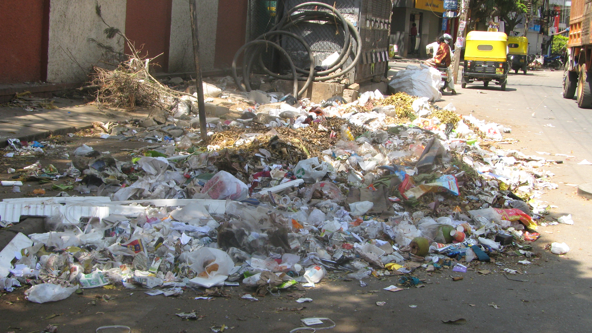](../../../../uploads/2012/02/feb20_119_spot1_1.jpg)</td><td>**Picture 1**: ‘Pride Supreme’ of 1st Cross Road (aka “Ugly Spot #3”) – notice how much of the road width the open dump is occupying.</td></tr><tr><td>

[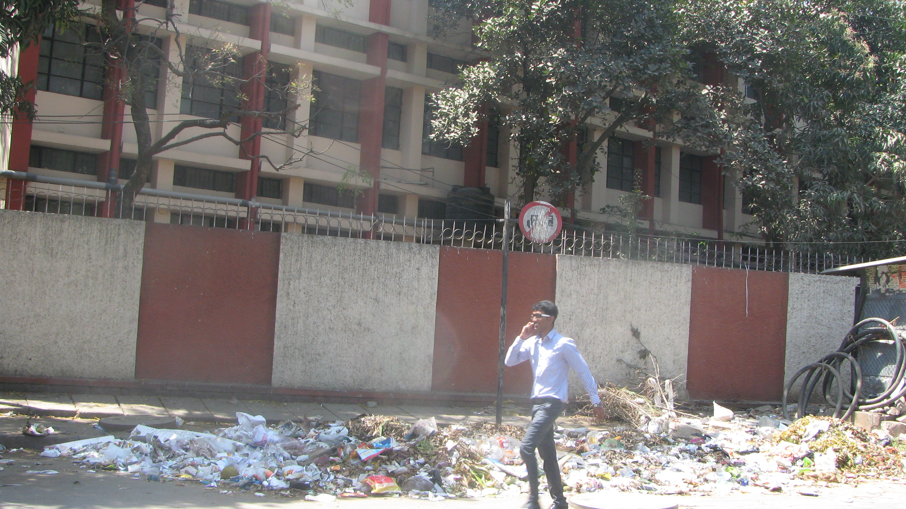](../../../../uploads/2012/02/feb20_123_spot1_jn_coll.jpg)</td><td>**Picture 2**: There’s walking ‘on the road’ and there’s walking in the ‘middle of the road’.</td></tr><tr><td>

[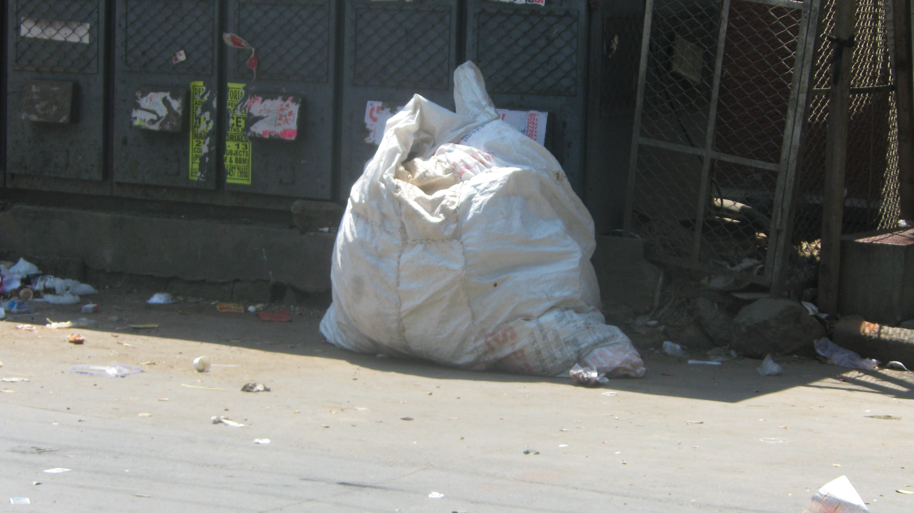](../../../../uploads/2012/02/feb20_133_spot1_mystery_bag.jpg)</td><td>**Picture 3**: What’s this mystery half-full large bag doing 5 feet away from the open dump?</td></tr><tr><td>

[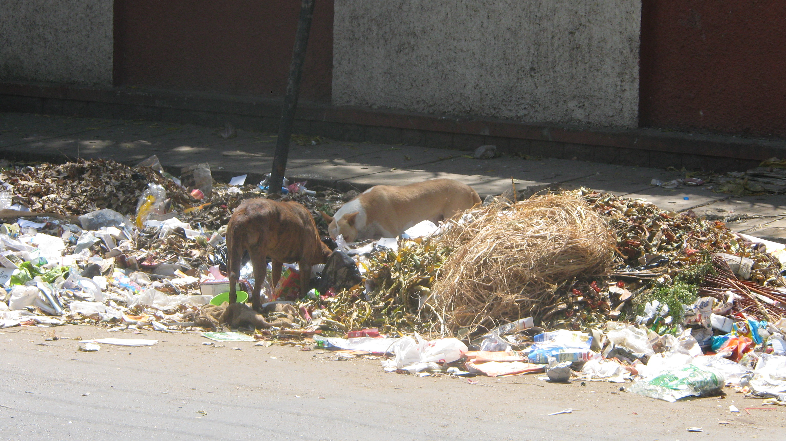](../../../../uploads/2012/02/feb20_134_spot1_dogs.jpg)</td><td>**Picture 4**: If there was any doubt that the garbage contains dumped food, just watch the dogs.</td></tr><tr><td>

[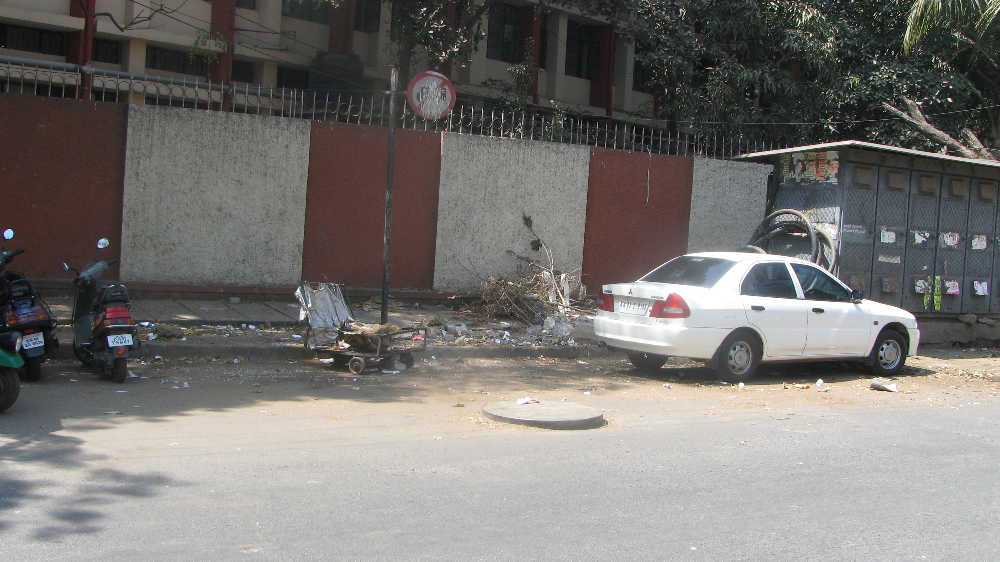](../../../../uploads/2012/02/feb22_002_spot1_clean_sorta.jpg)</td><td>**Picture 5**: Hello..?? What happened to all the garbage? This picture was taken an hour after the garbage pickup – what a difference! Parking room for 2 cars and then some…</td></tr><tr><td>

[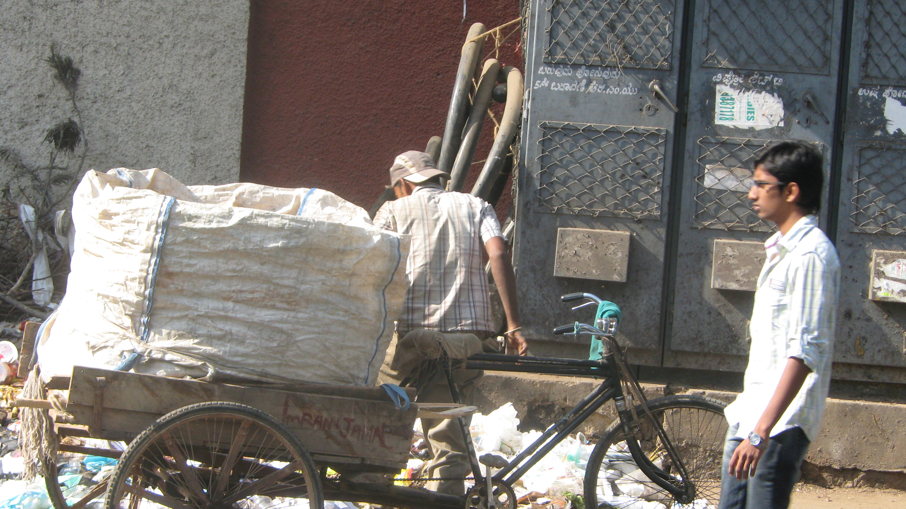](../../../../uploads/2012/02/feb22_011_spot1_imran_jamal.jpg)</td><td>**Picture 6**: Imran Jamal is a bit player in the Koramangala 1st Cross open dump ecosystem. On this day, he stopped for less than a minute, picked up a few bottles, and was off in a jiffy.</td></tr><tr><td>

</td><td>**Picture 7**: What’s that garbage trolley doing here? This was answered a few days later.</td></tr><tr><td>

[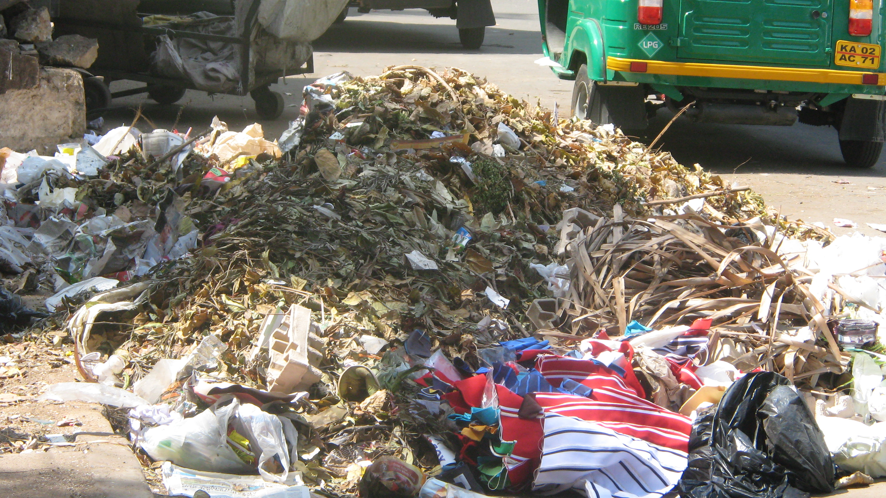](../../../../uploads/2012/02/feb24_004_spot1.jpg)</td><td>**Picture 8**: For the first 2 few days of observation, I was wondering who was dumping the leaves. On the 3rd morning, the leaf dump was massive.</td></tr><tr><td>

[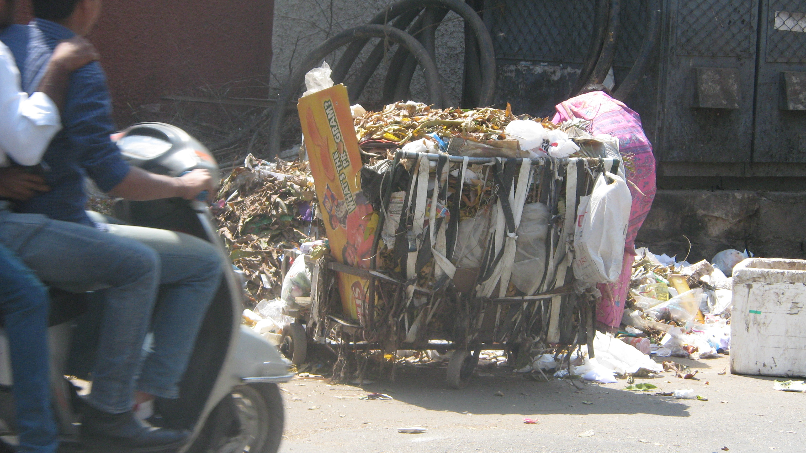](../../../../uploads/2012/02/feb24_008_spot1.jpg)</td><td>**Picture 9**: As I walked past the dump 10 min later, I saw the lady with the trolley full of leaves. I stupidly thought “I see. She’s loading the leaves on the trolley and taking them to a separate dump.. Hmm…”</td></tr><tr><td>

[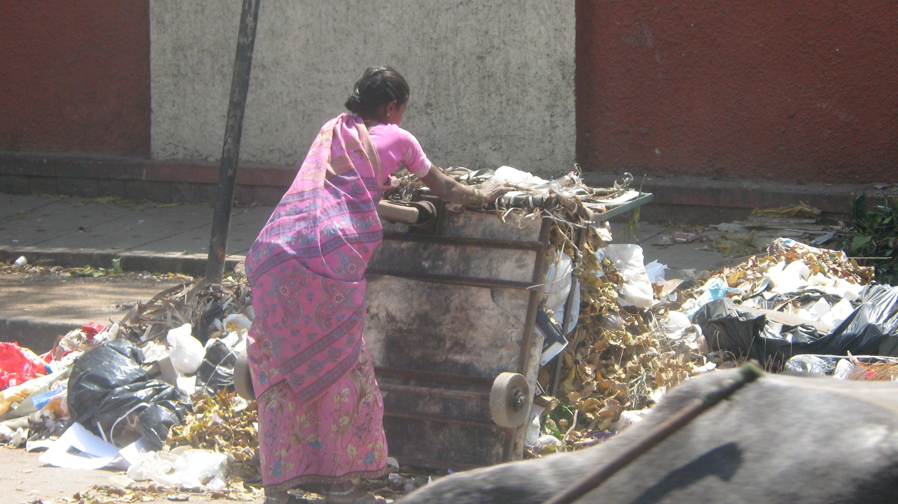](../../../../uploads/2012/02/feb24_009_spot1.jpg)</td><td>**Picture 10**: Wait! What! Whoa! She’s overturned the trolley and is dumping all the leaves onto the open dump. SHE is the source of the leaves dumping. Following a diligent sweeping of the Koramangala 5th Block sidewalks, no doubt…</td></tr><tr><td>

[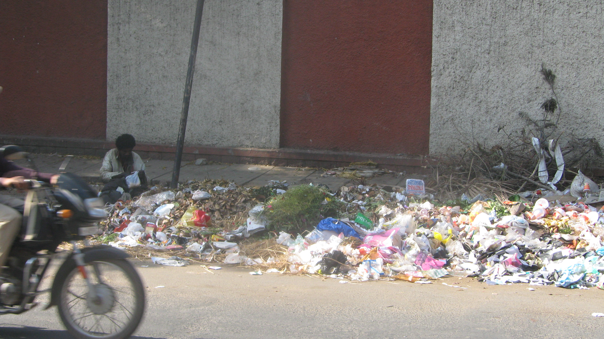](../../../../uploads/2012/02/feb22_007.jpg)</td><td>**Picture 11**: Who’s that man? And what’s he looking for in that plastic bag? Surely he’s not… NO!!!</td></tr><tr><td>

[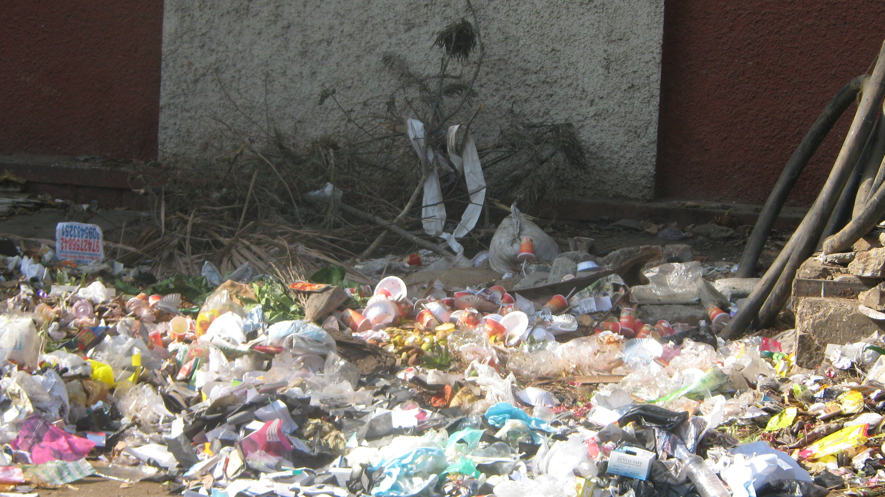](../../../../uploads/2012/02/feb22_009.jpg)</td><td>**Picture 12**: Let’s take a closer look at today’s garbage. It looks like a LOT of food stuff…what do you think?</td></tr><tr><td>

[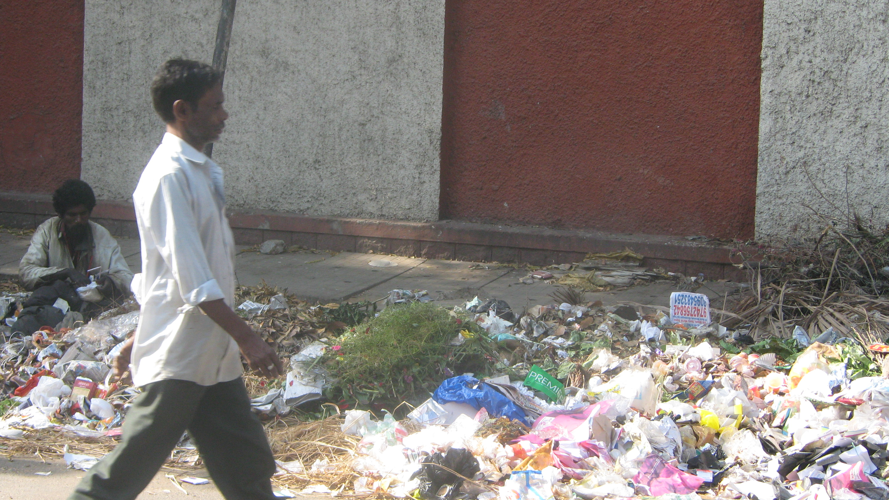](../../../../uploads/2012/02/feb22_010.jpg)</td><td>**Picture 13**: After rummaging through the open dump for a few minutes he found this plastic bag of food.</td></tr><tr><td>

[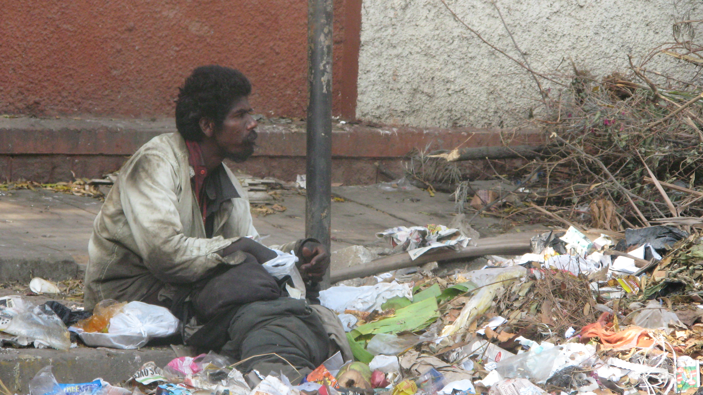](../../../../uploads/2012/02/feb22_013.jpg)</td><td>**Picture 14**: Two days ago, I had seen 2 dogs rummaging and eating in the open dump. Today it was this homeless man. The lump of clothes next to him are his ‘worldly’ possessions.</td></tr></thead></table>

Clicking pictures 11 through 14 was REALLY hard. It had been a while since I last saw homeless people scavenging through trash in Bangalore. I’ve seen homeless people in Chicago and San Francisco scavenging from garbage bins outside restaurants but a scene… from an open roadside dump… is NOT the same.

**So… a few awkward pictures and move on?**

Unlike the numerous [national shames](http://www.techsangam.com/2012/01/10/welcome-to-india-a-nation-of-national-shames/) that India is plagued with, this is just a *local* shame (a mere 1 km stretch of 1st Cross Road of which 400m is already clean). Surely we Bangalore residents can do something about the 3 ugly spots, the walls and the homeless man living on garbage? Surely this league of anonymous people ([The Ugly Indian](http://www.theuglyindian.com/) – TUI) has provided us with oodles of inspiration?

I’m now going to switch to the rallying cry from a popular kiddie TV show:

> Can we do it?
> 
> Yes, we can!

**What is \*IT\* we do?**

A series of good old fashioned TUI-style SpotFixes of course… starting with Ugly Spot #3. If you are new to this TUI/Ugly Indian lingo, do checkout this [mother of all Spot Fixes trilogy](http://www.techsangam.com/2011/10/19/the-ugly-indians-gift-to-bangalore-on-the-occasion-of-namma-metro-launch/). When I asked the manager at Juice Junction which establishments dump at Ugly Spot #3, he answered “Everybody!” My good friend (who lives on this street) told me that most of the restaurants dump their garbage at night.

**How can you help?**

The action now moves to the [TechSangam Facebook page](http://www.facebook.com/TechSangam/). If you are a Bangalore resident who frequents this part of Koramangala, you can leave a comment on this post or, better still, start following the action on the Facebook page. We are officially in the phase of discovering who “Everybody” is.. and can use everybody’s help!