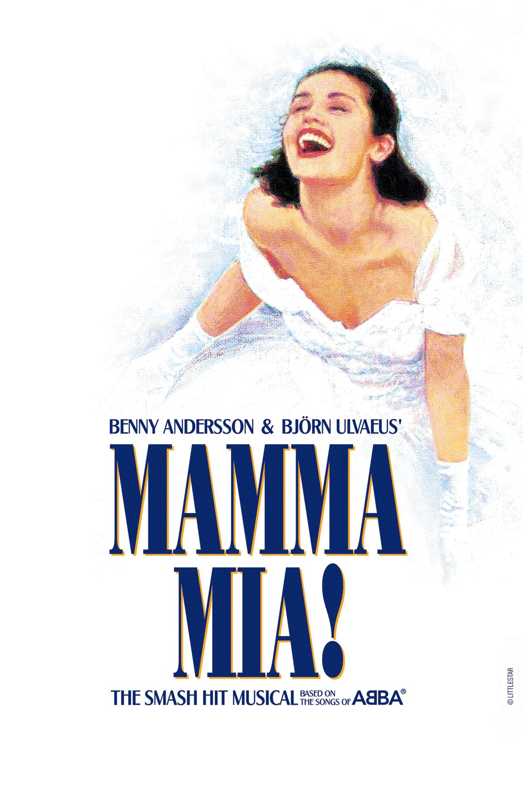

<figure aria-describedby="caption-attachment-1359" class="wp-caption alignleft" id="attachment_1359" style="width: 200px">

<figcaption class="wp-caption-text" id="caption-attachment-1359">Pic: courtesy Bing</figcaption></figure>

After a long time, I came across a Facebook status update which deserves highlighting. Here’s the 45-word beauty sans [PII](http://en.wikipedia.org/wiki/Personally_identifiable_information):

> Watched Mamma Mia in SF today and loved it. It made me want to hit the dance floor. Will try to get some sleep (hopefully I don’t need to nurse \[Infant\_Name\] four times tonight) and get up early tomorrow morning to edit my new novel.

Here are all the things being conveyed:

- I’m rich enough to afford going to a Broadway show
- I’m a dancer
- I have an infant at home (with a babysitter)
- My new novel is about to hit the shelves
- I’m a super mom!

Lest you think my Facebook friend is indulging in self-aggrandizement, I’ll quote another friend – *one person’s sharing is another person’s self-aggrandizement*.