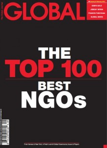

<figure aria-describedby="caption-attachment-723" class="wp-caption alignleft" id="attachment_723" style="width: 218px">

<figcaption class="wp-caption-text" id="caption-attachment-723">Pic: courtesy globaljournal.net</figcaption></figure>

The Global Journal released its inaugural [Top 100 Best NGOs](http://theglobaljournal.net/top100NGOs/) list. I read about it in this [DNA article](http://www.dnaindia.com/india/report_bangladesh-based-ngos-keeping-up-the-good-work_1658143) which focused more on the fact that (gasp!) Bangladesh had beaten India in the NGO sector and thus, *put a question mark over the hype surrounding the role played by the sector in the country*. Bangladesh’s BRAC, which happens to be the world’s largest NGO reaching a whopping 110 million people globally, is #4 on this list while India’s best ranked NGO (Barefoot College) is at a ‘lowly’ #15. However, for Indians who think of Bangladesh as competition, seven Indian NGOs figured in the top 100 list compared to two for Bangladesh. Here’s an overview of the seven Indian NGOs and a few others in the Top 100 that have a significant presence in India.

**The Seven Indian NGOs**

- [Barefoot College](http://theglobaljournal.net/article/view/view/493/) (#15): Founded by Bunker Roy and open only to individuals without a formal education, and committed to the de-mystification and de-centralization of sophisticated technology by handing its control to poor communities, Barefoot College’s model employs peer-to-peer learning grounded in practical knowledge to train ‘barefoot professionals’: teachers, doctors, midwives, mechanics, architects and more. To date, over three million people have participated.
- [Arvind Eye Care System](http://theglobaljournal.net/article/view/view/502/) (#21): Eradicating preventable blindness. Aravind’s unique ‘assembly-line’ treatment method increases productivity by a factor of ten, combined with an innovative non-profit model that uses the fees of wealthier patients to subsidize free service delivery to the bulk of its poorer clientele. Together, these elements allow the Aravind Eye Care System to perform over 300,000 eye surgeries per year (more than 3.6 million in the organization’s lifetime), 70 percent of which are subsidized or provided free to the poor.
- [Pratham](http://theglobaljournal.net/article/view/view/503/) (#22): Since its inception in 2007, Read India has trained over a million volunteers and teachers, and reached more than 34 million children. An earlier TechSangam post talks about [Pratham’s contributions to the Indian education policy debate](http://www.techsangam.com/2011/09/10/prathams-contributions-to-indian-education-policy-debate/).
- [Planet Read](http://theglobaljournal.net/article/view/view/508/) (#27): Using Bollywood to improve literacy. Recognizing that literacy skills have to be constantly reinforced, the organization appropriated the method of ‘Same Language Subtitling’ (SLS) – the practice of subtitling television programs, films or video clips in the same language as the audio track – and applied it to the wildly popular Bollywood music videos aired weekly on television throughout the country. Its weekly broadcasts reach an audience of approximately 200 million neo-literates worldwide.
- [Gram Vikas](http://theglobaljournal.net/article/view/view/548/) (#51): Using sanitation as a tool to empower communities. 350,000 direct beneficiaries. Requiring 100 percent community ‘buy-in’ as a precondition for commencing new projects, the MANTRA approach has achieved impressive results, eliminating 85 percent of water-borne diseases in participating villages, and boosting school attendance from ten to 90 percent. You can find the Gram Vikas story here – [health insights from Poverty Economics](http://www.techsangam.com/2011/08/03/health-insights-from-banerjee-duflos-poor-economics/).
- [Rishi Valley Institute for Educational Resources](http://theglobaljournal.net/article/view/view/562/) (#74): Village education ‘in a box’. Modular approach to learning that supports multigrade classroom teaching using graded cards to guide students in language, mathematics and environmental science. 25,000 schools following the Rishi Valley model.
- [International Development Enterprises (India)](http://theglobaljournal.net/article/view/view/560/) (#75): Life changing irrigation technologies for poor farmers. Client base of 1 million.

**Other NGOs with significant Indian presence**

- [Acumen Fund](http://theglobaljournal.net/article/view/view/510/) (#29): Making transformative social investments. In ten years, Acumen has invested $73 million in 65 companies, impacting an estimated 86 million lives.
- [ActionAid](http://theglobaljournal.net/article/view/view/535/) (#45): Mobilizing communities to fight poverty. Over 25 million beneficiaries.
- [Ashoka](http://theglobaljournal.net/article/view/view/558/) (#57): Fostering social entrepreneurship. Nearly 3000 fellows worldwide.
- [Room to Read](http://theglobaljournal.net/article/view/view/574/) (#66): Fighting poverty with books. Founded in 1999 by John Wood, this NGO now works in nine countries – Bangladesh, Cambodia, India, Laos, Nepal, South Africa, Sri Lanka, Vietnam and Zambia. Over 12,500 libraries built.

**Ranking Methodology**- Step #1: compilation of an exhaustive list of 1000 possible NGOs.
- Step #2: first round group review resulted in a ‘short list’ of 400.
- Step #3: second round group review resulted in an unranked Top 100.
- Criteria at every step included:
- Innovation
- Effectiveness
- Impact
- Efficiency &amp; value for money
- Transparency &amp; Accountability
- Sustainability
- Strategic &amp; Financial Management
- Peer Review

