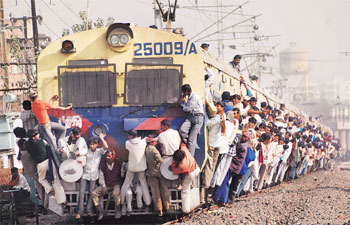

<figure aria-describedby="caption-attachment-749" class="wp-caption alignleft" id="attachment_749" style="width: 350px">

<figcaption class="wp-caption-text" id="caption-attachment-749">Pic: courtesy IndiaToday.in</figcaption></figure>

In the past week, three conversations with three different migrants in Bangalore (all working as security guards) reminded me why I need to devote more time (and blog space) to the migration meme.

**Conversation #1**: RMM works for Handiman Services as a security guard supervisor in Koramangala. RMM is 50 years old, hails from [Jajpur district](http://jajpur.nic.in/) in Orissa, and his profile is definitely atypical. RMM is a commerce graduate, ran a reasonably successful business as a [stockist](http://www.thefreedictionary.com/stockist) for years, generated enough surplus to build a 2-storey house in Jajpur (Orissa), and got his younger brother married and well-settled. The personal setback which led him to migrate to Bangalore 7 years ago is the subject of a detailed (future) [Field Reports](http://www.techsangam.com/category/field-reports/) post. After doing a series of accountant assistant jobs in various companies, he finally realized that the job of a security guard supervisor wasn’t too taxing and, more importantly, paid better than all his previous jobs. His current salary: Rs. 10,200. He lives in a nearby Ejipura slum where he pays a rent of Rs. 500 for a small room (shared, if I recall correctly). He visits his family once every two years. A pay-and-use Sulabh Complex serves his ablution needs. Why, I asked him, do you not bring your family to live with you in Bangalore? Since jobs in Jajpur would never pay as well as Bangalore jobs, he would like to bring his wife and college-going son to Bangalore but…

- His son is doing B.Com at Jajpur’s government college. Would he get admission in a decent Bangalore college without wrecking his monthly cash flows?
- Where would the “family of 3” live?

**Conversation #2**: GKP works as a security guard in my apartment complex, employed with Cavalier Security Services. He’s fairly new to Bangalore and this job. GKP has migrated from a village in Orissa’s [Keonjhar mining district](http://kendujhar.nic.in/). He has worked in the mines, his grown-up son used to work at a nearby mine until it shutdown recently (there’s a lot of entropy in India’s mining industry). His wife and son are continuing the family business (making pickles and snacks), they want him to return home but GKP is not able to walk away from the decent salary he’s earning. Bringing his family to Bangalore is a lot more challenging than RMM.

**Conversation #3**: Earlier this week, I met the first (migrant) security guard who was NOT from Bihar, Orissa, UP, North East or Nepal – he was from Pune. There were more surprises in store. He came to Bangalore because a few of his friends were early trailblazers. His salary is upwards of Rs. 8,000 and I was surprised to hear that he wouldn’t get this kind of a salary in Pune. In his early 20’s, he’s the only one amongst the group of Pune migrants who’s married. He shares a room with his friends – a fairly common trend among migrants. What was surprising to learn is that his employer (Sarvodaya Security Services) pays the rent for his room. This got me really excited — need to learn more about Sarvodaya – are they raising the bar for security services companies? Are there other security services firms with these kind of migrant friendly policies?

**Organizing the Unorganized Migrants**

You might recall from our overview of the [RSBY government health insurance program](http://www.techsangam.com/2012/02/22/rsby-government-initiative-that-mostly-works/) that 94% of India’s workforce is unorganized. Looking specifically at some important migrant trends and problems:

- As we noted in [A fresh look at the migration narrative](http://www.techsangam.com/2011/05/10/a-fresh-look-at-the-migration-narrative/), *urban areas will represent 70 percentage of India’s GDP by 2025. About 300 to 400 million Indians will leave the countryside in 25 years.* Even if we trip that estimate by 50%, we are still talking about a staggeringly big number.
- Bihari migrants remitted Rs. 4.5 billion ($100 million) in 2006. Oriya migrants remitted Rs. 20 billion in 2007.
- Migrants are preferred over local labour by employers because they are cheaper, work harder and are not unionised.
- Urban policies, especially on housing, do not simply neglect migrants, but actively discriminate against them.
- Practical areas for migrant support include improved access to market information, skills enhancement, certification of identity, remittances, housing and continued access to health, education and social assistance whilst ‘on the move’.
- In the absence of government policies for migrants, NGOs like Aajeevika in Rajasthan have stepped in to fill the void. With a membership boasting 50,000, Aajeevika provides identity cards, counseling, skills training, and financial inclusion services.
- NGOs like [Prayas](http://www.prayaschittor.org/) in Rajasthan and [Disha](http://www.disha-india.org/index.htm) in Gujarat believe that unionising migrant workers will go a long way towards realising their rights, improving their bargaining power in the market, and preventing exploitation. Bangalore-based social enterprise [LabourNet](http://labnet.in/web/?q=node/7) creates sustainable benefits for workers in the “construction” industry by offering them a platform to access a suite of services (identity, skills training, accident insurance, facilitating financial inclusion services like [Eko](http://www.techsangam.com/2011/05/01/khata-kholo-har-darwaza-kholo-ekos-branchless-banking-part-1/)).

Stay tuned for increased coverage of organizations working to improve the lot of India’s domestic migrants.