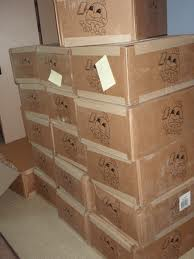

Pic: courtesy tetonlibraryproject.wordpress.com

It’s not what you think. I’m referring to 15 boxes of our book collection that we stashed away in my cousin’s attic in San Jose four years ago. When we returned to India after 16 years in US ([this post](https://www.ulaar.com/2008/06/02/why-are-we-moving-back-to-india/) gets into the “But why?” question) many of our friends in US and India thought we were nuts. When they heard we’d be accompanied only with six suitcases, a Power Mac G4 and a MacBook, they shook their heads.

We left behind a formidable *wake*.. a *wake of garages* with assortments of things stuffed into boxes and spillover suitcases ([this post](https://www.ulaar.com/2008/08/13/a-sense-of-satisfaction-and-accomplishment/) talks about it). A procession of kind friends and cousins transported our remaining suitcases to Bangalore between 2008 and 2009. All that remained were 15 boxes of books.

In the first few years after our move, every time I heard of a friend or acquaintance moving from Silicon Valley, the following conversation snippet would repeat (in Click… Whirr fashion) in the Kuruganti household:

**Me**: “Hey, so and so is moving to Bangalore. Shall we move our books along with their big move?”

**She**: “And *where* are we going to keep them?”

**Me**: “Err… umm… hmm…” (trailing decrescendo of unintelligible sounds)

My books and I had handled the prolonged separation quite stoically, especially since my reading had plummeted in the same time period. However, it was clear that I *did* want my books back in our Bangalore apartment (sans the urgency). Finally last year a slow-boat-to-China idea struck me – why not move the books in batches of 10 or 15? Ferried by kind legions of friends, cousins, sisters, and.. (yeah) more friends.

The first proof that this whacky idea could work came in last August when my dear sister brought the first batch of books – a whopping 21 at that! The excitement of getting a new pair of running shoes was overshadowed by the landmark event of our book library being re-seeded in Bangalore. It was a bonus to learn that there were at least 10 unread books. It’s my pleasure to introduce to you… the first 21 of my long-long friends.. many of whom were picked up from public library yearend sales and used book sales.

- [Around the world in eighty days](http://en.wikipedia.org/wiki/Around_the_World_in_Eighty_Days)
- Milan Kundera’s [The Book of Laughter and Forgetting](http://www.amazon.com/Book-Laughter-Forgetting-Milan-Kundera/dp/0060932147)
- Richard Bach’s [One](http://www.amazon.com/One-Richard-Bach/dp/044020562X)
- Agatha Christie’s [Curtain](http://www.goodreads.com/book/show/81903.Curtain)
- Erich Segal’s [Oliver’s Story](http://www.amazon.com/Olivers-Story-Erich-Segal/dp/0553275291)
- Mark Twain’s [Roughing It](http://www.gutenberg.org/ebooks/3177)
- Isaac Asimov’s [Foundation and Earth](http://www.amazon.com/Foundation-Earth-Isaac-Asimov/dp/0586071105)
- Robert Fulghum’s [All I really need to know I learned in kindergarten](http://www.junglee.com/Really-Need-Know-Learned-Kindergarten/dp/0345466179/ref=sr_1_1?ie=UTF8&qid=1331440573&sr=8-1)
- Rudyard Kipling’s [Kim](http://www.gutenberg.org/ebooks/2226)
- Rudyard Kipling’s [Wee Willie Winkie and other stories](http://www.biblio.com/rudyard-kipling/wee-willie-winkie-and-other~39386611~title)
- Milan Kundera’s [Immortality](http://www.nytimes.com/books/98/05/17/specials/kundera-immortality.html)
- VS Naipaul’s [Guerrillas](http://www.amazon.com/Guerrillas-V-S-Naipaul/dp/0679731741)
- John Kenneth Gailbraith’s [The New Industrial State](http://press.princeton.edu/titles/8389.html)
- Douglas Angus’s [Best Short Stories of the Modern Age](http://www.amazon.com/Best-Short-Stories-Modern-Age/dp/0449300587)
- Richard Nixon’s [The Real War](http://www.amazon.com/Real-War-Richard-Milhous-Nixon/dp/044651201X)
- George Orwell’s [Nineteen Eighty-four](http://www.junglee.com/1984-George-Orwell/dp/B007BA88UQ/ref=sr_1_1?ie=UTF8&qid=1331440443&sr=8-1)
- Rudolf Flesch’s [The Art of Plain Talk](http://www.amazon.com/Art-Plain-Talk-rudolf-flesch/dp/0020463804)
- John Steinbeck’s [Travels with Charley](http://www.theatlantic.com/past/docs/unbound/classrev/charley.htm)
- Homer’s [Odyssey](http://en.wikipedia.org/wiki/Odyssey)
- Robert Fulghum’s [UH-OH](http://www.amazon.com/Uh-Oh-Robert-Fulghum/dp/0804111898) (Some observations from both sides of the refrigerator door)
- [Agatha Christie – An Autobiography](http://www.amazon.co.uk/Agatha-Christie-Autobiography/dp/0006353282) (I have NO recollection of buying this book but am so glad it’s in our collection)
