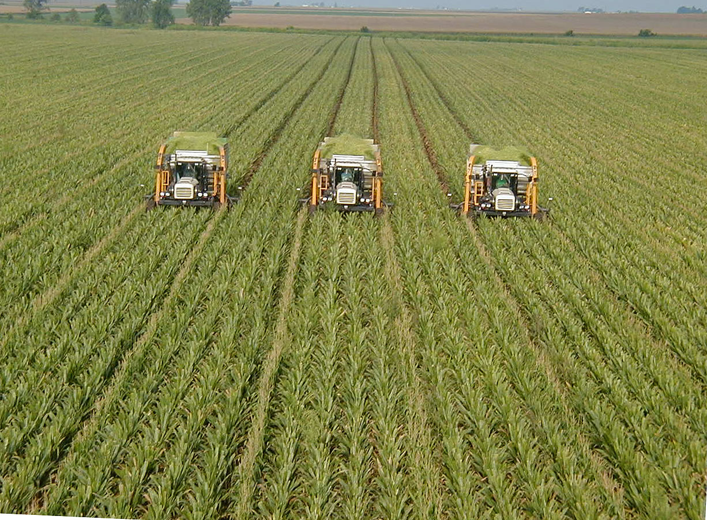
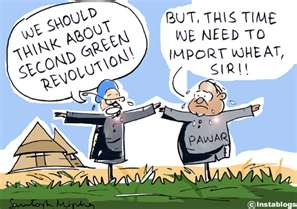

<figure aria-describedby="caption-attachment-765" class="wp-caption alignleft" id="attachment_765" style="width: 300px">

<figcaption class="wp-caption-text" id="caption-attachment-765">Pic: courtesy oecotextiles.wordpress.com</figcaption></figure>

> “Stop MNREGA for *one* year and let’s kickoff Second Green Revolution with the corresponding budget of Rs. 40,000 crores!”

Let me quickly disenchant you that a year of blogging and research on social enterprises has *not* made me an agricultural policy expert. The above statement was made by Dr. Ashok Gulati, a top agricultural economist and Chairman of the Committee of Agricultural Costs and Prices (CACP). In a recent [Business World interview](http://www.businessworld.in/businessworld/businessworld/content/%E2%80%98Allocate-Rs-40000-Crore-Green-Revolution%E2%80%99.html?storyInSinglePage=true), Dr. Gulati opines on a range of agricultural policy issues and states that, among other things, India’s agricultural growth rate potential is at least 5-6%. *For 15 years, we have failed to achieve our target and yet we haven’t learned that “business as usual” will not deliver. Gujarat for the last 10 years has had a growth of 10% in agriculture. In contrast, the national growth rate for the 11th plan (ending this year) is 3.2%, for the previous plan period, it was 2.4%.*

**Debunking the “State Subject” vs. “Central Subject” Cop-out Argument**

Gulati asks, *Was the Green Revolution brought by the states? Was the White Revolution brought by the states? Does export ban come under the states? If you want to have BT cotton or not, or BT brinjal or not, is this a state subject or a Central subject? The government needs to do things that the private sector cannot do – build roads in the rural areas, provide irrigation, water, and electricity. The second Green Revolution needs Rs 40,000 crore. The MGNREGA (Mahatma Gandhi National Rural Employment Guarantee Act) annual budget is Rs 40,000 crores – give this once for agriculture – allocate Rs 8,000 crores every year for five years in a row. Eastern India will give you a second Green Revolution which will ensure food security for the next 20-30 years. You can probably do away with MGNREGA and absorb the labour into the agricultural revolution that occurs. You want a second Green Revolution and you put Rs 400 crore. I haven’t heard a bigger joke. There are no roads there, no power, no procurement centre — the temple courtyard is the procurement centre. Are we joking?*

**Learn from and emulate the Gujarat Model**

Why not look at what they (Gujarat) have done to achieve a growth rate of 10% and replicate it? BT cotton is a huge success story in Gujarat. Earlier, there were around 10,000 check dams for irrigation; now the state has close to 150,000. Drip irrigation is a very high priority there. It is the only state where the water table is rising. When it rains, they recharge their groundwater. They have done massive reforms in the power sector. For irrigation they provide eight hours of power in a pre-announced schedule.

Then, every year before the Kharif season, there is a Krishi Mahotsav, attended by the Chief Minister. All agricultural research bodies and universities have to demonstrate their latest technologies at the mahotsav and have a direct contact with the farmer. About 300 Krishi Raths are sent to 18,500 villages with government officials to demonstrate the new seeds, technology and so on. From being a net wheat importer, the state is now a net exporter. Many fruits and vegetables such as bananas and chickoo (sapodilla) are coming up. Evidently, you can bring about a revolution.

<figure aria-describedby="caption-attachment-769" class="wp-caption alignright" id="attachment_769" style="width: 297px">

<figcaption class="wp-caption-text" id="caption-attachment-769">Pic: courtesy</figcaption></figure>

**More Key Insights**

- *If it is a drought year, the farmer loses. If it is a dream year, the farmer still loses. Something is seriously wrong with our marketing system.*
- *There are many laws and policies that are more than 50 years old which do not allow the market to function efficiently. For example, today, if you ban cotton export, the entire revolution in cotton production is likely to collapse because we export almost 25-30 per cent of our domestic production.* Yet, this (banning cotton export) is exactly what the boneheaded UPA government did, going against the advice of CACP. Opposition from farmers and the Gujarat government has forced UPA to [rollback the ban on cotton export](http://ibnlive.in.com/news/ban-on-cotton-export-to-be-formally-lifted-today/238190-37-64.html).