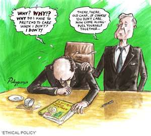
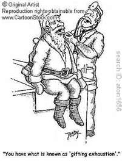
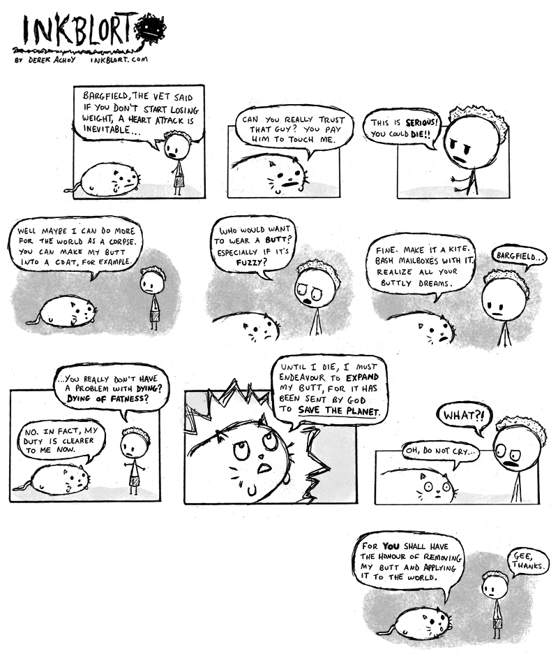

<figure aria-describedby="caption-attachment-783" class="wp-caption alignleft" id="attachment_783" style="width: 300px">

<figcaption class="wp-caption-text" id="caption-attachment-783">Pic courtesy: csrinpractice.com</figcaption></figure>

I spent 20 minutes searching for a long-forgotten quote on philanthropy (for use in my next post). I didn’t find it. But… I found some good ones, not all of which are complimentary, so here goes…

> - I used to be opposed to the idea of social entrepreneurship. I said let business be business, and philanthropy be philanthropy. Keep the two separate, don’t mix it up, and this is what I did, and I did that rather successfully, but I now recognize that actually you do need to mix it up and I think there is room for social entrepreneurship. – ***George Soros***
> - The premise of this foundation is one life on this planet is no more valuable than the next. – ***Melinda Gates***
> - I always had the old-school model that I’m going to work for as long as I’m relevant and focus on for-profit activities and someday when I retire I’m going to learn about philanthropy. – ***Marc Andreessen***
> - My theme for philanthropy is the same approach I used with technology: to find a need and fill it. – ***An Wang***
> - I’m not doing my philanthropic work, out of any kind of guilt, or any need to create good public relations. I’m doing it because I can afford to do it, and I believe in it. – ***George Soros***
> - Charity begins at home but should not end there. – ***Sir Francis Bacon***
> - We often excuse our own want of philanthropy by giving the name of fanaticism to the more ardent zeal of others. – ***Henry Wadsworth Longfellow***
> - Philanthropies and charities have a certain air of quackery (Ouch!) – ***Ralph Waldo Emerson*** (1803-1882)
> - Billions are wasted on ineffective philanthropy. Philanthropy is decades behind business in applying rigorous thinking to the use of money. – ***Michael Porter***
> - Philanthropy seems to me to have become simply the refuge of people who wish to annoy their fellow creatures. – ***Oscar Wilde***

List curated from: [afterquotes.com](http://www.afterquotes.com/) [famousquotes.com](http://www.famousquotes.com/) [famousquotesandauthors.com](http://www.famousquotesandauthors.com/) [brainyquote.com](http://www.brainyquote.com/)

More classic cartoons on philanthropy below:

<figure aria-describedby="caption-attachment-787" class="wp-caption aligncenter" id="attachment_787" style="width: 201px">

<figcaption class="wp-caption-text" id="caption-attachment-787">Pic courtesy: cartoonstock.com</figcaption></figure>

<figure aria-describedby="caption-attachment-788" class="wp-caption aligncenter" id="attachment_788" style="width: 800px">

<figcaption class="wp-caption-text" id="caption-attachment-788">Pic: courtesy inkblort.com</figcaption></figure>