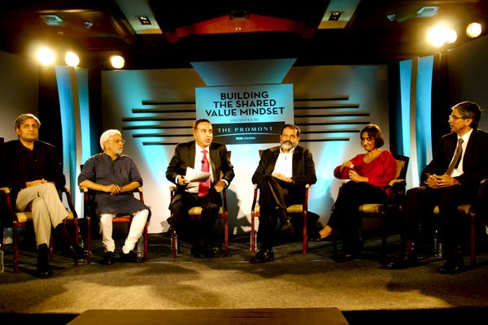

<figure aria-describedby="caption-attachment-869" class="wp-caption aligncenter" id="attachment_869" style="width: 600px">

<figcaption class="wp-caption-text" id="caption-attachment-869">Pic: courtesy Forbes India</figcaption></figure>

Back in Dec 2011, I attended a very interesting panel discussion organized by Forbes India. The panelists were Azim Premji Foundation’s Dileep Ranjekar, FabIndia’s Sunil Chainani, Janaagraha’s Ramesh Ramanathan, Manipal Education’s Mohandas Pai, and FSG’s Lalitha Vaidyanathan. The panel was excellently moderated by CNBC TV18’s Suresh Venkat. It was my introduction to **Shared Value** – a concept which, loosely speaking, is like ‘Corporate Social Responsibility (CSR) on steroids’. An earlier post [Just WHAT exactly is Shared Value](http://www.techsangam.com/2012/02/14/just-what-exactly-is-shared-value/) provided an overview of shared value, followed by a post on [Differences between CSR and CSV](http://www.techsangam.com/2012/02/16/differences-between-csr-and-csv-creating-shared-value/).

There were many interesting quotes I heard that evening. I finally reviewed the recorded videos today and am transcribing the most interesting quotes below.

> John Bissel (Fabindia’s founder) always said that in addition to making profits, he wanted artisans to have a better life and have sustainable jobs, key being ‘sustainable’. That’s been the DNA of Fabindia throughout its journey. – Sunil Chainani
> 
> 95% of micro-enterprises do not get access to formal banking systems. – Ramesh Ramanathan (Janaagraha)
> 
> In his interview for the role of Azim Premji Foundation CEO, Dileep Ranjekar had asked – “will this foundation be run like a ruthless business enterprise?” – Suresh Venkat
> 
> Government, Business &amp; Civil society all bring different things to the table – government has legitimacy, business has horse power, talent, resources and ideas, civil society has a lot of selflessness. – Dileep Ranjekar
> 
> Whether you call it shared value or conscious capitalism or impact investing, these are ALL good things because we’ve certainly not reached the boundaries of for-profit enterprises. But to suggest that capitalism should \*fundamentally\* change (as Michael Porter seems to be suggesting) is pushing it too far. – Ramesh Ramanthan
> 
> If you want to enjoy your wealth, you need to be a good citizen at the same time. – Mohandas Pai
> 
> I see Azim Premji Foundation as a holistic endeavor to create an impact on society. – Dileep Ranjekar
> 
> An important clarification needs to be made on the definition of community (in the shared value model). It’s not the ‘local’ community around a global company’s ‘local’ office but the community in a global sense. – Lalitha Vaidyanathan
> 
> The central question that shared value model tries to answer is this – governments and civil society play a role in inclusive growth. Can corporations also play a role in inclusive growth? And if so, how? – Lalitha Vaidyanathan
> 
> On the issue of value creation, the founders of successful companies get the most value through their stock but the community gets very little value. The Share Value model doesn’t address this problem. – Mohandas Pai
> 
> In India, we have no wealth tax on stocks, no inheritance tax, and we’ve dropped the tax rate to 30%! All of us lobbied the government to reduce taxes and now we’ve become rich and we’re using that wealth for ourselves. So clearly lobbying can be bad for Shared Value. Competing forces are needed to maintain checks and balances for all stakeholders. – Mohandas Pai
> 
> “We need to ensure that the Fabindia artisans (and the entire supply chain) remain competitive.” – Sunil Chainani, in response to Suresh Venkat’s hypothetical question about a super-efficient and cheaper digital printing technology displacing Fabindia’s artisans.