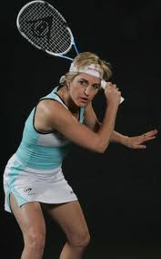
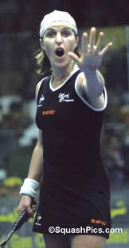

<figure aria-describedby="caption-attachment-1400" class="wp-caption alignleft" id="attachment_1400" style="width: 177px">

<figcaption class="wp-caption-text" id="caption-attachment-1400">Not how she looked in 2002 but what a "killer" and effortless backhand she had!</figcaption></figure>

Gosh! It’s been at least 5 years since I last played squash. Not counting the 3 games I played at an off-site corporate event in 2009. I’m talking ‘regular’ playing (regular = at least 3 times a week). Sometime last year, I removed “squash” from my Twitter bio — there are only so many “hoping to get back to …” tags one can use.

Why did I remember my first sporting love, especially after I expunged it from my Twitter bio? I’ve started reading Haruki Murakami’s [What I talk about when I talk about running](http://www.amazon.com/What-Talk-About-When-Running/dp/0307269191) and was pleasantly surprised to learn that he was(is?) seriously into squash. It makes sense of course — given his passion for running, swimming, marathons and triathlons. Truth be told, there’s an interesting squash-related post languishing in my Drafts folder for the past 3 months. I’ll even share the title because I’m hoping one of you will ask me to finish it soon — *Squash and the city*!

In the last few days, I’ve been reminiscing a lot about my squash playing days. My most regular playing stint was between 1998 and 2003 — the first year at Stanford (well before the courts and the program got really spiffed up with the [hiring of Mark Talbott](http://www.squashtalk.com/html/news/july04/news04-7-293.htm)) and subsequently at [Decathlon Club](http://www.westernathleticclubs.com/psrsv/Squash.php), Santa Clara. It was during the Decathlon Club playing days that I got an opportunity to watch Sarah Fitz-Gerald in action.

For the uninitiated, a quick Sarah FG introduction. Winner of 5 World Open, 2 British Open titles, and 60 WISPA tour titles, Australian Sarah Fitz-Gerald ranks alongside Michelle Martin and Heather McKay (fellow Australians) and Susan Devoy (New Zealand) as the sport’s greatest players. And what’s more, two of her major titles came after knee surgery. Fitz-Gerald was on an exhibition/promotion circuit spanning major American cities and our club pro (Jon Perry) managed to snag her for a day. She played against our club’s best male and female players (Atif Khan and Nicola Kelly respectively) and, of course, Jon Perry. After barely breaking a sweat, she talked about her training regimen, her (unsuccessful) efforts to make squash an olympic sport and ended with a spirited Q&amp;A. Here’s what I remember from that evening:

- <figure aria-describedby="caption-attachment-1403" class="wp-caption alignright" id="attachment_1403" style="width: 162px">

<figcaption class="wp-caption-text" id="caption-attachment-1403">Sarah Fitz-Gerald: I suppose she's shocked at a let/stroke call that went against her</figcaption></figure>
  
  Watching a superior player toying with a lower-rated player is not always pretty but it’s different when you are watching a master at work! Sarah’s movement on the court was a combination of beauty and languidness. Add a dose of good old-fashioned Aussie humor between points and we had an entertainer.
- Both Atif and Nicola managed a few points because… she let them! Nicola seemed a little overawed by the setting so she kept overdoing the backhand drop shot. Sarah would retrieve the drop with consummate ease and reply with a deep backhand rail. After the umpteenth time this happened, Sarah pointed (for the crowd’s benefit obviously) at the backhand front corner and said “That’s her favorite corner!” and “This is my favorite!” (pointing to the back left corner.
- Before Jon and Sarah started their first game, Sarah wagered that Jon would have to “drop his shorts” if he lost on “love”. Jon agreed (did he have a choice?) I’m sure he fancied his chances to get at least ONE point, especially since it was championship scoring (game goes till 15 and you get a point even on your opponent’s serve).
- There’s toying with an A level player and then there’s toying with an [AA level player](http://www.ussquash.com/uploadedFiles/USQ/Audiences/Players/Adults/Rankings/Rating-skill%20Scale.pdf) (PDF link) who’s the club pro!
- The quality of Sarah’s game was breathtaking to watch. If I have to pick ONE shot that defined her, it was her backhand rail — precision power hits at ‘every possible height’ with (I guess you’d call this) ‘copybook’ backswing.
- As she got inexorably closer to 15, it looked like Jon was getting more and more nervous. Jon lost the first game on “love”.
- She let Jon sweat a bit before she announced “Okay! you can just drop your socks for the second game!” 🙂 A collective sigh of relief from everyone. Jon lost the second game too but I think she let him win a few points.
- One of Sarah’s secret sauce: she used to train with the top male Australian squash players!

