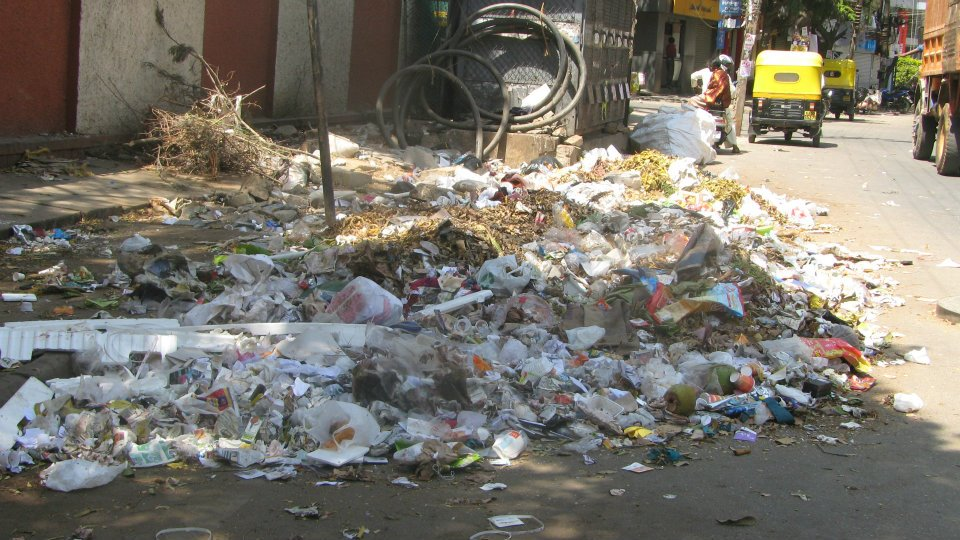
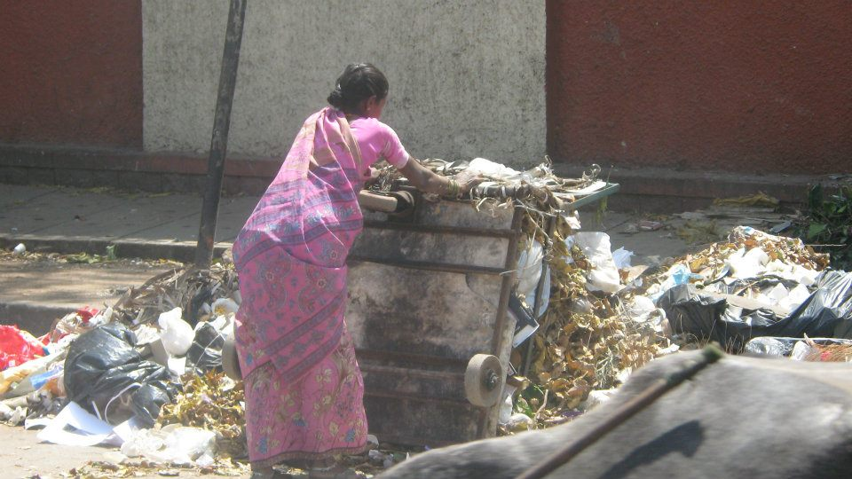

*\[Editor’s Note: This is Part 3 of a series on [Koramangala’s Street of Shame](http://www.techsangam.com/2012/02/26/koramangalas-street-of-shame/).\]*

<figure aria-describedby="caption-attachment-1009" class="wp-caption alignleft" id="attachment_1009" style="width: 300px">

<figcaption class="wp-caption-text" id="caption-attachment-1009">Ugly Spot #3 (open dump) on 1st Cross Rd, Koramangala 5th Block</figcaption></figure>

It’s been 16 days since I posted the last picture in this photo album – [Koramangala 5th Block 1st Cross](https://www.facebook.com/media/set/?set=a.399760906707444.117208.252642214752648&type=3). 65 pictures, numerous conversations with shopkeepers, and a month-long vigil later, I believe there are sufficient data points to document (what I’d like to call) the “undesign patterns” of this street.

**Heterogeneous “1 km” stretch of road**

I suppose there is no such thing as homogeneity on (and off) Indian streets. If most American cities are ‘90% similar’, it’s safe to say that most Indian cities (and city neighborhoods) are ‘90% different’. Yet I start this narrative by giving 1st Cross Street, Koramangala 5th Block the moniker *heterogeneous*.

- The commercial-residential distribution of this street ranges between 80:20 and 90:10.
- The street topography progressively deteriorates as you move from the ‘residential-heavy’ end (close to Sukh Sugar) towards the ‘restaurant-heavy’ end (close to Empire Hotel). This is not a surprising finding since residential communities tend to have a higher ownership of shared spaces than commercial communities (relatively speaking of course).
- Cleanliness grading for the 4 sections of the road
- Section 1: Sukh Sagar to Vaatsalya/Nova (Grade: A)
- Section 2: Nova to Edneer Mutt temple complex (Grade D)
- Section 3: Edneer Mutt temple complex to Lazeez Express (Grade F)
- Section 4: Beyond Lazeez Express to Raheja Arcade road (Grade C)

**Decoding the Letter Grades**Section 3: Grade F

- Open garbage dump at confluence of residential and commercial district.
- Commercial dumping by nearby juice stores and smaller sundry restaurant establishments.
- Residential dumping by *pourakarmikas* who, after having segregated leaves &amp; household trash into their carts, make it one unholy de-segregated pile.
- Raised manhole cover (courtesy Tata Teleservices) cripples a crucial 20% of street near the open dump.

Section 2: Grade D

- Open site on the left side of Edneer (and opposite William Penn/Cafe Coffee Day) is a vast peeing pasture for motorists and nearby shopkeepers with no access to toilets.
- Garbage dumped on pavements (multiple areas) and dumped next to the Edneer Mutt. The reason it’s a Grade D offense (and not Grade F) is because it’s not a daily “recurring” dump.
- Walls defaced by movie posters.
- Garbage being burnt by *pourakarmikas*.

<figure aria-describedby="caption-attachment-1010" class="wp-caption alignright" id="attachment_1010" style="width: 300px">

<figcaption class="wp-caption-text" id="caption-attachment-1010">Q: What follows after careful segregation? A: De-segregation of course!</figcaption></figure>

**Undesign Patterns**

1. BBMP truck picks up trash only from ONE spot ([Ugly Spot #3](http://www.techsangam.com/2012/02/27/koramangalas-street-of-shame-ugly-spot-3/)) on a *one km* stretch of road. This is in stark contrast to a parallel street (5th Cross Street) where I’ve seen pickups happen from at least 3 spots.
2. For a surcharge of Rs. 500 (unsure whether it’s an ‘official premium service’ or not), BBMP picks up bagged garbage from curbside. So far, I’m only aware of ONE restaurant (Jumboking) that avails of this service.
3. P*ourakarmikas* sweep leaves from neighboring residential streets &amp; pavements and load household trash into their carts. By the time they make it to Ugly Spot #3, the cart is full of segregated piles which makes their next step (dumping it all into an unholy de-segregated pile) particularly heartbreaking.
4. Since the residential trash volume generated by *pourakarmikas* between 9:30am and noon is quite high, a second BBMP truck rolls in around 12:30pm to pickup the accumulated garbage. It takes at least 30 minutes for the four BBMP workers to load the truck. Another side effect of this pickup time: traffic disruption at a busy junction.
5. Burning garbage (especially leaves) is a Bangalore-wide phenomenon and 1st Cross isn’t immune from it. Even though BBMP has made the practice punishable by levying fines, a [recent Citizen Matters article](http://bangalore.citizenmatters.in/articles/view/3599-leaf-litter-citizens-show-bbmp-the-way) points out mixed results with citizens reporting to BBMP. Interestingly, leaf burning on 1st Cross happens only in Section 2 (between Nova and Edneer Mutt). It’s about 1/2 km for the *pourakarmikas* to go all the way to Ugly Spot #3 so they dump opposite William Penn. Why set fire? Presumably because they don’t want their day’s hard work to be swept away by the wind. Related to point #1 (BBMP seems to pickup ONLY from Ugly Spot #3).

**What Next?**- In late February, when I moved my theater of operations from *Koramangala 3rd Block cafes (80 Feet Road)* to *Koramangala 5th block cafes (1st Cross Road)*, I figured a couple of weeks of ‘observing’ would be enough to initiate an [Ugly Indian style Spotfix](http://www.techsangam.com/2011/10/19/the-ugly-indians-gift-to-bangalore-on-the-occasion-of-namma-metro-launch/) at Ugly Spot #3. Turns out I was a tad bit optimistic. It took nearly 4 weeks (30-40 minutes per day of observation and conversations and one crucial night vigil with friend/local resident Praveen) to figure out the major undesign patterns.
- It’s clear that a series of interventions are needed on 1st Cross Road but where does one start? Ugly Spot #3 was my original first target because it’s clearly the street’s *nerve center of ugliness* but it’s also the hardest to fix. Let’s first assume that we can convince the known offenders (Juice Junction, Cool Point, egg roll joint next to Hot Chips) and others to stop dumping and get their garbage picked up for a fee. This leaves us with with the large volume of residential garbage (leaves and residents’ garbage). Let’s also assume that residents’ garbage is already ‘bagged’ which brings us to the *leaves*. Dear God, what are we to do with the leaves?
- If you’ve clicked through the aforementioned [CitizenMatters article](http://bangalore.citizenmatters.in/articles/view/3599-leaf-litter-citizens-show-bbmp-the-way), you’d have read about Meera Rajesh’s successful efforts in converting leaf litter to mulch and compost (Koramangala NGV apartment community). Earlier today I got a chance to speak to her. Cutting to the chase, I asked her “Is it possible to ferry the mountain of leaves from Koramangala 5th Block to your mulching/composting operation?”
- Here’s what she had to say:
- Leaves are not heavy but are voluminous, so transportation cost may not be trivial.
- Getting more leaves into NGV might jeopardize the delicate balance between the community’s conscience and convenience.
- Better idea would be to explore if a nearby park would be amenable to ‘hosting’ the mulching operation. Meera would be able to send the NGV mulching operator to train relevant folks.

**Other next steps?**- Obviously there are gaps and blind spots in my field research and observations. The biggest gap (probably more a ‘mental block’) is that I have not yet engaged with the BBMP truck staff — sure to yield insights and suggestions. The other blind spot is that I haven’t tried to contact anyone on the BBMP leadership team – maybe they have a masterplan? (I’m half-serious)
- Last month, I had emailed the BBMP Commissioner’s office about the leaf burning incidences (sent pictures taken on two different dates) — got an acknowledgement “within hours” but no subsequent communication. Over the next week, it ‘appeared’ that the leaf burning episodes had reduced but I couldn’t be sure.
- And finally my friend Praveen shared this interesting and relevant video on Koramangala 3rd Block’s Wealth Off Waste (WoW) Project.

<iframe allowfullscreen="true" class="youtube-player" height="394" src="https://www.youtube.com/embed/EqJSZzvb9VE?version=3&rel=1&fs=1&autohide=2&showsearch=0&showinfo=1&iv_load_policy=1&wmode=transparent" style="border:0;" width="700"></iframe>

  
